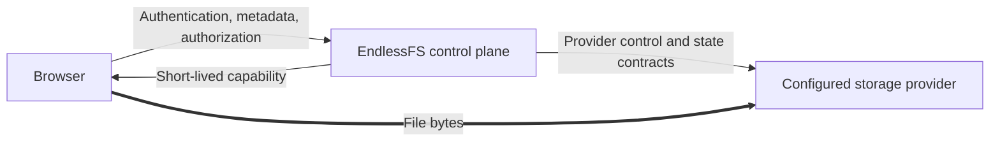

# EndlessFS

EndlessFS is an open-source, provider-neutral, security-first private cloud drive. Its Go control plane authorizes file operations while browser file bytes travel directly to and from the configured object-storage provider through short-lived provider-native capabilities.

> [!IMPORTANT]
> This repository is at **Milestone 5**. The accessible embedded Drive now exercises real passkey bootstrap/sign-in, direct resumable upload, download initiation, sharing, trash restore, responsive layout, and theme delivery through Go-controlled Chromium. Administration and account-recovery browser hardening plus final operational/release proof remain. Do not deploy this implementation or describe it as v1 complete or production-ready.

The normative implementation contract is [docs/v1-specification.md](./docs/v1-specification.md). A feature-complete mock-backed v1 will prove the full product locally, but it will not prove Google Cloud Storage interoperability or provide a production storage adapter.

## Why EndlessFS

- Passkey-only, usernameless identity with no password, email identity, or OAuth path.
- Strict logical user isolation and deny-by-default authorization.
- Direct browser-to-provider uploads and provider-to-browser downloads; the control plane does not proxy file bodies.
- Provider-neutral domain and state contracts backed by deterministic local implementations in v1.
- One Go binary with embedded HTML, application CSS, vanilla JavaScript, and validated theme media.
- Data-only themes: typed tokens and allowlisted static assets, never theme CSS, HTML, JavaScript, or remote code.
- No required SQL database, cache, queue, external identity service, analytics service, or persistent application filesystem.
- Nix as the sole development, build, test, package, and CI/CD interface.

## Architecture



Required dependency direction:

```text
HTTP and embedded UI -> application use cases -> domain + provider/state interfaces
provider implementations ---------------------> provider/state interfaces
```

Provider object keys never cross the public API. Private operations derive the owner scope from the authenticated session, not from client input.

## Start developing

Install [Nix with flakes enabled](https://nixos.org/download/), then run:

```console
nix develop
nix flake check
export ENDLESSFS_SESSION_SECRET="$(nix run .#generate-secret)"
export ENDLESSFS_BOOTSTRAP_TOKEN="$(nix run .#generate-secret)"
nix run .#dev
```

The development control server listens on `http://127.0.0.1:8080` by default. It also opens a separate ephemeral loopback data-plane listener; upload/download bytes use only that listener. Set `ENDLESSFS_MOCK_PROVIDER_URL=http://127.0.0.1:9090` to select a stable loopback data-plane port for browser testing.

Build the binary or an OCI archive without Docker:

```console
nix build
nix build .#container
```

Theme bundles are reproducible build inputs, never runtime directories. Downstream flakes may build an embedded custom set with:

```nix
endlessfs.packages.${system}.default.override {
  themeBundles = [ ./branding.efstheme ];
}
```

Every supplied archive/directory is validated before generated data is compiled into the binary. See [Theme API 1.0](./docs/theme-api.md).

All required builds and checks are Nix sandbox derivations, so project code cannot quietly depend on tools installed on the host. The required test gates are designed to run without cloud credentials, GCP, databases, persistent services, a container daemon, or non-loopback network access.

## Nix task interface

The v1 spec defines the following interface. Implemented commands are usable now; no command reports success through an empty test selection.

| Command | Current purpose |
|---|---|
| `nix develop` | Enter the pinned Go/Nix development environment. |
| `nix build` | Build the static `endlessfs` binary with embedded browser assets. |
| `nix build .#container` | Build a minimal, shell-free OCI archive. |
| `nix flake check` | Run the authoritative current build, format, lint, test, fuzz, race, security, policy, offline-sandbox, and OCI hardening gates. |
| `nix run .#dev` | Run the loopback-only development control plane. |
| `nix run .#generate-secret` | Generate one canonical 256-bit base64url environment secret. |
| `nix run .#fmt` / `.#fmt-check` | Apply or verify Go and Nix formatting. |
| `nix run .#lint` | Run `actionlint`, `go vet`, and `staticcheck`. |
| `nix run .#test` / `.#test-unit` | Run the current Go suite. |
| `nix run .#test-integration` | Run tests named as integration tests. |
| `nix run .#test-contract` | Run reusable provider and state-store contract suites. |
| `nix run .#test-e2e` | Run Go-controlled Chromium passkey and core Drive workflows. Nix supplies Chromium on Linux. |
| `nix run .#test-race` | Run the suite with Go's race detector. |
| `nix run .#test-fuzz` | Run bounded configuration, canonical-path, and theme-boundary fuzz smoke targets. |
| `nix run .#security` | Run deterministic static and forbidden-source checks. |
| `nix run .#container` | Build the local OCI archive through Nix. |
| `nix run .#theme-check -- PATH` | Validate and resolve a `.efstheme` archive or equivalent directory. |
| `nix run .#theme-preview -- PATH` | Serve the application-owned responsive component/state conformance fixture on loopback. |
| `nix run .#test-theme` | Run theme schema, compiler, inheritance, media, archive, contrast, preference, and HTTP tests. |

Longer fuzz campaigns can set `ENDLESSFS_FUZZTIME`, for example:

```console
ENDLESSFS_FUZZTIME=2m nix run .#test-fuzz
```

## Current configuration

Only settings that have validation and tests are parsed by the current binary:

| Variable | Default | Behavior now |
|---|---:|---|
| `ENDLESSFS_BASE_URL` | Derived in loopback development | Exact HTTP(S) origin; HTTPS is required for public listeners. |
| `ENDLESSFS_LISTEN_ADDR` | `127.0.0.1:8080` | Loopback for HTTP development; non-loopback requires a coherent HTTPS base URL. |
| `ENDLESSFS_STORAGE_PROVIDER` | `mock` | v1 currently accepts only the deterministic local provider. |
| `ENDLESSFS_MOCK_PROVIDER_URL` | Ephemeral loopback origin | Optional explicit HTTP loopback origin/port for the separate capability data plane. |
| `ALLOW_REGISTRATION` | `false` | Exact `true` or `false`; exposed as non-secret public policy. |
| `INVITE_REGISTRATION` | `true` | Exact `true` or `false`; exposed as non-secret public policy. |
| `ENDLESSFS_BOOTSTRAP_TOKEN` | Unset | Optional canonical 256-bit base64url token; enables only the unused first-admin bootstrap. |
| `ENDLESSFS_SESSION_SECRET` | Required | Canonical 256-bit base64url process secret; never exposed publicly or accepted as an argument. |
| `ENDLESSFS_WEBAUTHN_RP_ID` | Base URL hostname | Must exactly match the configured base URL hostname. |
| `ENDLESSFS_WEBAUTHN_RP_NAME` | `EndlessFS` | Validated authenticator-facing relying-party name. |
| `ENDLESSFS_SESSION_TTL` | `12h` | Positive absolute lifetime, capped at `168h`. |
| `ENDLESSFS_DOWNLOAD_CAPABILITY_TTL` | `60s` | Exact-object download lifetime, capped at `10m`. |
| `ENDLESSFS_UPLOAD_INIT_TTL` | `5m` | Destination-bound upload initiation lifetime, capped at `1h`. |
| `ENDLESSFS_TEXT_PREVIEW_MAX_BYTES` | `1048576` | Maximum validated UTF-8 plain-text preview size, capped at 16 MiB. |
| `ENDLESSFS_DEFAULT_LIGHT_THEME` | `endlessfs-light` | Installed light-appearance theme used by `system`; startup rejects missing/wrong-appearance values. |
| `ENDLESSFS_DEFAULT_DARK_THEME` | `endlessfs-dark` | Installed dark-appearance theme used by `system`; startup rejects missing/wrong-appearance values. |

The remaining theme and logging settings in specification section 15 will be added with the behavior they protect. Secrets are never accepted as command-line arguments or exposed through the public configuration endpoint. Remove `ENDLESSFS_BOOTSTRAP_TOKEN` after the initial administrator has been created. The current HTTP contract is documented in [docs/http-api.md](./docs/http-api.md).

## Repository map

```text
cmd/endlessfs/           process entry point
internal/config/         environment parsing and validation
internal/auth/           established WebAuthn adapter, sessions, cookies, CSRF, and origin policy
internal/domain/         strict paths, names, IDs, entries, operations, and capabilities
internal/model/          strict versioned persistence records
internal/provider/       provider contract and deterministic capability-aware memory provider
internal/state/          state contract, strict codec, and concurrency-safe memory CAS store
internal/secret/         redacted bearer-token hashing and validation
internal/httpapi/        router and transport security headers
internal/identity/       bootstrap, registration, accounts, passkeys, invites, roles, and recovery
internal/drive/          authenticated files, transfers, operations, trash, previews, and shares
internal/theme/          closed Theme API, compiler, media validation, registry, preferences, and built-ins
internal/web/            embedded HTML, CSS, and vanilla JavaScript
internal/e2e/            Go-controlled Chromium passkey, Drive, responsive, and privacy workflows
tools/check-source/      forbidden dependency/source policy check
tools/generate-secret/   operator-directed 256-bit environment-secret generator
tools/theme/             theme validation, generated API inventory, build embedding, and preview fixture
tools/repository-policy/ checked-in GitHub ruleset validator/applier
.github/rulesets/        declarative default-branch and release-tag policy
.github/workflows/       PR, CI, GHCR, release, and policy workflows
docs/                    normative specification and project documentation
AGENTS.md                repository instructions for implementation agents
```

The package structure will expand in the order defined by specification section 20: identity, file control plane, themes, browser drive, sharing/admin UI, then adversarial hardening and release proof. Direct dependency rationale is recorded in [docs/dependencies.md](./docs/dependencies.md).

## CI, containers, releases, and branch protection

GitHub Actions contains no project test selection or tool installation logic beyond bootstrapping Nix. Actions are pinned to immutable revisions, Nix build outputs are cached, full checks use a standard Ubuntu runner, and a bounded macOS job proves contributor-platform compatibility.

- `CI` runs the authoritative Nix gate on pull requests, merge groups, and `main`, plus a Darwin build/unit smoke test.
- `PR` provides the fast format, lint, and source-policy status used by the default-branch ruleset.
- `Container` publishes `sha-<commit>` and `edge` images to `ghcr.io/applyinnovations/endlessfs` after changes reach `main`.
- `Release` re-verifies `v*.*.*` tags, publishes version and `latest` images, and creates a GitHub release containing the Nix-built archive, checksum, and initial release inventory.
- `Repository Policy` explicitly applies the checked-in branch and tag rulesets.

Repository rules are external GitHub state, so checking in JSON does not activate them by itself. A repository administrator must:

1. Create a fine-grained token limited to this repository with **Administration: write**.
2. Add it as the `REPOSITORY_RULESET_TOKEN` secret in the protected `repository-policy` environment.
3. Run the `Repository Policy` workflow once, and again after intentionally changing `.github/rulesets/*.json`.

The policy requires one approval, resolved review threads, linear history, and the `Nix checks` and `Fast checks` job contexts; it blocks deletion and force-push of the default branch and protects `v*` release tags from mutation. Review these defaults before the first collaborative merge.

## Delivery roadmap

- **Milestone 0 — complete:** reproducible skeleton, binary, embedded shell, Nix checks, OCI, CI and repository policy.
- **Milestone 1 — complete:** typed domain, strict paths, state CAS, provider contracts, capability-aware local data plane, and deterministic faults.
- **Milestone 2 — complete:** WebAuthn, sessions, CSRF/origin policy, bootstrap, registration matrix, invites, roles, and recovery.
- **Milestone 3 — complete:** browse and file operations, direct resumable transfers, idempotency, trash, previews, and sharing control plane.
- **Milestone 4 — complete:** closed Theme API, safe media validation, complete light/dark bundles, inheritance, fallback, preferences, and Nix tooling.
- **Milestone 5 — complete:** accessible browser drive, confirmed-offset transfers, previews, trash, theme UX, and real Chromium coverage.
- **Milestone 6 — next:** sharing, settings, passkey, recovery, and administration UI hardening and browser matrices.
- **Milestone 7:** cross-user/adversarial matrices, full fuzz/race/coverage gates, browser accessibility, OCI inspection, and release evidence.

v1 is done only when every acceptance criterion in section 21 is evidenced, the section 22 checklist is complete, and a clean, network-denied `nix flake check` passes.

## Contributing and security

Read [AGENTS.md](./AGENTS.md) and [CONTRIBUTING.md](./CONTRIBUTING.md) before making a change. Security reports should follow [SECURITY.md](./SECURITY.md), not a public issue.

EndlessFS is licensed under [Apache-2.0](./LICENSE).
