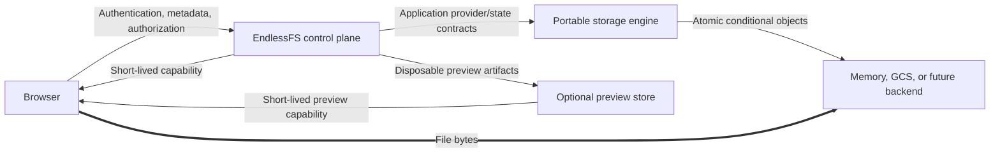

# EndlessFS

EndlessFS is an open-source, provider-neutral, security-first private cloud drive. Its Go control plane authorizes file operations while browser file bytes travel directly to and from the configured object-storage provider through short-lived provider-native capabilities.

> [!IMPORTANT]
> The clarified **v1 specification is provider-portable and multi-replica safe**. One canonical storage engine runs over both the deterministic memory backend and a locally qualified GCS adapter; raw copying its checkpoint-authorized keys and bodies to a conforming backend requires no state migration or logical-version rewrite. This is not a production-storage claim: no live GCS bucket, cloud deployment, or production operations review is part of the deterministic v1 gate.

The normative implementation contract is [docs/v1-specification.md](./docs/v1-specification.md). The credential-free GCS suite models the documented JSON/XML, generation, signing, CORS, checksum, range, resumable-session, cancellation, and failure behavior on loopback. It qualifies the integration layer locally; only the separate opt-in live qualification described by the specification can establish real-service interoperability.

The [v1.1 media browsing and image preview specification](./docs/v1.1-media-preview-specification.md) is implemented over the same portable source engine. Its private content identities are canonical across replicas, raw-copy cutovers, memory, and the locally qualified GCS adapter. It adds an always-available virtualized media grid and full-screen navigation, with optional WebP-only generated image thumbnails behind an independently faultable preview store. Both the deterministic memory store and a durable shared GCS preview bucket use the same provider-neutral store semantics over the existing thin object-store interface. The GCS path is credential-free protocol-qualified; no live cloud validation or deployment is claimed. The [v1.2 video](./docs/v1.2-video-preview-specification.md) and [v1.3 PDF](./docs/v1.3-pdf-preview-specification.md) preview drafts remain deferred for revision; their unchecked acceptance criteria are plans, not current release evidence.

## Why EndlessFS

- Passkey-only, usernameless identity with no password, email identity, or OAuth path.
- Strict logical user isolation and deny-by-default authorization.
- Direct browser-to-provider uploads and provider-to-browser downloads; the control plane does not proxy file bodies.
- One provider-independent canonical format and portable engine, with logical state independent of GCS generations, S3 version IDs, Azure ETags, bucket names, and provider metadata.
- Durable admission, fencing, takeover, operation, and checkpoint protocols for multiple replicas sharing one single- or split-bucket storage set.
- Optional lazy image previews stored independently from originals, with fast WebP variants and file-type icon fallback.
- One Go binary with embedded HTML, application CSS, vanilla JavaScript, and validated theme media.
- Data-only themes: typed tokens and allowlisted static assets, never theme CSS, HTML, JavaScript, or remote code.
- No required SQL database, cache, queue, external identity service, analytics service, or persistent application filesystem.
- Nix as the sole development, build, test, package, and CI/CD interface.

## Architecture



Required dependency direction:

```text
HTTP and embedded UI -> application use cases -> domain + provider/state interfaces
portable engine ------> canonical format + narrow object-store backend interface
backend adapters -----> narrow object-store backend interface
```

Provider object keys never cross the public API. Private operations derive the owner scope from the authenticated session, not from client input.

## Start developing

Install [Nix with flakes enabled](https://nixos.org/download/), then run:

```console
nix develop
nix flake check
export ENDLESSFS_SESSION_SECRET="$(nix run .#generate-secret)"
export ENDLESSFS_BOOTSTRAP_TOKEN="$(nix run .#generate-secret)"
nix run .#dev
```

The development control server listens on `http://127.0.0.1:8080` by default. It also opens a separate ephemeral loopback data-plane listener; upload/download bytes use only that listener. Set `ENDLESSFS_MOCK_PROVIDER_URL=http://127.0.0.1:9090` to select a stable loopback data-plane port for browser testing.

Build the binary, OCI archive, or complete release record without Docker:

```console
nix build
nix build .#container
nix build .#container-images
nix build .#release
nix build .#release-images
```

Theme bundles are reproducible build inputs, never runtime directories. Downstream flakes may build an embedded custom set with:

```nix
endlessfs.packages.${system}.default.override {
  themeBundles = [ ./branding.efstheme ];
}
```

Every supplied archive/directory is validated before generated data is compiled into the binary. See [Theme API 1.1](./docs/theme-api.md).

All required builds and checks are Nix sandbox derivations, so project code cannot quietly depend on tools installed on the host. The required test gates are designed to run without cloud credentials, GCP, databases, persistent services, a container daemon, or non-loopback network access.

## Nix task interface

The v1 spec defines the following interface. Implemented commands are usable now; no command reports success through an empty test selection.

| Command | Current purpose |
|---|---|
| `nix develop` | Enter the pinned Go/Nix development environment. |
| `nix build` | Build the static `endlessfs` binary with embedded browser assets. |
| `nix build .#container` | Build a minimal, shell-free OCI archive. |
| `nix flake check` | Run the authoritative current build, format, lint, test, fuzz, race, security, policy, offline-sandbox, and OCI hardening gates. |
| `nix run .#dev` | Run the loopback-only development control plane. |
| `nix run .#generate-secret` | Generate one canonical 256-bit base64url environment secret. |
| `nix run .#fmt` / `.#fmt-check` | Apply or verify Go and Nix formatting. |
| `nix run .#lint` | Run `actionlint`, `go vet`, and `staticcheck`. |
| `nix run .#test` / `.#test-unit` | Run the current Go suite. |
| `nix run .#test-integration` | Run tests named as integration tests. |
| `nix run .#test-contract` | Run reusable provider and state-store contract suites. |
| `nix run .#test-replica` | Run deterministic multi-replica admission, fencing, takeover, and recovery tests. |
| `nix run .#test-portability` | Run canonical-format, checkpoint, raw-copy/reopen, and continued-mutation tests. |
| `nix run .#provider-verify -- check CONFIG` | Strictly read and verify a closed checkpoint on configured single- or split-backend memory fixtures/GCS buckets. |
| `nix run .#test-preview` | Run focused preview policy, generator, store-contract, and HTTP tests. |
| `nix run .#test-e2e` | Run Go-controlled Chromium passkey and core Drive workflows. Nix supplies Chromium on Linux. |
| `nix run .#test-coverage` | Run the complete suite and enforce 85% repository plus 95% security-boundary statement coverage. |
| `nix run .#test-race` | Run the suite with Go's race detector. |
| `nix run .#test-fuzz` | Run fixed-iteration path, encoding, JSON, cursor, share, capability, WebAuthn, logging, theme, and image-preview decoder fuzz smoke targets. |
| `nix run .#security` | Run pinned static, vulnerability, configuration, dependency, source-policy, and OCI checks. |
| `nix run .#dependency-check` | Verify the locked module inventory and retained dependency licenses. |
| `nix run .#container` | Build the local OCI archive through Nix. |
| `nix run .#theme-check -- PATH` | Validate and resolve a `.efstheme` archive or equivalent directory. |
| `nix run .#theme-preview -- PATH` | Serve the application-owned responsive component/state conformance fixture on loopback. |
| `nix run .#test-theme` | Run theme schema, compiler, inheritance, media, archive, contrast, preference, and HTTP tests. |

The default fuzz smoke campaign executes 1,000 generated inputs per target. Longer fuzz campaigns can set `ENDLESSFS_FUZZTIME`, for example:

```console
ENDLESSFS_FUZZTIME=2m nix run .#test-fuzz
```

## Current configuration

Only settings that have validation and tests are parsed by the current binary:

| Variable | Default | Behavior now |
|---|---:|---|
| `ENDLESSFS_BASE_URL` | Derived in loopback development | Exact HTTP(S) origin; HTTPS is required for public listeners. |
| `ENDLESSFS_LISTEN_ADDR` | `127.0.0.1:8080` | Loopback for HTTP development; non-loopback requires a coherent HTTPS base URL. |
| `ENDLESSFS_STORAGE_PROVIDER` | `mock` | Exact `mock` or `gcs`. The mock is ephemeral; GCS uses ADC and the same portable engine. |
| `ENDLESSFS_MOCK_PROVIDER_URL` | Ephemeral loopback origin | Optional explicit HTTP loopback origin/port for the separate capability data plane. |
| `ENDLESSFS_GCS_FILE_BUCKET` | Unset | Required with `gcs`; private file bucket for immutable blobs and upload staging, also used for state by default. |
| `ENDLESSFS_GCS_STATE_BUCKET` | `ENDLESSFS_GCS_FILE_BUCKET` | Optional private state/metadata bucket. Set it to a distinct bucket for policy/cost isolation or to the file bucket for explicit single-bucket mode. |
| `ENDLESSFS_GCS_PREVIEW_BUCKET` | Unset | Required when `ENDLESSFS_PREVIEW_PROVIDER=gcs`; distinct private bucket for disposable generated-preview artifacts and manifests. |
| `ENDLESSFS_GCS_SIGNING_SERVICE_ACCOUNT` | ADC discovery | Optional lowercase service-account email used by the official client for keyless IAM `signBlob` signed URLs. |
| `ENDLESSFS_WRITER_SET_ID` | Local mock identifier | Stable canonical base64url identifier of at least 128 bits; required with `gcs` and identical across all replicas and provider cutovers. |
| `ALLOW_REGISTRATION` | `false` | Exact `true` or `false`; exposed as non-secret public policy. |
| `INVITE_REGISTRATION` | `true` | Exact `true` or `false`; exposed as non-secret public policy. |
| `ENDLESSFS_BOOTSTRAP_TOKEN` | Unset | Optional canonical 256-bit base64url token; enables only the unused first-admin bootstrap. |
| `ENDLESSFS_SESSION_SECRET` | Required | Canonical 256-bit base64url process secret; never exposed publicly or accepted as an argument. |
| `ENDLESSFS_WEBAUTHN_RP_ID` | Base URL hostname | Must exactly match the configured base URL hostname. |
| `ENDLESSFS_WEBAUTHN_RP_NAME` | `EndlessFS` | Validated authenticator-facing relying-party name. |
| `ENDLESSFS_SESSION_TTL` | `12h` | Positive absolute lifetime, capped at `168h`. |
| `ENDLESSFS_DOWNLOAD_CAPABILITY_TTL` | `60s` | Exact-object download lifetime, capped at `10m`. |
| `ENDLESSFS_UPLOAD_INIT_TTL` | `5m` | Destination-bound upload initiation lifetime, capped at `1h`. |
| `ENDLESSFS_TEXT_PREVIEW_MAX_BYTES` | `1048576` | Maximum validated UTF-8 plain-text preview size, capped at 16 MiB. |
| `ENDLESSFS_DEFAULT_LIGHT_THEME` | `endlessfs-light` | Installed light-appearance theme used by `system`; startup rejects missing/wrong-appearance values. |
| `ENDLESSFS_DEFAULT_DARK_THEME` | `endlessfs-dark` | Installed dark-appearance theme used by `system`; startup rejects missing/wrong-appearance values. |
| `ENDLESSFS_LOG_LEVEL` | `info` | Exact `debug`, `info`, `warn`, or `error`; all levels retain structural secret redaction. |
| `ENDLESSFS_PREVIEW_PROVIDER` | `disabled` | Accepts `disabled`, the loopback-only ephemeral `mock`, or the durable shared `gcs` store. The GCS preview provider requires GCS authoritative storage and a distinct preview bucket. |
| `ENDLESSFS_PREVIEW_AUTOMATIC` | Provider configured | Enables lazy generation for visible eligible image tiles; `false` is manual-only. |
| `ENDLESSFS_PREVIEW_FORMATS` | `image` | Closed packaged capability set. `video`, `pdf`, unknown, duplicate, or unpackaged values fail startup in the image profile. |
| `ENDLESSFS_PREVIEW_AUTO_MAX_AGE` | Unset | Optional positive source-age limit for automatic generation. |
| `ENDLESSFS_PREVIEW_AUTO_MAX_SOURCE_BYTES` | Unset | Optional positive source-size limit for automatic generation. |
| `ENDLESSFS_PREVIEW_RESOLUTIONS` | `256,512,1600` | Strictly increasing maximum-edge WebP variants from 64 through 4096. |
| `ENDLESSFS_PREVIEW_MAX_CONCURRENCY` | `2` | Global generation bound from 1 through 8; per-user generation remains serialized. |
| `ENDLESSFS_PREVIEW_OPERATION_TIMEOUT` | `45s` | Hard generation timeout, capped at 5 minutes. |
| `ENDLESSFS_PREVIEW_STARTUP_TIMEOUT` | `10s` | Generator and preview-store startup validation timeout, capped at 60 seconds. |
| `ENDLESSFS_PREVIEW_KEY_SECRET` | Ephemeral for mock | Canonical 256-bit key for non-revealing artifact bindings; required for `gcs` and identical on every replica sharing the preview bucket. |

Secrets are never accepted as command-line arguments or exposed through the public configuration endpoint. Remove `ENDLESSFS_BOOTSTRAP_TOKEN` after the initial administrator has been created. The current HTTP contract is documented in [docs/http-api.md](./docs/http-api.md).

## Repository map

```text
cmd/endlessfs/           process entry point
internal/config/         environment parsing and validation
internal/auth/           established WebAuthn adapter, sessions, cookies, CSRF, and origin policy
internal/domain/         strict paths, names, IDs, entries, operations, and capabilities
internal/model/          strict versioned persistence records
internal/storageformat/  canonical keys, envelopes, logical versions, writer/gate/operation/checkpoint records
internal/objectstore/    narrow atomic backend contract plus memory and GCS adapters
internal/portable/       provider-independent state/filesystem, admission, fencing, recovery, and checkpoints
internal/provider/       application-facing contracts and legacy deterministic test provider
internal/state/          state contract, strict codec, and concurrency-safe memory CAS store
internal/secret/         redacted bearer-token hashing and validation
internal/httpapi/        router and transport security headers
internal/identity/       bootstrap, registration, accounts, passkeys, invites, roles, and recovery
internal/drive/          authenticated files, transfers, operations, trash, previews, and shares
internal/logging/        structured, level-aware, security-field-redacting JSON logging
internal/preview/        generated-preview policy, static WebP codec, memory/durable stores, contracts, and orchestration
internal/theme/          closed Theme API, compiler, media validation, registry, preferences, and built-ins
internal/web/            embedded HTML, CSS, and vanilla JavaScript
internal/e2e/            Go-controlled Chromium passkey, Drive, responsive, and privacy workflows
tools/check-source/      forbidden dependency/source policy check
tools/generate-secret/   operator-directed 256-bit environment-secret generator
tools/provider-verify/   read-only closed-checkpoint verifier for copied storage sets
tools/theme/             theme validation, generated API inventory, build embedding, and preview fixture
tools/repository-policy/ checked-in GitHub ruleset validator/applier
tools/coverage.awk       repository and security-boundary coverage policy
.tekton/                 xlab Linux PaC CI, publishing, release, and retired Darwin definition
.github/rulesets/        declarative default-branch and release-tag policy
.github/workflows/       temporary Linux bootstrap checks; removed at PaC cutover
docs/                    normative specification and project documentation
AGENTS.md                repository instructions for implementation agents
```

Direct dependency rationale is recorded in [docs/dependencies.md](./docs/dependencies.md). The implemented boundary review is [docs/threat-model.md](./docs/threat-model.md), operational guidance is [docs/operations.md](./docs/operations.md), and the acceptance record is [docs/v1-evidence.md](./docs/v1-evidence.md).

## CI, containers, releases, and branch protection

Tekton Pipelines-as-Code runs the project-owned CI and release lifecycle on the
xlab bare-metal Talos Linux cluster. Active runs use local-NVMe source, Git, and
Nix caches plus generous CPU and memory reservations; they invoke only the
repository's Nix interface for build and test logic. xlab is CI compute only:
these pipelines neither target nor configure the GKE cluster that hosts
`drive.endlessfs.com`.

- `endlessfs-ci-` runs the fast policy check, authoritative Nix gate, and
  host-side Chromium coverage on pull requests and merge-queue refs.
- `endlessfs-container-` publishes `sha-<commit>` and `edge` images after
  merge-queue-verified changes reach `main`.
- `endlessfs-release-` re-verifies `v*.*.*` tags, publishes version and `latest`
  images, and creates a GitHub release containing every Nix-built artifact.
- The short-lived PaC GitHub App installation token used for cloning is reused
  for release creation and asset upload. It is the configured GHCR candidate,
  but the registry path must pass the disposable xlab push proof documented in
  `.tekton/README.md`; App `packages: write` is not claimed as proof by itself.
  Repository administration remains outside ordinary CI.

The former Darwin smoke job is deprecated. Its triggerless PaC definition
cannot start a PipelineRun and contains no Namespace Mac runner reference. The
legacy Linux GitHub workflows remain only for the default-branch-provenance
bootstrap described in [.tekton/README.md](./.tekton/README.md); they are removed
after the PaC required check and package write are proven.

To run the image against Google Cloud Storage, follow the short [GCS container guide](./docs/gcs-container.md).

Repository rules are external GitHub state, so checking in JSON does not activate them by itself. A repository administrator must:

1. Create a short-lived fine-grained token limited to this repository with
   **Administration: write**.
2. Validate the desired state with `nix run .#repository-policy -- check`.
3. Export the token as `GH_TOKEN` and the repository as `GITHUB_REPOSITORY`, then
   run `nix run .#repository-policy -- apply` from a trusted administrator
   checkout. Repeat only after intentionally changing the checked-in JSON.

The policy requires pull requests, resolved review threads, squash-only linear
history, the xlab App-owned `tekton-xlab / endlessfs-ci-` context, and a
one-at-a-time merge queue. Do not apply that context until the safe-cutover proof
in `.tekton/README.md` is complete. While the repository has one maintainer it
requires no separate approval; enable final-push and code-owner approval when a
second maintainer joins. It blocks deletion and force-push of the default branch,
limits `v*.*.*` tag creation to the current release maintainer, and prevents
release-tag mutation or deletion.

## Delivery roadmap

- **Milestone 0 — implemented baseline:** reproducible skeleton, binary, embedded shell, Nix checks, OCI, CI and repository policy.
- **Milestone 1 — implemented baseline:** typed domain, strict paths, state CAS, provider contracts, capability-aware local data plane, and deterministic faults.
- **Milestone 2 — implemented baseline:** WebAuthn, sessions, CSRF/origin policy, bootstrap, registration matrix, invites, roles, and recovery.
- **Milestone 3 — implemented baseline:** browse and file operations, direct resumable transfers, idempotency, trash, previews, and sharing control plane.
- **Milestone 4 — implemented baseline:** closed Theme API, safe media validation, complete light/dark bundles, inheritance, fallback, preferences, and Nix tooling.
- **Milestone 5 — implemented baseline:** accessible browser drive, confirmed-offset transfers, previews, trash, theme UX, and real Chromium coverage.
- **Milestone 6 — implemented baseline:** public-share management, invite onboarding, profile/passkey settings, account administration, disable/enable behavior, recovery, and a second full Chromium journey.
- **Milestone 7 — implemented baseline:** exhaustive cross-user and traversal matrices, fuzz/race/coverage gates, structured-log redaction, dependency/vulnerability policy, OCI inspection, threat/operations review, and release evidence.
- **v1 portability clarification — implemented:** canonical single-/split-bucket storage-set format, one portable engine, multi-replica admission/fencing/recovery, quiescent checkpoint/raw-copy verification, and credential-free GCS protocol qualification.
- **v1.1 media previews — complete:** always-available virtualized grid and viewer, optional generated image WebP variants, independent preview-store lifecycle, strict startup validation, and real-browser scale proof.
- **v1.2/v1.3 — deferred:** video and PDF generator profiles will be revised now that the v1.1 base architecture is implemented.

Every claimed acceptance criterion in specification section 21 is indexed in the evidence record and `nix flake check` remains the clean, network-denied release gate. “Locally qualified GCS” means the documented protocol and shared contracts passed without credentials; it never means a live deployment is production-ready.

## Contributing and security

Read [AGENTS.md](./AGENTS.md) and [CONTRIBUTING.md](./CONTRIBUTING.md) before making a change. Security reports should follow [SECURITY.md](./SECURITY.md), not a public issue.

EndlessFS is licensed under [Apache-2.0](./LICENSE).
