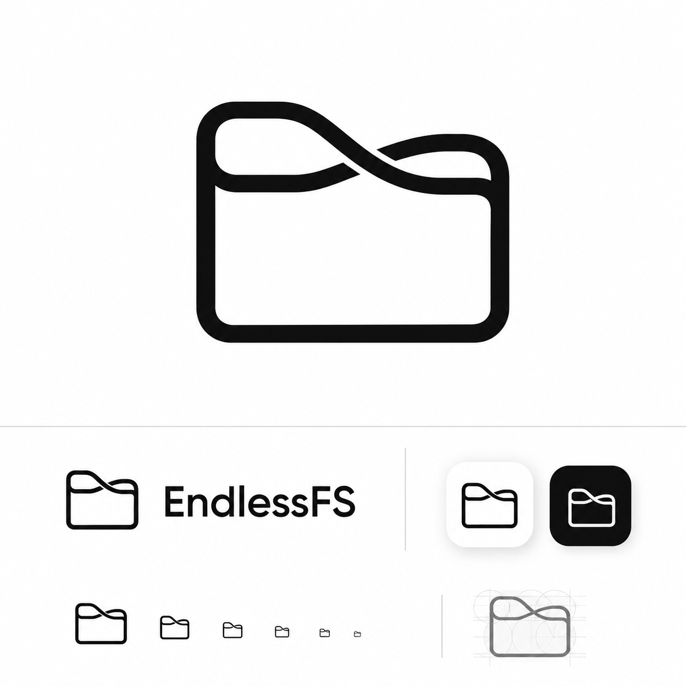
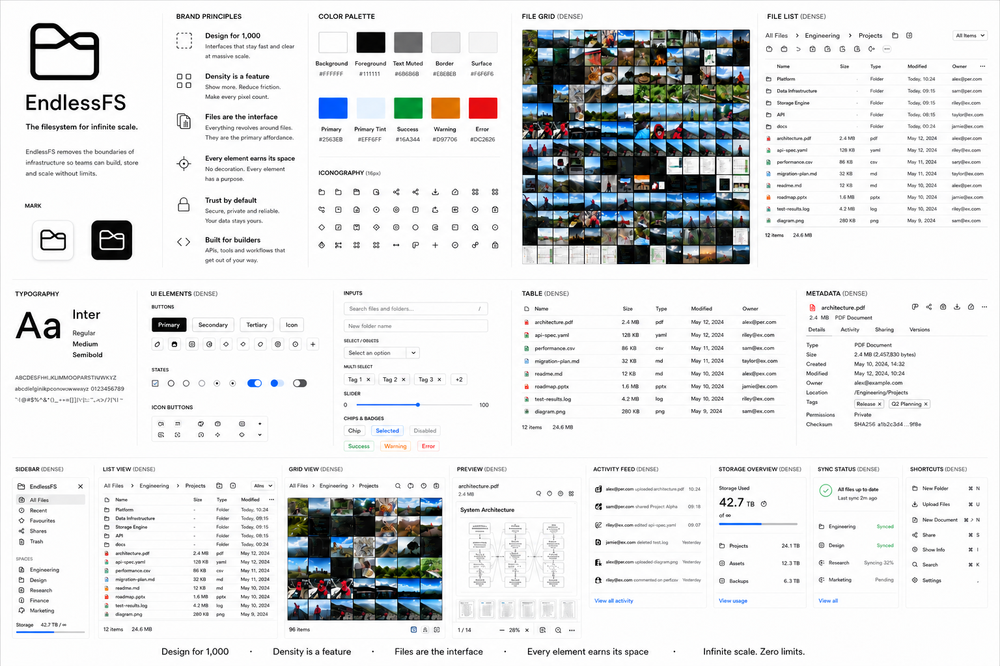

# EndlessFS Brand Guidelines

> **Core idea:** EndlessFS is a precise, private, dependable filesystem tool designed to disappear behind the user's files.

## Brand identity

EndlessFS is an open-source, provider-neutral, security-first private cloud drive. Its product identity should feel less like a cloud-storage dashboard and more like a **precision filesystem instrument**: fast, quiet, dense, predictable, private, and dependable.

The brand is intentionally understated. EndlessFS must not compete visually with the files it manages. Identity comes from consistency, restraint, precision, density, and the Infinite Folder mark rather than decorative UI.

### Brand pillars

**Endlessness.** The filesystem feels continuous and unconstrained. Infrastructure, storage providers, devices, views, and interfaces may change; the user's relationship with their files remains coherent.

**Speed.** Everything should feel immediate. Minimize loading, waiting, scrolling, unnecessary interactions, confirmation rituals, and interruption.

**Privacy.** Privacy is architectural rather than cosmetic. The interface reinforces that files belong to the user and remain under their control without repeatedly advertising security features.

**Reliability.** EndlessFS is a precise tool. Behavior is deterministic, state is legible, layout is stable, and actions produce the result the user expects.

**Simplicity.** Remove anything that does not contribute meaningfully to browsing, understanding, or operating on files.

## Design system reference

The following board is the agreed light-mode visual reference. It establishes the intended density, hierarchy, compactness, thumbnail treatment, tables, controls, metadata, navigation, and restrained use of color.

This board is a reference, not a fixed component inventory. Future interfaces should inherit its principles rather than mechanically copying its layouts.

The token values written in this guide are canonical. The board demonstrates visual relationships and component intent; implementations must not sample, infer, or copy palette values from the image. If a board swatch and this guide differ, use this guide.

## Logo

The EndlessFS mark is an **Infinite Folder**: a refined folder silhouette whose upper geometry flows into an asymmetric continuous form suggestive of infinity. It should read as a folder first and reveal the endless motif second.

The mark shown on the logo-system board is approved as the geometry reference. Production work must recreate that mark as a clean, optimized SVG, validate it at favicon and product sizes, and preserve the approved silhouette rather than redesigning it.

- Monochrome by default.
- Geometric, continuous, and restrained.
- Recognizable at favicon scale.
- The off-centre crossover is intentional.
- Use the symbol alone for favicon/app-icon contexts.
- Pair the symbol with `EndlessFS` when product identification is useful.
- Never replace the integrated geometry with a literal infinity symbol added to a conventional folder.
- Avoid gradients, illustrative treatments, decorative effects, and unnecessary brand-color fills.

## Color system

EndlessFS is predominantly monochrome. Color communicates interaction state or semantic meaning, not decoration.

| Token | Value | Purpose |
|---|---:|---|
| Background | `#FFFFFF` | Primary workspace behind content |
| Foreground | `#111111` | Primary text, strong controls, primary actions, ordinary progress |
| Text Muted | `#6B6B6B` | Secondary text and metadata |
| Border | `#E8E8E8` | Dividers, disabled structure, and skeletons |
| Surface | `#F6F6F6` | Hover and quiet surfaces |
| Primary | `#2563EB` | Active, focus, and selected states only |
| Primary Tint | `#EFF6FF` | Selected and active background treatment |
| Success | `#16803A` | Successful semantic states |
| Warning | `#D97706` | Warning semantic states |
| Error | `#D92D20` | Failure and destructive semantic states |

### Color rules

- Token names describe purpose, never their current hue or appearance.
- Themes may change a token's value without changing its name or meaning.
- Components consume semantic tokens only; do not embed raw values or hue-named aliases in component rules.
- The application should be governed by Background, Foreground, Text Muted, Border, and Surface at first glance.
- Primary is an interaction-state role, not a decorative brand field.
- Primary actions use Foreground; secondary actions use Surface or Background.
- Links use typography and interaction treatment rather than a browser-default color.
- Normal progress bars use Foreground.
- Success, Warning, and Error are strictly semantic.
- Avoid persistent Success decoration for routine operations.
- Avoid large decorative color fields that compete with file content.

## Typography and iconography

Use neutral, highly legible typography suitable for dense information display. The selected family is **Inter v4.0**, pinned to upstream commit `2ce9119398be143fa289c3e180824db1b7ed803e`, under the SIL Open Font License 1.1. Production uses embedded WOFF2 assets for Regular 400, Medium 500, and Semibold 600 only. Record the exact asset digests and license in the repository inventory; never fetch fonts at runtime.

- Prefer compact line heights appropriate to tools rather than editorial layouts.
- Use weight and alignment before boxes, fills, or extra spacing.
- Keep secondary metadata readable but subordinate.
- Avoid oversized headings inside operational UI.
- Remove trivial or implied text.
- Icons are simple, geometric, consistent, and generally based on a compact 16 px system.
- Prefer recognizable icons over icon-plus-label duplication when meaning is unambiguous.
- Avoid decorative iconography.

## Product and UI principles

### 1. Files are the interface
Browsing and operating on files is the product. Chrome exists only to facilitate that work and must never compete with file content. The application is not a dashboard surrounding a file browser; **the file browser is the application**.

### 2. One predictable mental model
Presentation may change across views, devices, and future interfaces, but navigation, selection, actions, and state behave consistently. Learning EndlessFS once should mean understanding it everywhere. Do not encode the product around a fixed number of views.

### 3. Density is a feature
EndlessFS maximizes useful information per pixel. Components use the **minimum padding and spacing required for legibility, interaction, and accessibility**, not conventional SaaS spaciousness. Dense tables, grids, menus, queues, sheets, toolbars, and controls are the default. Components must never be expanded merely to fill available space.

### 4. No redundant space
Padding must have a specific functional purpose. Avoid containers inside padded containers, decorative whitespace, oversized cards, repeated margins, and large empty states when a compact state works. Content needing no supporting information may run edge-to-edge. Image/media grids should contain only the visual content or file-type representation, with effectively zero decorative padding, captions, or card chrome. Establish grouping through alignment, typography, subtle dividers, shared geometry, or state before adding space.

### 5. Every element earns its space
Every persistent element must justify the pixels it occupies. Remove trivial instructions, redundant labels, implied information, unnecessary containers, decorative copy, and irrelevant controls. Simplicity is achieved through subtraction, not by making fewer components larger.

### 6. Design for 1,000
Every container and interaction must answer: **how would this remain understandable and efficient if its contents became disproportionately large?** “1,000” communicates a way of thinking, not a universal fixture size, rendering requirement, or acceptance threshold. Choose virtualization, aggregation, grouping, filtering, bounded concurrency, progressive detail, or summary-plus-exception presentation according to the container. Large directories must remain comfortable to navigate, large transfer sets comfortable to monitor, and large selections comfortable to operate on and remediate without exposing every item at equal detail.

### 7. Zero layout shift
Interface geometry is deterministic. Loading, thumbnails, metadata, errors, progress, and asynchronous state changes must not unexpectedly move surrounding UI. Reserve geometry before content arrives.

### 8. Continuity over loading
Preserve interaction while work happens. Prefer virtualization, progressive rendering, stable placeholders, background work, and incremental availability over blocking states. Huge libraries should feel continuous rather than artificially paginated.

### 9. Actions just work
Routine actions execute immediately when intent is clear. Avoid unnecessary confirmation dialogs, intermediate screens, and ceremony. The shortest safe path is the default.

### 10. Reversibility over confirmation
Use reversibility as the safety mechanism for routine reversible operations. Deleting moves a file directly to the application Trash; a brief toast provides **Undo**. Application Trash has no automatic retention deadline: an item remains visible there until restore, permanent deletion, or empty Trash. A storage backend may separately retain physically deleted objects under its configured provider-native soft-delete or retention policy, such as 30 days. That infrastructure policy is not application Trash, is not portable, and must not be presented as an EndlessFS restore guarantee. Reserve confirmation for genuinely irreversible or unusually consequential application actions.

### 11. Feedback without interruption
Toasts briefly confirm outcomes and disappear quickly. Routine success feedback should not require acknowledgement or remain persistent.

### 12. Floating UI stays out of the way
Toasts, menus, queues, popovers, and transient controls must not cover the current selection, focused element, primary actions, or failure remediation. Placement responds predictably to reserved safe regions and viewport edges. Transient surfaces collapse, reposition, or disappear when their purpose is complete, and return focus to a deterministic location.

### 13. Use available surfaces
Do not create dedicated interface regions when an existing surface naturally supports the interaction. The usable file container is the upload drop zone; no permanent upload drop area should consume screen space.

### 14. Secondary UI preserves context
On larger screens use side sheets for substantial secondary information and workflows so file context remains visible. On smaller screens use full-screen secondary surfaces. Avoid cramped centered popup modals for workflows that need meaningful space.

### 15. Transient workflows stay transient
Upload queues, progress, transfer failures, and similar operational UI appear when relevant, remain compact, scale to many operations, are easy to hide/show, and make failures easy to remediate.

### 16. Interaction cost must be justified
Every click, tap, confirmation, dismissal, transition, pointer movement, and interruption has a cost. Introduce interactions only when they materially improve safety, understanding, or control.

### 17. Motion communicates state
Motion exists to communicate state, preserve spatial understanding, or make response feel immediate and elegant. Input response is never delayed for animation. Motion uses reserved geometry and must never cause layout shift, reorder content unexpectedly, obscure state, or change the deterministic outcome of an interaction. Reduced-motion preferences remove non-essential transitions without hiding state.

### 18. Visual restraint creates clarity
Use plain Background surfaces, Foreground typography, restrained neutral structure, minimal borders, and minimal decoration. Avoid excessive cards, shadows, gradients, rounded containers, and layered surfaces.

### 19. The interface is a precision tool
EndlessFS should feel dependable, fast, quiet, and exact: an instrument for working with files rather than an experience demanding attention for itself.

## File presentation

### Dense row views
- Keep row height compact.
- Avoid card treatment around individual rows.
- Use columns for metadata when space permits.
- Do not repeat information established by context.
- Keep headers compact and stable.
- Keep column widths and numeric alignment stable while data loads or updates.
- Truncate long values predictably and expose the complete accessible value without increasing every row's height.
- Reorganize or remove secondary columns at narrow widths; preserve item identity, primary metadata, selection, and common actions.
- Make selection immediately legible without increasing row height.
- Virtualize large directories or use equivalent techniques.

Responsive layouts may rearrange metadata, but behavior remains consistent.

### Thumbnail and media grids
- Thumbnails sit directly beside one another.
- No filename captions by default.
- No individual card containers.
- No decorative padding.
- No persistent metadata underneath thumbnails.
- Gaps should be zero or as close to zero as implementation requires.
- Preserve stable tile geometry.
- Non-previewable file types use a deterministic file-type representation with a compact semantic icon and short type/extension cue; they never appear as broken images or indefinite loading placeholders.
- Selection states overlay or minimally alter the tile rather than creating surrounding chrome.
- The grid virtualizes and scrolls continuously through very large libraries.

The reference behavior is closer to a dense photo library/contact sheet than a conventional card grid.

## Selection, focus, and active states

Use Primary for strong active, focus, and selected states and Primary Tint for quiet selected and active surfaces. Focus must remain accessible, selection must not create layout shift, and Primary must not be diluted through unrelated decoration. Selection patterns must scale from one item to thousands. The theme assigns their concrete values.

## Buttons and controls

- Primary actions: Foreground with a high-contrast label.
- Secondary actions: Surface or transparent treatment with restrained structure.
- Keep controls compact.
- Never inflate controls to fill containers.
- Use icon-only controls when meaning is established and accessible naming exists.
- Avoid excessive borders around groups.
- Keep toolbars dense and aligned with the content they operate on.
- Disabled controls recede without disappearing.
- Hover, focus, selected, and active states remain distinct but restrained.

## Tables and metadata

Tables should behave like professional file-management tools rather than spacious web cards.

- Tight row heights and minimal horizontal padding.
- Stable columns and consistent numeric alignment.
- Text Muted for secondary metadata.
- Borders only where they improve scanning.
- Prefer subtle row states to boxing every row.
- Remove/reorganize columns responsively without changing underlying behavior.
- Metadata side sheets use width efficiently; do not turn every property into a large card or form row.

## Uploads and transfers

Uploading is a natural file operation, not a separate feature.

- The file browsing surface acts as the drop target.
- Do not reserve permanent space for a drop zone.
- Transfer queues are compact, collapsible, scalable, and easy to remediate.
- Large queues aggregate routine completed work, keep active work visible, and surface failures without requiring every transfer to remain expanded.
- Queue rendering and update work remain bounded as the transfer set grows.
- Progress uses Foreground by default.
- Errors use Error only where intervention is required.
- Successful completion resolves into normal file state rather than persistent Success UI.
- Failed items are obvious without expanding every successful item.

## Loading and performance perception

- Never block the entire interface when only part is loading.
- Maintain stable geometry.
- Prefer immediate navigation with progressive population.
- Virtualize large collections.
- Avoid spinners that replace entire working surfaces.
- Use a spinner only for a compact action whose geometry is already reserved; never use one as an indefinite substitute for a directory, grid, table, or sheet.
- Keep loaded files interactive while additional content arrives.
- Avoid manual pagination when continuous virtualized browsing is practical.
- Loading UI occupies the same geometry as the content it replaces.

## Responsive behavior

Responsive design changes presentation, not the mental model.

- Landscape layouts can expose more columns and denser metadata.
- Portrait layouts increase row depth only as necessary for useful information and touch usability.
- Large screens favor side sheets.
- Small screens favor full-screen secondary surfaces.
- Controls may collapse into menus when necessary, but common actions stay visible or at most one menu level deep.
- A change in orientation preserves location, selection, active work, focus intent, and scroll context without reordering data.
- Narrow layouts must not introduce horizontal page scrolling; tables and toolbars reorganize within the available width.
- Density remains a principle on small screens; responsiveness is not permission for unnecessary padding.

## Accessibility

Density must not compromise operability.

- Maintain visible accessible focus.
- Preserve sufficient contrast.
- Give icon-only controls accessible names.
- Touch targets may use invisible hit areas larger than visible geometry, allowing visual density without reducing usability.
- Keyboard navigation is first-class for browsing, selection, menus, sheets, and actions.
- Respect reduced-motion preferences.
- Never rely on color alone for semantic state.

Solve accessibility structurally rather than making the whole visual system oversized.

## Interface text

EndlessFS is a tool, not a prose surface.

- Do not place descriptive, promotional, conversational, or explanatory paragraphs in the operational interface.
- Limit visible text to concise labels, verbs, names, values, counts, status, and the shortest useful recovery instruction.
- Prefer an established icon with an accessible name when its meaning is unambiguous.
- Errors identify the failed action and available recovery using the fewest clear words.
- Toasts state outcomes or the available Undo action succinctly.
- Accessible names, relationships, and live status remain complete even when visible text is minimal.
- Do not expose privacy or architecture claims as interface copy; privacy is enforced by behavior.

## Anti-patterns

Do not introduce:

- spacious SaaS dashboards;
- cards nested inside cards;
- large rounded containers around routine content;
- decorative gradients or excessive shadows;
- permanent upload drop zones;
- filename captions under every image thumbnail;
- confirmation dialogs for reversible routine actions;
- persistent success banners;
- large empty-state illustrations;
- UI expanded merely to occupy available space;
- pagination where continuous virtualized browsing is practical;
- instructional, promotional, or conversational prose;
- Primary treatment without interaction-state meaning;
- loading transitions that reflow the page;
- modal dialogs that unnecessarily hide file context;
- separate surfaces for interactions that naturally belong to the file browser.

## Product foundation

The visual identity reflects the architecture: provider-neutral storage, strict logical isolation, direct browser-to-provider file transfer, portable canonical storage semantics, multi-replica safety, passkey-only identity, independently faultable previews, and minimal required infrastructure.

These implementation characteristics should inform the product's feeling of **endlessness, speed, privacy, reliability, and simplicity** without turning the interface into a technical architecture diagram.

---

**EndlessFS:** files first; dense by design; predictable at scale.
