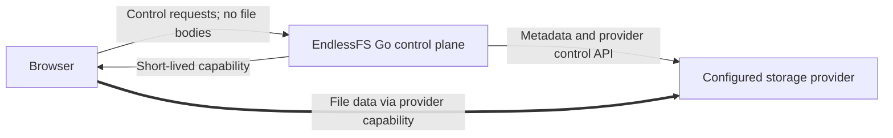
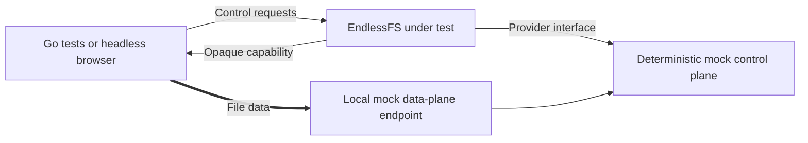
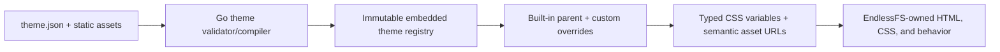

# EndlessFS v1 Specification

**Status:** Implementation specification  
**Audience:** Implementation agents, maintainers, reviewers, and security testers  
**Normative language:** “MUST”, “MUST NOT”, “SHOULD”, and “MAY” are requirements terms.  
**Target:** A feature-complete, locally reproducible v1 that requires no deployment, cloud account, GCP project, GCS bucket, cloud credential, or network access to build and verify.

---

## 1. Executive contract

EndlessFS is an open-source, provider-agnostic, security-first, private, self-hostable cloud drive. It provides a fast browser interface over cloud object storage while separating the application control plane from the file data plane.

The central architectural rule is:

> EndlessFS authorizes and coordinates file operations; in a real provider deployment, file bytes travel directly between the browser and the storage provider through short-lived, provider-native capabilities.

EndlessFS v1 MUST deliver the complete user-facing and control-plane behavior described in this document against deterministic local provider implementations. All v1 acceptance tests MUST run locally without real GCP integration. Google Cloud Storage (GCS) is the first intended production provider and informs the capability model, but a live GCS adapter, real bucket, GCP credentials, and any deployment are explicitly outside the v1 completion gate.

This distinction is deliberate:

- **v1 feature complete** means the domain model, security boundaries, API, browser UI, transfer protocol, provider contracts, and all specified workflows pass deterministic local tests.
- **v1 does not claim production-provider validation.** Local mocks prove conformance to the EndlessFS contracts, not interoperability with GCS.
- A future GCS adapter MUST pass the same provider contract suite and separate opt-in live integration tests before it can be called production-ready.

### 1.1 Non-negotiable constraints

- Go is the only application language and server-side toolchain.
- Nix is the sole build, development, test, packaging, and CI/CD tooling framework.
- The browser client uses embedded HTML, CSS, and minimal vanilla JavaScript.
- Themes are data-only bundles containing a typed manifest and validated static assets. Theme-supplied CSS, HTML, JavaScript, templates, or executable expressions are prohibited.
- EndlessFS ships immutable, complete light and dark theme bundles. Custom themes inherit from one of them so missing or newly introduced visual assets always have a safe fallback.
- Node.js, npm, pnpm, Yarn, frontend frameworks, CSS frameworks, Python, Ruby, Java, Make, Taskfile, and language-independent task runners MUST NOT be required.
- No SQL database, Redis, cache service, queue, persistent volume, external identity provider, OAuth provider, email service, analytics service, CDN, or other external runtime infrastructure is allowed.
- Authentication uses WebAuthn/passkeys only. There are no passwords, OAuth flows, or email identities.
- The user profile contains only `userID` and `displayName`. Email addresses MUST NOT be requested, inferred, transmitted as identity, or stored.
- `ALLOW_REGISTRATION` and `INVITE_REGISTRATION` are independent v1 controls. Invite links and secure first-admin bootstrap are required in v1.
- Browser-direct provider-native upload and download capabilities are a core contract, not an optional optimization.
- Every provider implementation MUST have deterministic test doubles and MUST pass shared provider contract tests.
- Development follows red → green → refactor. Security-sensitive behavior requires positive and negative tests.

---

## 2. Product goals and success definition

### 2.1 Goals

EndlessFS v1 MUST provide:

1. A private multi-user drive with strict logical user isolation.
2. Secure passkey-only registration and authentication.
3. Secure bootstrap of exactly one initial administrator.
4. Public and invite registration policies controlled independently by environment variables.
5. A polished browser experience for browsing and managing files and folders.
6. Direct, resumable, concurrent browser-to-provider uploads through provider capabilities.
7. Direct provider-to-browser downloads through short-lived capabilities.
8. Trash, restore, sharing, previews, and basic administration.
9. A provider-neutral application core with no GCS types or object keys crossing into domain or HTTP APIs.
10. A deterministic local implementation proving the complete product without cloud resources.
11. A single Go binary with embedded frontend assets and no external production runtime dependencies other than a configured storage provider.
12. Reproducible development and CI entry points defined entirely by Nix.
13. User-selectable light, dark, and operator-supplied data-only themes without allowing theme code to change application behavior.

### 2.2 Product statement

> EndlessFS is a private, open-source, self-hostable cloud drive whose Go control plane uses passkeys for identity and short-lived storage capabilities for direct browser transfers. Its functionality is visually unopinionated through safe data-only themes, and it adds no required database, cache, queue, identity provider, or persistent application filesystem.

### 2.3 v1 completion boundary

The implementation is v1 complete only when:

- every acceptance criterion in section 21 passes;
- every required checkbox in section 22 is checked with test or review evidence;
- `nix flake check` succeeds from a clean checkout without cloud credentials;
- the full required suite succeeds with outbound network access denied;
- no real provider or deployment is needed for any required check; and
- the limitations in this specification are documented without presenting the local mock as production storage.

---

## 3. Scope

### 3.1 Required end-user functionality

#### Identity and accounts

- Usernameless passkey sign-in using discoverable WebAuthn credentials.
- Passkey registration with user verification required.
- Multiple passkeys per account.
- Passkey listing, naming, and removal; the final passkey cannot be removed through self-service.
- Sign-out and revocation of the current session.
- No password, email, username, OAuth, or social-login path.
- A profile consisting strictly of:

  ```text
  userID       cryptographically random 128-bit or 256-bit identifier
  displayName  user-supplied display value
  ```
- Self-service display-name update; changing it has no authentication or authorization effect.

#### Registration and administration

- One-time, concurrency-safe bootstrap of the first administrator.
- Independent support for all four combinations of `ALLOW_REGISTRATION` and `INVITE_REGISTRATION`.
- Admin-created bearer invite links with hashed-at-rest tokens.
- Single-use invites by default, optional expiry, listing, and revocation.
- Registration from an invite using only a display name and passkey.
- Admin user listing using only opaque user IDs, display names, separate role membership, and account status.
- Admin account disable/enable.
- Admin-generated, single-use account-recovery links that allow a user who lost all passkeys to register a new passkey. Recovery MUST NOT reveal or replace the user ID and MUST revoke existing sessions when completed.
- Admin role grant/revoke, while preventing removal or disablement of the final enabled administrator.

#### Files and folders

- Browse a root and nested folders.
- Paginated directory listings.
- Current-folder filename filtering.
- Create empty folders.
- Drag-and-drop files.
- Multi-file selection and upload.
- Folder upload where the browser exposes relative paths, with a multi-file fallback.
- Concurrent upload initialization and transfer.
- Resumable uploads, progress, retry, and cancellation.
- Upload conflict handling: fail, replace, or generate a non-conflicting name.
- Single-file direct downloads.
- Multi-selection downloads as separate direct downloads; server-generated ZIP archives are not required.
- Rename, move, copy, trash, restore, and permanent deletion.
- Batch operations on a selection.
- File metadata: name, virtual path, kind, byte size, media type, modification time, and opaque version.
- Basic safe previews for common images, plain text, and PDF.

#### Sharing

- Read-only public bearer links for a file or folder.
- Optional share expiry.
- Share listing and revocation by the owner.
- Public folder browsing limited to the shared subtree.
- Direct-capability downloads from shares.
- No anonymous write, upload, edit, or re-share.

#### Browser experience

- Responsive layout usable on desktop and mobile browsers.
- Familiar list/grid file-browser interactions without imitating a full operating system.
- Keyboard navigation and accessible status/error reporting.
- Upload queue with per-item status and progress.
- Clear empty, loading, offline/error, conflict, expired-link, and access-denied states.
- No externally hosted or runtime-fetched third-party scripts, fonts, images, analytics, or telemetry. Validated embedded theme media is allowed.
- User-selectable installed themes, including the bundled light and dark themes.
- A theme preference that follows the user across devices while remaining separate from the two-field identity profile.
- Safe fallback to an immutable built-in parent if a custom theme or individual override becomes unavailable.

### 3.2 Required operator/developer functionality

- Environment-variable configuration with startup validation.
- Health and readiness endpoints that reveal no secrets.
- Structured logs with secret and path redaction rules.
- One Go binary with embedded frontend assets.
- A locally buildable OCI image; publishing or deployment is not required.
- Deterministic in-memory mocks and a local capability/data-plane mock.
- Nix commands for formatting, linting, testing, fuzz smoke tests, security checks, building, image creation, and local development.
- Nix validation, preview, test, and embedding of operator-supplied data-only theme bundles.

---

## 4. Explicit non-goals

The following are not part of v1:

- A real GCS adapter or live GCS integration testing.
- Creating or configuring a GCP project, bucket, service account, workload identity, IAM binding, CORS policy, domain, TLS certificate, ingress, Kubernetes resource, or production deployment.
- Amazon S3, S3-compatible, Azure Blob, or multi-provider implementations.
- Production durability supplied by the local mock provider.
- Google Drive or Dropbox feature parity.
- Google Docs-style editing, office-suite integration, or real-time collaboration.
- Desktop sync, WebDAV, FUSE, native desktop clients, or native mobile apps.
- Content-addressed deduplication or cross-user deduplication.
- End-to-end or client-side file encryption.
- File version history beyond the opaque version used for concurrency control.
- Full-drive indexed search, document-content search, or OCR.
- Favorites, comments, activity feeds, notification delivery, or email.
- Antivirus scanning, data-loss prevention, media transcoding, thumbnails generated server-side, or archive creation.
- Anonymous uploads, writeable shares, user-to-user collaboration ACLs, teams, or groups.
- Billing, quotas, subscriptions, telemetry, or an EndlessFS-hosted control service.
- Automated account recovery without an administrator.
- Import/export between providers or external mutation reconciliation.
- A guarantee of unlimited storage or bandwidth. Limits remain those of the browser and selected provider.
- Theme-supplied CSS, HTML, JavaScript, Web Components, templates, or application plugins.
- Themes changing semantic structure, control visibility, event behavior, authorization, wording, accessibility relationships, breakpoints, or DOM order.
- Ordinary-user theme upload or runtime administrator theme installation. Custom v1 themes are validated and embedded reproducibly through Nix.

---

## 5. Architecture

### 5.1 Production-target architecture



The EndlessFS control plane authenticates users, validates virtual paths, applies authorization, manages metadata, and creates provider capabilities. It MUST NOT expose provider credentials and MUST NOT accept file bodies through its normal control API.

### 5.2 v1 local verification architecture



For end-to-end tests, the mock data-plane endpoint MUST be distinguishable from the EndlessFS control endpoint by origin or listener. Instrumentation MUST prove that upload and download bodies did not traverse the control-plane handlers. The mock may run in the same test process, but it MUST model a separate trust boundary and capability-bearing request.

### 5.3 Component boundaries

The implementation SHOULD use packages with narrow responsibilities:

```text
cmd/endlessfs           process entry point only
internal/config         environment parsing and validation
internal/domain         IDs, paths, file metadata, policies
internal/auth           WebAuthn ceremonies and sessions
internal/registration   bootstrap, public registration, invites, recovery
internal/admin          role and account administration
internal/files          file/folder use cases and authorization
internal/shares         share lifecycle and public access
internal/trash          trash lifecycle
internal/provider       provider-neutral interfaces and contract suite
internal/provider/mock  deterministic implementations
internal/state          provider-backed application metadata interface
internal/theme          bundle schema, validation, inheritance, asset registry
internal/httpapi        HTTP transport, middleware, problem responses
internal/web            embedded HTML/CSS/vanilla JavaScript
```

These names are guidance, not a required directory layout. The dependency direction is required:

```text
HTTP/UI -> application use cases -> domain + provider/state interfaces
provider implementations -> provider/state interfaces
```

Domain and application packages MUST NOT import GCS SDK packages, mock-provider packages, or HTTP transport packages.

### 5.4 Persistent-state principle

In a future real deployment, the configured storage provider is the authoritative store for both user content and the small amount of EndlessFS metadata. The application container is replaceable and has no required persistent filesystem.

The v1 local mock MAY be in-memory and ephemeral. Temporary directories MAY be used inside tests but are not application dependencies and MUST be created and removed by the test harness. A v1 demo restarting with an empty mock is acceptable; production durability is not claimed until a real provider is implemented and validated.

Built-in and custom v1 theme bundles are build inputs embedded in the Go binary. Only the selected theme ID is persistent user state; no runtime theme directory or persistent application volume is required.

---

## 6. Technology and repository constraints

### 6.1 Allowed technology

- All application, server, test-driver, helper, and generator code MUST be Go.
- Go’s standard library SHOULD be preferred.
- Third-party Go modules MAY be used where they materially improve security or reduce risky complexity, especially for WebAuthn, Unicode normalization, and future provider SDKs.
- Cryptographic protocols MUST use established libraries; custom WebAuthn or cryptographic implementations are prohibited.
- Frontend assets MUST be authored as HTML, CSS, and minimal vanilla JavaScript and embedded with Go’s `embed` package.
- Application CSS is owned by EndlessFS. Themes supply only typed manifest data and static media that the Go theme compiler converts into allowlisted CSS custom-property values and semantic asset mappings.
- Headless browser tests MAY use Chromium supplied by Nix and controlled by a Go library. They MUST NOT require Node.js.
- Nix flakes MUST pin the complete development and CI environment.

### 6.2 Forbidden project dependencies

The repository MUST NOT require or contain project workflows based on:

- `package.json`, npm, pnpm, Yarn, Bun, Deno, or Node.js;
- React, Vue, Angular, Svelte, Preact, HTMX, Tailwind, Bootstrap, or another frontend/CSS framework;
- Python, Ruby, Java, .NET, PHP, Rust, or another application language;
- Makefiles, Taskfiles, Justfiles, or bespoke CI shell pipelines as the public task interface;
- SQL migrations or database schemas;
- Docker Compose or a container runtime for required tests;
- externally hosted runtime assets.
- raw CSS, HTML, JavaScript, template, or executable files inside a theme bundle.

Nix may package normal command-line tools such as Go, a linter, a vulnerability checker, a container builder/scanner, and Chromium. Nix remains the only public orchestration layer.

### 6.3 Dependency policy

- Every Go module and Nix input MUST be locked.
- New dependencies MUST be justified in review by maintenance health, license, security history, and why the standard library is insufficient.
- Direct dependencies SHOULD remain small and auditable.
- Frontend dependencies vendored as prebuilt JavaScript are prohibited.
- Builds MUST be repeatable from `go.sum` and `flake.lock`.
- Generated source or assets MUST have a reproducible Nix command and MUST be committed only if the repository documents why.

---

## 7. Domain rules and security invariants

The following invariants apply in every HTTP handler, background-free use case, mock, and future provider:

1. **Authenticated scope:** every private storage operation derives its owner scope from the authenticated session, never from a client-supplied user ID.
2. **No raw provider keys:** HTTP requests and responses never accept or expose provider object keys. Provider capability URLs are the only intentional provider-specific values returned to a browser.
3. **Reserved metadata:** application metadata is outside all user-visible namespaces and cannot be listed, previewed, shared, moved, copied, trashed, or downloaded through file APIs.
4. **Path construction:** a client supplies only a validated virtual path. The server combines it with an internal `userID` and area.
5. **Deny by default:** an operation without an explicit policy decision fails closed.
6. **Bearer capability handling:** invite, recovery, share, session, and provider-capability tokens are secrets and are never written to normal logs or stored in plaintext.
7. **No identity inference:** display names are presentation only, need not be unique, and never participate in authentication or authorization.
8. **No email:** request DTOs, persisted schemas, UI labels, logs, fixtures, and tests MUST NOT model email as user identity.
9. **One-time actions:** bootstrap, invite consumption, recovery consumption, and WebAuthn challenges use atomic create/compare-and-swap operations so concurrent replays yield at most one success.
10. **Private-by-default files:** provider objects remain private; access is mediated by short-lived capabilities.
11. **Control-plane body limit:** control endpoints reject unexpectedly large bodies and never expose a generic file-proxy route.
12. **Time and randomness:** security-sensitive time and randomness use injected interfaces in tests and cryptographically secure system sources in normal operation.
13. **Data-only themes:** theme inputs are parsed against a closed typed schema, never interpreted as markup or code, and cannot add network origins or arbitrary CSS declarations.
14. **Theme fallback:** every custom theme resolves through an immutable complete built-in parent before it can be selected.

### 7.1 Virtual path rules

A `UserPath` is a provider-independent absolute virtual path.

- Root is `/`.
- Separator is `/`.
- Input MUST be valid UTF-8 and normalized to Unicode NFC before comparison or persistence.
- Each segment MUST be 1–255 UTF-8 bytes after normalization.
- The full normalized path MUST be at most 4096 UTF-8 bytes.
- NUL, ASCII control characters, `/`, and `\` are forbidden inside a segment.
- `.` and `..` segments are forbidden rather than resolved.
- Empty segments, repeated separators, and trailing separators are rejected except for root.
- The reserved top-level names `.endlessfs` and `.trash` are rejected case-insensitively.
- Paths are case-sensitive after normalization.
- Percent-decoding occurs exactly once at the HTTP boundary before validation.
- Validation MUST be applied identically to list, stat, upload, download, preview, create, move, copy, delete, trash, restore, and share paths.

Path conflict behavior is explicit; the server MUST NOT silently overwrite an existing item unless the caller chose `replace` and passed the required current version where applicable.

### 7.2 Display names and credential labels

- Display names are valid UTF-8 normalized to NFC, trimmed at both ends, 1–100 Unicode code points, and at most 256 UTF-8 bytes.
- NUL, control characters, and line/paragraph separators are rejected.
- Display names are not unique and never select an account.
- Optional passkey labels follow the same rules with a 64-code-point limit.
- Both values are always rendered as text and safely encoded in logs and JSON.

---

## 8. Provider and state interfaces

Exact package names may differ, but the semantic separation and behavior in this section are normative.

### 8.1 Core types

```go
type UserID string

type Area uint8
const (
    AreaLive Area = iota + 1
    AreaTrash
)

type Scope struct {
    UserID UserID
    Area   Area
}

// UserPath can only be constructed by the validated parser.
type UserPath struct { /* unexported normalized segments */ }

type EntryKind string
const (
    EntryFile      EntryKind = "file"
    EntryDirectory EntryKind = "directory"
)

type Entry struct {
    Path         UserPath
    Name         string
    Kind         EntryKind
    Size         int64
    MediaType    string
    ModifiedAt   time.Time
    Version      string // opaque provider-independent concurrency token
}
```

Only trusted application code may create a `Scope`. Provider implementations receive a scope and a validated path, not a concatenated key from HTTP input.

### 8.2 Storage provider interface

```go
type StorageProvider interface {
    List(ctx context.Context, scope Scope, req ListRequest) (ListPage, error)
    Stat(ctx context.Context, scope Scope, path UserPath) (Entry, error)
    CreateDirectory(ctx context.Context, scope Scope, req CreateDirectoryRequest) (Entry, error)

    CreateUpload(ctx context.Context, scope Scope, req CreateUploadRequest) (UploadCapability, error)
    CompleteUpload(ctx context.Context, scope Scope, req CompleteUploadRequest) (Entry, error)
    AbortUpload(ctx context.Context, scope Scope, uploadID UploadID) error
    CreateDownload(ctx context.Context, scope Scope, req CreateDownloadRequest) (DownloadCapability, error)

    Copy(ctx context.Context, from Scope, to Scope, req CopyRequest) (Operation, error)
    Move(ctx context.Context, from Scope, to Scope, req MoveRequest) (Operation, error)
    Delete(ctx context.Context, scope Scope, req DeleteRequest) (Operation, error)
    GetOperation(ctx context.Context, userID UserID, operationID OperationID) (Operation, error)
}
```

Required semantics:

- `List` is one directory only, stable within a page sequence, paginated with an opaque cursor, and never leaks another scope.
- `Stat` returns `ErrNotFound` for missing entries without leaking whether an out-of-scope provider key exists.
- `CreateDirectory` supports empty directories independent of how a provider represents them.
- `CreateUpload` binds a capability to one authenticated scope, one destination path, declared size, safe media type, and expiration.
- `CompleteUpload` verifies that the uploaded object matches the initiated destination and declared constraints before making it visible as complete.
- `CreateDownload` binds the capability to a single authorized object/version and disposition.
- `Copy` and `Move` receive trusted source and destination scopes created by the application. Provider implementations reject differing user IDs; v1 permits area transitions only for the application’s live↔trash workflows.
- `Copy`, `Move`, and `Delete` work for files and directory trees and are idempotent when the same idempotency key is reused.
- Long operations MAY be asynchronous. `Operation` exposes `pending`, `running`, `succeeded`, or `failed` and a stable error, but never provider internals.
- Conflict modes are `fail`, `replace`, and `rename`. `fail` is the default.
- Cancellation and partial failure MUST leave a diagnosable operation record. A failed operation MUST not report success for a partially completed tree.
- Provider errors map to a small domain taxonomy: invalid, unauthenticated, unauthorized, not found, conflict, precondition failed, rate limited, unavailable, and internal.

### 8.3 Capability model

```go
type UploadProtocol string
const (
    UploadSingle    UploadProtocol = "single"
    UploadResumable UploadProtocol = "resumable"
)

type UploadCapability struct {
    UploadID   UploadID
    Protocol   UploadProtocol
    URL        string
    Method     string
    Headers    map[string]string
    ExpiresAt  time.Time
    ChunkRules *ChunkRules
}

type DownloadCapability struct {
    URL       string
    Method    string
    Headers   map[string]string
    ExpiresAt time.Time
}
```

- Capability URLs and headers are bearer secrets.
- They MUST be scoped to the minimum action and shortest practical lifetime.
- Download capabilities default to 60 seconds and MUST NOT exceed 10 minutes.
- Upload-initiation capabilities default to 5 minutes. A resumable session MAY remain valid for a bounded provider-supported duration required to complete a large transfer; its leakage risk MUST be documented and it MUST remain restricted to one destination.
- API responses containing capabilities MUST use `Cache-Control: no-store`.
- Capability values MUST be redacted from logs, metrics, traces, error messages, and referrers.
- The browser MUST send only the returned method and allowlisted headers to the returned URL.
- A capability MUST NOT grant list, overwrite-other-object, metadata-namespace, or cross-user access.

### 8.4 Application state store

Small application records are stored through a separate provider-neutral interface:

```go
type StateStore interface {
    Get(context.Context, StateKey) (StateValue, error)
    List(context.Context, StatePrefix, PageRequest) (StatePage, error)
    Create(context.Context, StateKey, []byte) (Version, error)
    CompareAndSwap(context.Context, StateKey, Version, []byte) (Version, error)
    Delete(context.Context, StateKey, Version) error
}
```

- `Create` succeeds only when the key is absent.
- `CompareAndSwap` and `Delete` succeed only for the supplied current version.
- These primitives MUST be sufficient to implement single-use token consumption and final-admin invariants without SQL transactions.
- Records use versioned JSON with strict decoding, size limits, and unknown-field rejection.
- State keys are constructed only from trusted fixed prefixes and encoded opaque IDs.
- State values MUST never contain plaintext bearer tokens.
- The storage provider and state store MAY be implemented by one real provider, but their interfaces and authorization surfaces remain separate.

### 8.5 Shared contract suites

Every implementation MUST pass reusable tests covering:

- file and directory CRUD;
- empty folders;
- pagination and cursor rejection;
- path boundary behavior;
- conflict and version preconditions;
- upload create/complete/abort;
- resumable offset, retry, and completion behavior;
- capability expiry and scope;
- direct downloads and range requests;
- recursive copy, move, delete, trash, and restore prerequisites;
- idempotency;
- injected faults and retry classification;
- concurrency;
- cross-scope isolation; and
- state-store create/CAS/delete races.

The contract suite, not a provider-specific test suite, defines EndlessFS semantics.

### 8.6 Deterministic local mocks

v1 MUST include:

1. **In-memory storage and state implementations** for fast unit, integration, race, and contract tests.
2. **A capability-aware local data-plane mock** for HTTP and browser end-to-end tests.
3. **Fault injection** for expiry, not-found, conflict, partial operation failure, rate limiting, transient unavailability, checksum mismatch, interrupted upload, and stale version.
4. **Controllable time, randomness, IDs, and ordering** so tests are deterministic.
5. **Instrumentation** that records control-plane calls and data-plane byte counts without recording secrets or content.
6. **Large-object simulation** using logical sizes and resumable offsets without allocating multi-gigabyte files.

Mocks MUST enforce the same authorization and capability constraints expected of a real provider. A permissive map that bypasses expiry, scope, versions, or resumability is insufficient.

---

## 9. Internal storage layout and data model

The following layout is conceptual and provider-neutral. It MUST NOT appear in public APIs.

```text
.endlessfs/v1/
  bootstrap/state.json
  users/<userID>/profile.json
  accounts/<userID>.json
  credentials/<credentialIDHash>.json
  roles/admins.json
  sessions/<sessionTokenHash>.json
  ceremonies/<ceremonyIDHash>.json
  invites/<inviteTokenHash>.json
  recoveries/<recoveryTokenHash>.json
  shares/<shareTokenHash>.json
  trash/<userID>/<trashID>.json
  uploads/<userID>/<uploadID>.json
  operations/<userID>/<operationID>.json
  idempotency/<userID>/<keyHash>.json
  preferences/<userID>/theme.json

files/<userID>/live/...
files/<userID>/trash/<trashID>/...
```

Provider implementations may map this differently, but MUST preserve equivalent isolation and atomicity.

### 9.1 User profile

The profile record contains exactly:

```json
{
  "userID": "base64url-random-identifier",
  "displayName": "User supplied name"
}
```

No email, login name, avatar URL, external identity, phone number, or provider subject exists in this model. Operational properties such as enabled/disabled state and administrator membership are separate records.

### 9.2 Account record

```text
schemaVersion
userID
status              enabled | disabled
createdAt
updatedAt
```

### 9.3 WebAuthn credential record

```text
schemaVersion
credentialID
userID
publicKey
signCount
transports          optional WebAuthn transport hints
backupEligible      when supplied by the WebAuthn library
backupState         when supplied by the WebAuthn library
label               optional user-supplied device label
createdAt
lastUsedAt
```

Attestation defaults to `none`. Only metadata required for correct WebAuthn verification and credential management is stored. Credential IDs are indexed by a non-reversible filename-safe hash or encoding; they are never treated as user identity.

### 9.4 Session record

```text
schemaVersion
sessionTokenHash
userID
csrfTokenHash
createdAt
expiresAt
lastSeenAt           optional, coarsely updated
authnCredentialIDHash
```

The raw session token exists only in the secure cookie. Disabling an account or completing recovery revokes all sessions for that user.

### 9.5 Invite record

```text
schemaVersion
inviteID             random non-secret management identifier
tokenHash
createdByUserID
createdAt
expiresAt            optional
maxUses              1 in v1
uses                 0 or 1
usedAt               optional
usedByUserID         optional
revokedAt            optional
```

The raw token is returned once at creation and is not recoverable later.

### 9.6 Recovery record

```text
schemaVersion
recoveryID           random non-secret management identifier
tokenHash
targetUserID
createdByUserID
createdAt
expiresAt
usedAt               optional
revokedAt            optional
```

Recovery links are single-use, short-lived, do not authenticate as the target user, and allow only a new WebAuthn credential ceremony. Completion revokes all prior sessions.

### 9.7 Share record

```text
schemaVersion
shareID               random non-secret management identifier
tokenHash
ownerUserID
rootPath
rootVersion           opaque version bound when the share is created
kind                  file | directory
createdAt
expiresAt             optional
revokedAt             optional
```

Shares are read-only. A folder share authorizes descendants of the normalized recorded root only. The root version prevents a moved, replaced, or trashed item from silently retargeting the token to a different object later created at the same path. Replacing the shared root invalidates the share; it must be explicitly recreated.

### 9.8 Trash record

```text
schemaVersion
trashID
ownerUserID
originalPath
trashedPath           internal only
kind
trashedAt
originalVersion
```

Trash has no automatic retention deadline in v1. Users may permanently delete items. Restore defaults to conflict failure and supports explicit rename-on-conflict.

### 9.9 Theme preference

```text
schemaVersion
themeID              stable installed theme identifier or system
```

The theme preference is presentation state, not identity. It MUST remain separate from the profile containing only `userID` and `displayName`. `system` resolves through the configured default light and dark theme IDs using the browser color-scheme preference. An unavailable custom theme resolves to its built-in parent or `endlessfs-light` without preventing authentication or navigation.

### 9.10 Serialization and schema evolution

- Every non-profile record has an integer `schemaVersion`.
- JSON decoding rejects duplicate keys, unknown fields, invalid UTF-8, oversized documents, and trailing content.
- Times are UTC RFC 3339 with sufficient precision for concurrency tests.
- Tokens and binary identifiers use unpadded base64url when exposed.
- IDs are at least 128 bits of cryptographic randomness; bearer invite, share, recovery, and session tokens are 256 bits.
- Token comparisons use constant-time comparison after hashing where applicable.
- Metadata changes use optimistic concurrency through state versions.

### 9.11 Crash-safe multi-record changes

The state store deliberately offers conditional single-record operations, not database transactions. Any use case that changes multiple records MUST therefore use a durable, crash-safe state machine:

1. A single conditional write is the linearization point that claims the bootstrap, invite, recovery, idempotency key, or administrative guard.
2. The claimed record contains a stable operation ID and enough non-secret information to resume safely.
3. Materialization of profile, account, credential, role, session, and related records is idempotent.
4. The new account or privilege is not usable until the operation reaches `committed`.
5. A retry of the same verified operation resumes it; another claimant cannot take it over.
6. Startup or request-time reconciliation can finish an interrupted committed/claimed operation without cloud-specific logic.

The admin-role index is one versioned set updated by compare-and-swap. Removing or disabling an administrator first updates this guard while proving that at least one enabled administrator remains, then idempotently applies the account change. A crash may temporarily leave an enabled non-admin account, but MUST never leave zero enabled administrators or grant an unintended privilege.

---

## 10. Authentication, registration, and administration

### 10.1 WebAuthn policy

- WebAuthn is the only authentication protocol.
- Registration requires a discoverable credential/resident key and user verification.
- Authentication is usernameless; the authenticator-provided `userHandle` resolves to the opaque `userID`.
- During registration, WebAuthn `user.id` is the random binary user ID, `user.name` is an opaque encoding of that ID, and `user.displayName` is the supplied display name. No field is populated with an email address.
- The WebAuthn RP ID and allowed origins come only from validated server configuration.
- Origin, RP ID hash, challenge, ceremony type, user presence, user verification, credential ownership, and signature MUST be verified by an established Go WebAuthn library.
- Attestation conveyance is `none` in v1; hardware provenance policy is out of scope.
- Challenges contain at least 256 bits of randomness, expire within five minutes, are bound to one ceremony and browser, and are consumed atomically.
- Counter behavior follows the chosen WebAuthn library’s current guidance; a counter anomaly is logged safely and handled without inventing custom cryptography.
- A credential ID may belong to exactly one user.
- Successful authentication rotates the session token.

### 10.2 Session and CSRF policy

- Cookie name: `__Host-endlessfs_session` in secure mode.
- Cookie attributes: `Secure`, `HttpOnly`, `SameSite=Strict`, `Path=/`, and no `Domain`.
- Local loopback development MAY use a clearly marked insecure cookie name because HTTPS is unavailable; this mode MUST refuse non-loopback binding.
- Sessions have an absolute expiry, default 12 hours and maximum 7 days.
- Authenticated mutations require a per-session CSRF token plus exact allowed-origin validation.
- Login and registration ceremony endpoints require exact origin validation and ceremony binding even before a session exists.
- GET and HEAD endpoints MUST be side-effect free.
- Session identifiers are rotated after authentication, recovery, privilege changes, and other security boundary changes.
- Logout revokes the server-side session and clears the cookie.

### 10.3 Registration-policy matrix

| `ALLOW_REGISTRATION` | `INVITE_REGISTRATION` | Required behavior |
|---|---|---|
| `false` | `false` | Only an unused configured bootstrap may create the initial admin; all other registration is closed. |
| `false` | `true` | Valid invites may register; public registration is denied. This is the recommended normal configuration. |
| `true` | `false` | Public passkey registration is allowed; invite creation/consumption endpoints are disabled. |
| `true` | `true` | Public and valid invite registration are both allowed independently. |

Policy is checked at both ceremony start and verification. Turning registration off during an in-progress ceremony causes verification to fail closed unless it is a still-valid invite flow explicitly permitted by `INVITE_REGISTRATION`.

### 10.4 Secure bootstrap

- Bootstrap is available only when no bootstrap-complete marker and no user records exist.
- `ENDLESSFS_BOOTSTRAP_TOKEN` is a high-entropy secret supplied through environment configuration, never a command argument or URL parameter.
- The token is sent in a protected request body or authorization header and is never logged.
- The bootstrap flow registers a display name and first passkey, then uses the crash-safe state machine in section 9.11. One conditional claim is the linearization point; user, enabled account, admin membership, and bootstrap-complete records are materialized idempotently before the account becomes usable.
- Concurrent valid bootstrap attempts result in exactly one administrator account; all others receive a generic conflict.
- Once complete, bootstrap endpoints permanently return unavailable even if the original token remains configured.
- Startup logs warn, without printing the value, if a bootstrap token remains configured after completion.
- The operator is instructed to remove the token after bootstrap.

### 10.5 Invite registration

- Only an authenticated enabled admin may create, list, or revoke invites.
- Invite tokens are 256 random bits and stored only as SHA-256 hashes.
- Raw tokens are returned once in a link of the form `/register/invite/<token>`.
- Tokens are single-use in v1 and may have an expiry.
- Invite pages use `Referrer-Policy: no-referrer` and `Cache-Control: no-store`.
- Invite consumption is claimed only after successful WebAuthn verification. One compare-and-swap transition binds the invite to a stable pending registration operation, which materializes the account idempotently and commits before the account becomes usable.
- Two concurrent verifications using the same invite produce exactly one account.
- Invalid, expired, used, and revoked tokens return the same public-facing error shape.
- Invite flows never request an email or preassign a display name.

### 10.6 Public registration

- When enabled, any visitor at an allowed origin may choose a display name and register a passkey.
- Public registration uses rate limits local to the process for basic abuse resistance. These limits are not claimed as distributed denial-of-service protection.
- Duplicate display names are allowed.
- No first-user-becomes-admin shortcut exists. Only the explicit bootstrap creates the first admin.
- If no administrator exists due to corrupted state, public registration MUST NOT assign one implicitly.

### 10.7 Passkey management and recovery

- A signed-in user may add another passkey after fresh user verification.
- The UI strongly encourages at least two passkeys.
- Removing a passkey requires a recent authenticated ceremony and cannot remove the final credential.
- There is no self-service reset, backup code, password, email link, or OAuth fallback.
- An admin may create a short-lived single-use recovery link for a selected opaque user ID.
- The administrator copies that link to the user through an operator-chosen out-of-band channel; EndlessFS sends no email or notification.
- Recovery registers a new credential to the existing user and revokes all existing sessions.
- Recovery does not delete old credentials automatically; the recovered user or admin may remove them explicitly after review.
- Recovery creation and completion are security events in redacted logs.

### 10.8 Administration

- Admin membership is stored separately from the two-field profile.
- Admin APIs never grant access to users’ file contents. Administrators can technically be powerful at the deployment/provider level, but the application UI and file APIs do not provide impersonation or browse-as-user.
- Disabling an account revokes its sessions and blocks new authentication, capability creation, share access by ownership, and private file operations.
- Existing public share links owned by a disabled account become unavailable.
- The final enabled administrator cannot be disabled, deleted, or demoted.
- Permanent user deletion and bulk content deletion are out of scope for v1; account disable is the supported administrative action.

---

## 11. File, folder, transfer, trash, preview, and share behavior

### 11.1 Listings and metadata

- The default page size is 200 entries; the maximum is 1000.
- Cursors are opaque, integrity protected or server-validated, scoped to user and directory, and reject tampering or reuse in another scope.
- Sort options are name, modified time, size, and kind; ordering and tie-breaking are deterministic.
- Current-folder filtering is a case-insensitive display filter over loaded/listed filenames and is not advertised as indexed search.
- The API never requires a full-drive scan for a normal directory view.
- The root and all returned paths are virtual user paths.

### 11.2 Uploads

1. The browser submits destination path, name, size, media type, conflict mode, and resumable preference to EndlessFS.
2. EndlessFS authenticates, authorizes, validates and derives the internal scope.
3. The provider returns a destination-bound capability.
4. The browser sends file bytes directly to the capability URL.
5. The browser reports completion to EndlessFS.
6. EndlessFS verifies provider state and returns the final entry.

Requirements:

- The control API MUST reject file bodies and request bodies over its documented limit.
- A single upload and a batch of up to 100 upload initializations are supported.
- The UI defaults to four concurrent transfers and allows a bounded setting from one to eight.
- Resumable upload state tracks the confirmed provider offset, never merely bytes attempted by the browser.
- Retry uses bounded exponential backoff with jitter and distinguishes retryable from terminal errors.
- Resume after an interrupted request starts at the provider-confirmed offset.
- Cancellation calls `AbortUpload` and prevents completion where the provider supports it.
- Declared size, destination, media type, and expected version are checked at completion.
- Checksums are used when the provider supports them; mismatch fails completion.
- A failed or expired upload does not create a visible complete file.
- Upload status survives page navigation only if the provider/session supports it; cross-browser persistence is not required in v1.
- Large-object tests simulate offsets above 1 TiB without allocating equivalent storage.

### 11.3 Downloads

- EndlessFS authorizes the exact entry/version and returns a short-lived direct capability.
- Normal attachment downloads use a safe `Content-Disposition` filename.
- Previews use an explicit inline disposition only for the safe preview allowlist.
- Range requests are supported by the capability contract for preview and resume behavior.
- Multi-file download triggers independent capabilities; no server-side ZIP or byte proxy exists.
- The browser gives a clear error if a capability expires and may request a fresh one after reauthorization.

### 11.4 Create, rename, move, copy, and batch operations

- Empty directory creation is supported.
- Rename is a move within one parent.
- Move and copy accept files or trees.
- Destination conflicts fail by default.
- `replace` requires explicit confirmation and appropriate version preconditions.
- `rename` conflict mode generates a deterministic human-readable suffix without exceeding path limits.
- Batch requests contain at most 100 selected source items and return per-item results plus an overall operation ID.
- Repeating a request with the same user-scoped idempotency key returns the original outcome.
- Source and destination are reauthorized when an asynchronous operation begins and before final commit where feasible.
- The UI displays progress for asynchronous operations and exposes actionable failures.

### 11.5 Trash and restore

- Normal delete means move to trash, not permanent deletion.
- Trash is not addressable by normal file paths and is exposed through dedicated endpoints.
- Trash listings include original path and trash time.
- Restore returns to the original path by default.
- Restore conflicts fail unless the user explicitly chooses generated-name restore.
- Permanent deletion requires an explicit confirmation action and deletes only the selected trash ID.
- Empty trash is a separate confirmed batch action.
- Trashed content cannot be downloaded or shared through normal file/share APIs.
- Existing share links to trashed content become unavailable.

### 11.6 Safe previews

v1 previews:

- raster images from an allowlist such as PNG, JPEG, GIF, and WebP;
- UTF-8 plain text up to a configurable displayed-byte limit, default 1 MiB; and
- PDF through the browser’s native viewer where available.

Security rules:

- Server-provided media types and client upload media types are untrusted.
- HTML, JavaScript, SVG, XML, office documents, and unknown formats are download-only.
- Text is decoded with strict limits and inserted as text, never `innerHTML`.
- Preview responses use `X-Content-Type-Options: nosniff` and a restrictive CSP.
- Image/PDF capability origins are explicitly allowlisted in CSP configuration.
- A failed preview falls back to metadata and download.
- No server-side transcoding or thumbnail service is introduced.

### 11.7 Public shares

- Share tokens are 256 random bits and stored only as hashes.
- A token authorizes read-only access to one recorded file or one recorded directory subtree.
- The share landing page discloses the owner’s display name only if the product explicitly chooses to show it; default behavior is not to expose it.
- Public folder listing paths are always relative to the shared root.
- `..`, encoded traversal, alternate separators, and absolute paths cannot escape the root.
- File bytes use a fresh short-lived provider capability after each public authorization.
- Share pages and API responses use `Cache-Control: no-store` and `Referrer-Policy: no-referrer`.
- Revocation and expiry take effect before a new capability can be issued. Already issued capabilities may remain valid until their short expiry; this residual window is documented.
- Public errors do not distinguish nonexistent, expired, revoked, disabled-owner, or moved content.

---

## 12. HTTP API expectations

The exact JSON field casing may be finalized once and then documented in an OpenAPI-like Markdown reference generated or maintained without Node tooling. The route families and semantics below are required.

### 12.1 General conventions

- API prefix: `/api/v1`.
- JSON uses UTF-8 and `application/json`.
- Errors use `application/problem+json` with stable `type`, `title`, `status`, `code`, and `requestID`. Details MUST NOT expose secrets, internal keys, stack traces, or record existence across an authorization boundary.
- Unknown JSON fields, duplicate keys, invalid types, and trailing content are rejected.
- Control request bodies default to a 1 MiB maximum, with smaller endpoint-specific limits.
- Times are RFC 3339 UTC; sizes are signed 64-bit byte counts encoded safely for JavaScript.
- Pagination uses `limit` and opaque `cursor`.
- Mutating authenticated routes require CSRF and exact-origin validation.
- `Idempotency-Key` is required for upload initialization, copy, move, trash, restore, permanent delete, share creation, invite creation, and recovery creation.
- `Cache-Control: no-store` is required on authentication, session, token, and capability responses.
- Request IDs are accepted only after validation or generated by the server; untrusted values are not echoed into logs without sanitization.

### 12.2 Public configuration and health

| Method | Route | Behavior |
|---|---|---|
| GET | `/healthz` | Process liveness only; no provider details or secrets. |
| GET | `/readyz` | Valid configuration and reachable configured local provider for v1. |
| GET | `/api/v1/config` | Public product name, registration modes, passkey availability, upload limits; no secrets. |
| GET | `/api/v1/themes` | List safe metadata for installed compatible themes and the configured defaults. |
| GET | `/assets/themes/{digest}/{path}` | Serve immutable validated theme media with exact content type; no arbitrary filesystem lookup. |

### 12.3 Bootstrap, registration, and authentication

| Method | Route | Behavior |
|---|---|---|
| POST | `/api/v1/bootstrap/options` | Start initial-admin WebAuthn registration after bootstrap-token validation. |
| POST | `/api/v1/bootstrap/verify` | Verify credential and atomically create exactly one first admin. |
| POST | `/api/v1/registration/options` | Start public or invite registration using display name only. |
| POST | `/api/v1/registration/verify` | Verify and atomically create account/consume invite. |
| POST | `/api/v1/authentication/options` | Start usernameless passkey authentication. |
| POST | `/api/v1/authentication/verify` | Verify assertion and create rotated session. |
| POST | `/api/v1/logout` | Revoke current session and clear cookie. |
| GET | `/api/v1/me` | Return `userID`, `displayName`, separate roles, and CSRF delivery mechanism. |
| PATCH | `/api/v1/me` | Update the display name only; `userID` and roles are immutable here. |
| GET | `/api/v1/me/preferences/theme` | Return the current explicit or `system` theme preference and resolved theme. |
| PUT | `/api/v1/me/preferences/theme` | Select an installed compatible theme or `system`. |
| GET | `/api/v1/me/passkeys` | List credential IDs in safe display form, labels, and dates. |
| POST | `/api/v1/me/passkeys/options` | Begin add-passkey ceremony after recent authentication. |
| POST | `/api/v1/me/passkeys/verify` | Add a credential to the current user. |
| DELETE | `/api/v1/me/passkeys/{credentialID}` | Remove a non-final credential after fresh verification. |

WebAuthn request/response payloads follow the selected library and WebAuthn JSON conventions. The server ignores any client attempt to choose `userID`, RP ID, origin, role, or credential owner.

### 12.4 Admin APIs

| Method | Route | Behavior |
|---|---|---|
| GET | `/api/v1/admin/invites` | List invite metadata, never raw tokens. |
| POST | `/api/v1/admin/invites` | Create single-use invite and return raw link once. |
| DELETE | `/api/v1/admin/invites/{inviteID}` | Revoke invite. |
| GET | `/api/v1/admin/users` | Paginated minimal user/role/status listing. |
| POST | `/api/v1/admin/users/{userID}/disable` | Disable account and sessions, preserving final-admin rule. |
| POST | `/api/v1/admin/users/{userID}/enable` | Re-enable account. |
| POST | `/api/v1/admin/users/{userID}/admin` | Grant admin role. |
| DELETE | `/api/v1/admin/users/{userID}/admin` | Revoke admin role, preserving final-admin rule. |
| POST | `/api/v1/admin/users/{userID}/recoveries` | Create one-use recovery link and return it once. |
| POST | `/api/v1/recovery/options` | Begin passkey recovery from a valid token. |
| POST | `/api/v1/recovery/verify` | Register credential, consume token, and revoke sessions. |

### 12.5 File and transfer APIs

| Method | Route | Behavior |
|---|---|---|
| GET | `/api/v1/files` | List one virtual directory using `path`, `limit`, `cursor`, and sort. |
| GET | `/api/v1/files/stat` | Stat one virtual path. |
| POST | `/api/v1/directories` | Create an empty directory. |
| POST | `/api/v1/uploads` | Create one upload capability. |
| POST | `/api/v1/uploads/batch` | Create up to 100 destination-bound upload capabilities. |
| GET | `/api/v1/uploads/{uploadID}` | Return safe upload status/confirmed offset. |
| POST | `/api/v1/uploads/{uploadID}/complete` | Verify and finalize an upload. |
| DELETE | `/api/v1/uploads/{uploadID}` | Abort an upload. |
| POST | `/api/v1/downloads` | Create a short-lived capability for an authorized file/version. |
| POST | `/api/v1/files/copy` | Start idempotent file/tree copy. |
| POST | `/api/v1/files/move` | Start idempotent rename/move. |
| POST | `/api/v1/files/trash` | Move one or more items to trash. |
| GET | `/api/v1/operations/{operationID}` | Poll a user-scoped operation. |
| GET | `/api/v1/trash` | List trash records. |
| POST | `/api/v1/trash/{trashID}/restore` | Restore with explicit conflict policy. |
| DELETE | `/api/v1/trash/{trashID}` | Permanently delete one item. |
| POST | `/api/v1/trash/empty` | Confirmed empty-trash operation. |

The browser sends virtual paths only. Any JSON field resembling a provider key, bucket, owner prefix, or arbitrary capability URL is rejected.

### 12.6 Share APIs

| Method | Route | Behavior |
|---|---|---|
| GET | `/api/v1/shares` | List current user’s share metadata, not raw tokens. |
| POST | `/api/v1/shares` | Create a read-only file/folder link and return the raw link once. |
| DELETE | `/api/v1/shares/{shareID}` | Revoke an owned share. |
| GET | `/s/{token}` | Serve the public share shell with no token-referring assets. |
| GET | `/api/v1/public/shares/{token}` | Return safe root metadata or folder page. |
| POST | `/api/v1/public/shares/{token}/downloads` | Authorize a path under the root and create a direct download capability. |

### 12.7 Security headers

All application HTML responses MUST set at least:

```text
Content-Security-Policy: default-src 'self'; object-src 'none'; base-uri 'none'; frame-ancestors 'none'; form-action 'self'; ...explicit provider origins only...
X-Content-Type-Options: nosniff
Referrer-Policy: no-referrer
Permissions-Policy: camera=(), microphone=(), geolocation=(), payment=()
Cross-Origin-Opener-Policy: same-origin
```

The CSP MUST avoid `unsafe-eval`; inline script MUST be avoided or protected by a per-response nonce. HSTS is enabled in secure production mode, not forced for loopback development. CORS is denied by default on the control API. Future provider CORS is configured at the provider, never by broadening control API CORS.

---

## 13. Browser UI and accessibility requirements

### 13.1 Pages/views

The embedded UI MUST include:

- bootstrap;
- public/invite registration;
- passkey sign-in;
- drive browser;
- upload queue;
- preview/metadata panel;
- trash;
- share management;
- passkey, account, and theme settings;
- admin users, invites, and recovery management; and
- public file/folder share views.

### 13.2 Drive interaction

- Breadcrumbs always represent a validated virtual path.
- List and grid modes MAY be offered; at least one polished mode is required.
- Selection supports pointer and keyboard interaction, select all for the loaded page, and clear selection.
- Drag-and-drop has a visible target and does not prevent ordinary page interaction outside the target.
- Folder upload uses browser directory selection when available and clearly provides a multi-file fallback.
- Destructive operations show the exact item count and consequence.
- Permanent deletion is visually distinct from trash.
- Conflicts provide fail, replace, and non-conflicting-name choices where allowed.
- Progress uses confirmed uploaded bytes; indeterminate states are labeled accurately.
- The UI never displays or asks the user to manipulate bucket names, object keys, signed headers, or provider credentials.

### 13.3 Accessibility and responsive behavior

- Target WCAG 2.2 AA for core workflows.
- All functions are keyboard reachable.
- Focus is visible and restored sensibly after dialogs and navigation.
- Icons have accessible names; color is not the sole status cue.
- Dynamic upload and operation status uses non-disruptive live regions.
- Dialogs trap focus, close predictably, and have labeled titles/actions.
- Touch targets and layouts work at 320 CSS pixels wide.
- Reduced-motion preferences are respected.
- Browser end-to-end tests cover keyboard-only bootstrap, login, upload, download initiation, share creation, and trash restore where practical.

### 13.4 Frontend security and privacy

- No runtime requests occur except to the EndlessFS origin and returned/configured provider capability origins.
- No service worker is required in v1.
- Sensitive API responses are not persisted to `localStorage`, IndexedDB, or caches.
- Raw invite, recovery, share, and provider tokens are held only as long as needed.
- Filenames and display names are rendered as text, never HTML.
- UI state in URLs MUST NOT contain provider keys or session data.
- Theme selection MUST be applied before first meaningful paint where practical to avoid a light/dark flash.
- Theme asset alternative text and accessible control names come from the application, not the bundle.
- If a selected custom theme cannot resolve, the UI falls back safely and presents a non-blocking explanation after authentication.

---

## 14. Data-only theme system

### 14.1 Theme boundary

EndlessFS owns all semantic HTML, application CSS rules, responsive behavior, JavaScript behavior, accessibility relationships, labels, interaction states, and security-sensitive presentation. A theme supplies data consumed by that implementation.

A theme bundle MAY supply:

- typed design-token overrides;
- sanitized SVG images;
- PNG, WebP, and supported AVIF images;
- WOFF2 fonts;
- logos, favicons, illustrations, individual icons, and structured raster sprite atlases; and
- safe descriptive metadata such as theme name, author, version, and license.

A theme bundle MUST NOT contain or cause EndlessFS to interpret:

- CSS or preprocessor source;
- HTML, templates, Markdown, or DOM fragments;
- JavaScript, WebAssembly, Web Components, event handlers, or executable expressions;
- remote URLs, `@import`, data URLs, or dynamic asset discovery;
- raw CSS selectors, property names, property values, or arbitrary custom properties; or
- application wording, accessible names, authorization rules, routes, or behavior.

Themes cannot configure `display`, `visibility`, `position`, `z-index`, `pointer-events`, DOM order, responsive breakpoints, overflow behavior, focus management, or security-dialog behavior. “Unopinionated look and feel” means that EndlessFS exposes a broad visual token and asset contract; it does not surrender functional control to the theme.

### 14.2 Runtime architecture



The Go theme compiler:

1. validates the archive, manifest, values, inheritance, and media;
2. resolves the complete parent-plus-override theme;
3. serializes typed values into application-owned CSS custom properties;
4. maps semantic asset slots to immutable content-addressed URLs;
5. generates any required `@font-face` rules from validated WOFF2 declarations; and
6. embeds the resolved registry and media in the Go binary.

No raw manifest string is concatenated into HTML or CSS. Values are parsed into typed Go values and serialized by type-specific encoders.

### 14.3 Bundle format

The distributable format is a deterministic ZIP archive with the extension `.efstheme`. An unpacked directory with the same layout MAY be accepted as a Nix build input.

```text
example-theme.efstheme
├── theme.json
└── assets/
    ├── logo.svg
    ├── favicon.svg
    ├── icons/
    │   ├── file.svg
    │   ├── folder.svg
    │   ├── upload.svg
    │   └── trash.svg
    ├── illustrations/
    │   └── empty-folder.webp
    └── fonts/
        ├── interface-regular.woff2
        └── interface-bold.woff2
```

Example manifest:

```json
{
  "schemaVersion": 1,
  "themeAPI": { "major": 1, "minor": 0 },
  "id": "com.example.endlessfs",
  "name": "Example Theme",
  "version": "1.0.0",
  "extends": "endlessfs-light",
  "appearance": "light",
  "author": "Example",
  "license": "CC-BY-4.0",
  "tokens": {
    "color.canvas": "#f7f8fa",
    "color.surface": "#ffffff",
    "color.text.primary": "#172033",
    "color.text.muted": "#647084",
    "color.accent": "#356ae6",
    "color.danger": "#c53030",
    "radius.control": 8,
    "radius.panel": 14,
    "spacing.density": "comfortable",
    "control.height": 40,
    "motion.duration.normal": 160
  },
  "fonts": {
    "interface": {
      "regular": "assets/fonts/interface-regular.woff2",
      "bold": "assets/fonts/interface-bold.woff2"
    }
  },
  "assets": {
    "brand.logo": "assets/logo.svg",
    "brand.favicon": "assets/favicon.svg",
    "icon.file": "assets/icons/file.svg",
    "icon.folder": "assets/icons/folder.svg",
    "icon.upload": "assets/icons/upload.svg",
    "icon.trash": "assets/icons/trash.svg",
    "illustration.emptyFolder": "assets/illustrations/empty-folder.webp"
  }
}
```

Manifest rules:

- JSON is decoded strictly with duplicate-key, unknown-field, size, invalid-UTF-8, and trailing-content rejection.
- Theme IDs use a lowercase reverse-domain-style syntax, are at most 128 bytes, and cannot begin with `endlessfs-` unless built into the upstream project.
- Names, author values, and versions are presentation metadata and are rendered as text.
- `license` is required and contains a syntactically valid SPDX expression or documented `LicenseRef-*` identifier covering the distributed bundle; the build inventory preserves it without attempting online license resolution.
- `version` is semantic-version shaped. Theme API compatibility, not the theme version, controls loading.
- Every custom v1 theme directly extends exactly one of `endlessfs-light` or `endlessfs-dark`.
- `appearance` must match the built-in parent.
- Bundle paths are normalized relative paths beneath `assets/`; absolute paths, traversal, empty segments, backslashes, symlinks, hard links, and duplicate normalized names are rejected.
- A custom theme ID cannot shadow a built-in or another embedded theme ID.

### 14.4 Theme API and typed design tokens

The Theme API is a versioned public contract containing:

- the closed registry of token names;
- the type, unit, range, and default for each token;
- semantic asset-slot names and accepted media for each;
- font slots and supported weights/styles;
- accessibility relationships and contrast pairs; and
- the compatibility rules for additions and removals.

The initial registry MUST be broad enough that themes can establish a distinct visual identity without raw CSS:

| Category | Required token families |
|---|---|
| Palette | Canvas, surfaces, elevated surfaces, primary/muted/inverse text, borders, accent, success, warning, danger, selection, overlay |
| Typography | Interface/monospace font slots, type scale, weights, line heights, letter spacing within bounded ranges |
| Shape | Controls, fields, panels, dialogs, menus, badges, thumbnails, and avatar radii |
| Spacing | Compact/comfortable density, page gutters, control padding, component and section gaps |
| Metrics | Toolbar/sidebar dimensions, row height, control height, thumbnail sizes, icon scale within safe ranges |
| Elevation | Structured shadow levels and overlay opacity |
| Motion | Bounded durations and allowlisted easing presets; reduced-motion always overrides them |
| Interaction | Hover, active, selected, disabled, drop-target, focus-ring, and validation-state colors |
| File state | Uploading, complete, failed, shared, offline, and trashed presentation tokens |
| Branding | Logo/mark dimensions, login illustration dimensions, and safe image fitting modes |

Token values use closed types rather than CSS strings:

- colors are parsed from a documented strict hexadecimal grammar or structured color object;
- dimensions are numbers interpreted in a contract-defined unit and range;
- opacity is a number from 0 through 1;
- font choices reference declared logical font slots;
- font weights and styles are enumerated or range checked;
- density, fitting mode, and easing are enums;
- shadows are structured numeric objects with typed colors; and
- durations are bounded integer milliseconds.

Unknown tokens are rejected. An application accepts a bundle only when it supports the declared Theme API major and at least the declared minor. A newer application accepts an older compatible bundle and supplies any newly added tokens from its built-in parent. Removing or changing the meaning/type of a token requires a new Theme API major.

The compiler maps token IDs one-to-one to internal CSS custom properties, for example:

```text
color.accent             -> --efs-color-accent
radius.control           -> --efs-radius-control
motion.duration.normal   -> --efs-motion-duration-normal
```

This mapping is generated and documented from the Go token registry. Theme authors cannot name arbitrary CSS properties or variables.

### 14.5 Semantic media and font slots

Application code requests media by a stable semantic slot, never by a bundle path. The Theme API MUST include complete registries for at least:

```text
brand.logo
brand.mark
brand.favicon

icon.file
icon.folder
icon.upload
icon.download
icon.copy
icon.move
icon.share
icon.trash
icon.restore
icon.settings
icon.passkey
icon.warning
icon.error

illustration.emptyDrive
illustration.emptyFolder
illustration.emptyTrash
illustration.uploadFailed
```

The full registry belongs in generated theme-author documentation and expands as UI features are added.

For every slot, the contract defines accepted formats, maximum decoded dimensions/bytes, aspect-ratio behavior, and whether it is rendered as an image, mask, favicon, or bounded background. The application owns the element, size bounds, loading behavior, alternative text, accessible name, and fallback. Bundle media is always decorative from the authorization and accessibility perspective.

Individual media files are preferred. A raster sprite atlas MAY be declared through a structured object containing a validated image path, integer crop rectangle, pixel ratio, and target slot. Coordinates must fit within the decoded image. SVG symbol sheets, inline SVG fragments, and theme-controlled DOM injection are prohibited.

Fonts:

- v1 accepts WOFF2 only;
- each file must have a valid signature, bounded size, and declared logical weight/style;
- font-family names used by application CSS are compiler-generated and cannot inject CSS;
- fonts are served locally with immutable URLs and exact media types; and
- a failed custom font falls back to the corresponding built-in parent font and then to the application-owned system stack.

### 14.6 Validation and media safety

The Go validator MUST enforce, at minimum:

- maximum 25 MiB compressed bundle size;
- maximum 50 MiB total uncompressed size;
- maximum 512 files;
- maximum 10 MiB per asset;
- maximum archive/path nesting of eight segments;
- compression-ratio and duplicate-entry defenses;
- media signature validation independent of filename extension;
- decoded image dimension/pixel limits;
- manifest-to-file reference closure; unreferenced files are rejected;
- no network, device, absolute, parent, or cross-bundle references; and
- a content digest over the canonical validated result.

SVG is accepted only as a sanitized static subset. The sanitizer rejects scripts, event attributes, external references, `foreignObject`, embedded HTML, remote/data URLs, animation capable of external access, and unsupported active elements. SVGs are never inserted inline into the EndlessFS DOM. They are served as image/mask resources with exact MIME type, `nosniff`, restrictive response CSP, and immutable content-addressed URLs.

Theme assets cannot add CSP origins. Runtime requests remain restricted to EndlessFS and explicitly returned provider capability origins.

A manifest that explicitly references a missing, invalid, or incompatible file fails theme validation. An omitted token or slot is valid and inherits from the parent. This distinction prevents typos from being mistaken for intentional fallback.

### 14.7 Built-in themes and inheritance

EndlessFS MUST ship:

- `endlessfs-light`; and
- `endlessfs-dark`.

They are normal theme bundles processed by the same compiler, registry, and tests as custom bundles. Each is immutable and complete for every required token, font slot, and semantic asset slot in the supported Theme API. Neither can be removed, shadowed, or replaced by configuration.

Custom themes are partial overlays. Resolution is deterministic:

1. Load the complete declared built-in parent.
2. Apply valid custom token overrides.
3. Apply valid custom font and media-slot overrides.
4. Produce a resolved immutable theme with no missing required value.
5. Content-address the resolved theme and all media.

Fallback rules:

- An omitted custom token, font, or asset inherits from the parent.
- A new token or slot introduced by a compatible EndlessFS release is inherited automatically by older custom themes.
- A custom media load failure in the browser triggers the already-resolved parent URL for that slot.
- If a selected custom theme is unavailable or incompatible, the corresponding built-in parent is used.
- If its parent cannot be determined, `endlessfs-light` is used.
- Minimal application-owned emergency colors, system fonts, focus indicators, and reset controls remain embedded outside the bundle system so even an internal built-in asset failure cannot block sign-in or theme reset.

Fallback never changes application data or authorization. After authentication, the UI reports a custom-theme fallback non-disruptively and permits the user to select another installed theme.

### 14.8 Installation, selection, and delivery

v1 theme installation is reproducible and build-time only:

- Upstream light/dark bundles live in the repository.
- The Nix package exposes a `themeBundles` list of store paths. Operators add custom archives/directories through that argument in their own flake or through the documented source-tree development input; no mutable host path is read at runtime.
- Nix invokes the Go theme validator/compiler before the application build.
- Validated themes and media are embedded into the single Go binary.
- Any invalid bundle fails the build with a path-safe diagnostic.
- Theme IDs, versions, API compatibility, licenses, and content digests appear in build/release inventory.

Runtime admin import, ordinary-user upload, filesystem theme directories, remote theme registries, and network theme installation are outside v1. A future runtime importer must use the same validator and a provider-backed reserved theme store; it cannot weaken the data-only model.

At runtime:

- `GET /api/v1/themes` lists only installed compatible theme metadata.
- A signed-in user selects an installed ID or `system`.
- The preference is stored in the separate record described in section 9.9.
- `system` maps `prefers-color-scheme` to the configured default light and dark IDs.
- The server keeps a non-secret, allowlisted device theme cookie so signed-out pages can reuse the last resolved appearance. The cookie cannot select an uninstalled value and contains no identity or session data.
- The server emits the resolved content-addressed theme reference before first meaningful paint where practical.
- `?safe-theme=1` provides a request-scoped emergency built-in-light rendering without modifying the stored preference; authenticated settings allow a permanent reset.
- Theme media uses long-lived immutable caching by digest. Preference and resolution responses use `no-store`.

### 14.9 Accessibility and functional guarantees

Themes may alter presentation but MUST NOT weaken the application’s WCAG 2.2 AA target. The theme compiler or test suite rejects a theme when required combinations fail documented contrast requirements, including normal text, large text, focus indication, selected state, validation errors, and destructive actions.

Application-owned CSS enforces:

- visibility and operation of required controls;
- focus and keyboard behavior;
- semantic disabled/hidden states;
- dialog containment and destructive confirmation;
- responsive breakpoints and overflow safety;
- reduced-motion overrides;
- minimum usable target geometry; and
- text alternatives and non-color status cues.

Every embedded theme runs through a theme conformance fixture containing all components, visual states, dialogs, empty/error conditions, typography levels, icons, and responsive layouts. The full core workflow suite MUST run under both built-in themes. Each custom theme MUST pass theme validation, the conformance fixture, network-origin checks, and a bounded functional smoke suite before it can be embedded.

---

## 15. Configuration

Configuration is read from environment variables. Secrets MUST NOT be accepted as command-line flags.

| Variable | Required/default | v1 behavior |
|---|---|---|
| `ENDLESSFS_BASE_URL` | Required outside loopback dev | Canonical HTTPS origin; determines allowed origin. |
| `ENDLESSFS_LISTEN_ADDR` | Default `127.0.0.1:8080` | Non-loopback requires secure-mode validation. |
| `ENDLESSFS_STORAGE_PROVIDER` | v1 default `mock` | Only deterministic local providers are acceptance-gated. |
| `ENDLESSFS_MOCK_PROVIDER_URL` | Required for split E2E mock | Local control/data-plane mock endpoint. |
| `ALLOW_REGISTRATION` | Default `false` | Public registration switch. |
| `INVITE_REGISTRATION` | Default `true` | Invite creation and consumption switch. |
| `ENDLESSFS_BOOTSTRAP_TOKEN` | Required to enable unused bootstrap | Minimum 32 random bytes; never logged. |
| `ENDLESSFS_SESSION_SECRET` | Required outside tests | Minimum 32 random bytes for cookie/ceremony protection. |
| `ENDLESSFS_WEBAUTHN_RP_ID` | Derived only when unambiguous | Explicit RP ID, validated against base URL. |
| `ENDLESSFS_WEBAUTHN_RP_NAME` | Default `EndlessFS` | Display name shown by authenticators. |
| `ENDLESSFS_SESSION_TTL` | Default `12h`, max `168h` | Absolute session lifetime. |
| `ENDLESSFS_DOWNLOAD_CAPABILITY_TTL` | Default `60s`, max `10m` | Download bearer lifetime. |
| `ENDLESSFS_UPLOAD_INIT_TTL` | Default `5m` | Upload initiation lifetime. |
| `ENDLESSFS_TEXT_PREVIEW_MAX_BYTES` | Default `1048576` | Bounded text preview. |
| `ENDLESSFS_DEFAULT_LIGHT_THEME` | Default `endlessfs-light` | Installed light-appearance theme used by `system`; invalid values fail startup. |
| `ENDLESSFS_DEFAULT_DARK_THEME` | Default `endlessfs-dark` | Installed dark-appearance theme used by `system`; invalid values fail startup. |
| `ENDLESSFS_LOG_LEVEL` | Default `info` | Structured logging level. |

Rules:

- Boolean values accept only documented exact forms and invalid values fail startup.
- Secret values are never included in config dumps.
- Base URL, RP ID, origin, cookie security, and listen address are validated as a coherent set.
- Production/secure mode requires HTTPS and forbids wildcard origins.
- Loopback development is explicit and cannot bind publicly.
- Unknown `ENDLESSFS_` variables SHOULD cause a warning to catch misspellings without logging values.
- Configured default themes must exist, be compatible, and declare the corresponding light/dark appearance. Built-in IDs remain the safe defaults.
- No GCS variable or credential is required for v1 build, test, or acceptance.

---

## 16. Privacy, logging, and runtime behavior

### 16.1 Privacy

EndlessFS MUST NOT:

- collect telemetry or analytics;
- contact EndlessFS.com or any central service;
- load unvalidated or externally hosted third-party assets;
- fetch themes, fonts, icons, manifests, or other theme media from remote services;
- store email addresses;
- expose filenames or metadata to any service other than the configured provider;
- require license checks, crash-reporting services, update beacons, or external identity;
- make undocumented outbound requests.

### 16.2 Logs

Logs are structured and include time, severity, event name, request ID, result class, and duration where useful.

Logs MUST NOT contain:

- session cookies or CSRF tokens;
- WebAuthn challenges or full credential IDs;
- invite, share, recovery, bootstrap, or capability tokens;
- capability URLs/query strings or authorization headers;
- file bodies or preview content;
- full virtual paths at normal log levels; or
- provider object keys.

Theme validation logs may include a sanitized embedded theme ID and relative bundle path, but never raw media content, archive bytes, unsafe original paths, or user identity.

Security events may contain a stable keyed pseudonymous user reference and coarse operation category. Debug logging remains safe by construction; it does not switch secret logging on.

### 16.3 Runtime properties

- Graceful shutdown stops new work, completes or safely abandons active control requests, and does not corrupt state.
- The server sets read-header, read, write, idle, and request-body limits.
- The control plane never buffers file payloads.
- Resource use scales with control request concurrency and directory page size, not total stored bytes.
- Background queues or workers requiring durable external state are prohibited. Provider operations are polled through persisted operation records when asynchronous behavior is needed.
- The locally built OCI image contains the Go binary, required certificate/timezone data if needed, and embedded assets; it does not contain a shell, package manager, Node runtime, or cloud credential.
- Theme manifests and media are immutable embedded resources; normal theme selection performs no archive parsing, extraction, filesystem lookup, or network installation at runtime.

---

## 17. Threat model

### 17.1 Protected assets

- User file contents and filenames.
- User isolation boundaries.
- WebAuthn public credentials and ceremony state.
- Sessions and CSRF secrets.
- Invite, share, recovery, bootstrap, and provider capabilities.
- Administrator membership and account status.
- Application metadata integrity.
- Theme-registry integrity, safe visual fallbacks, and the distinction between application code and theme data.
- Provider credentials in a future real adapter.

### 17.2 Trust boundaries

1. Browser ↔ EndlessFS control plane.
2. Browser ↔ provider data plane.
3. EndlessFS ↔ provider control/state plane.
4. Anonymous visitor ↔ public invite/share/recovery routes.
5. Operator configuration ↔ process.
6. Embedded untrusted filenames/content ↔ browser rendering.
7. Operator-supplied theme archives/media ↔ Nix/Go build-time validation and browser rendering.

### 17.3 Assumptions

- TLS is correctly terminated for any non-loopback real deployment.
- The host, container runtime, configured provider, and operator are trusted at the infrastructure layer.
- The user’s browser and authenticator are not fully compromised.
- Go, Nix, pinned dependencies, and the chosen WebAuthn library behave according to their documented security contracts.
- The future provider can issue appropriately scoped capabilities and perform conditional metadata writes.
- Operators treat custom theme media as untrusted build input and do not bypass Nix validation.

### 17.4 Threats, mitigations, and residual risk

| Threat | Required mitigation | Residual risk / explicit tradeoff |
|---|---|---|
| Cross-user object access | Server-derived scope; validated `UserPath`; no raw keys; exhaustive negative tests | Logical siloing is not cryptographic separation. |
| Compromised EndlessFS process | Least-privilege provider identity, private bucket, short capability TTLs, no static keys where possible | A single real-provider identity may access all users’ metadata/files. Compromise can expose all users. This v1 tradeoff is explicitly accepted. |
| Malicious/compromised operator or provider | Application-level admin separation and audit events | No end-to-end encryption; operator/provider can access stored data. |
| Path traversal/namespace escape | Single canonical parser, NFC normalization, typed paths, reserved namespace, fuzz tests | Unicode confusables may mislead users but cannot alter authorization. |
| Bearer token theft | 256-bit tokens, hash at rest, TLS, no-referrer/no-store, redaction, expiry/revocation | An unexpired stolen share/provider capability can be used until expiry or revocation takes effect. |
| Invite/recovery replay | Atomic consume with CAS and indistinguishable errors | A recipient may intentionally give the unused bearer link to another person. No email binding exists by design. |
| Bootstrap race/reuse | High-entropy config token plus atomic one-time marker | Operator leaking the unused bootstrap token allows first-admin capture. |
| Session theft/fixation | Secure host cookie, hashed server record, rotation, expiry, logout/recovery revocation | A compromised browser can act as the user during session lifetime. |
| CSRF | SameSite strict cookie, CSRF token, exact-origin checks, safe methods | Browser defects or same-origin script compromise defeat CSRF defenses. |
| XSS/content execution | Embedded assets, strict CSP, escaping, no `innerHTML`, safe preview allowlist, `nosniff` | Browser PDF/image decoder vulnerabilities remain browser risk. |
| Theme code/injection | Data-only closed manifest; no CSS/HTML/JS; typed serialization; sanitized SVG; exact MIME; no remote references; build-time validation | Fonts and image decoders remain browser attack surface, so formats and sizes are deliberately restricted. |
| Theme hides or spoofs functionality | Application-owned layout/behavior, bounded token registry, immutable built-in parents, contrast tests, conformance fixture, safe-theme override | A trusted operator may still choose misleading branding or imagery; themes are not an authenticity boundary. |
| Missing/stale theme assets | Complete immutable parents, compatible Theme API, inheritance for new slots, content-addressed embedding, per-slot and whole-theme fallback | Fallback may temporarily produce mixed custom/default visuals but cannot block functionality. |
| WebAuthn phishing/misconfiguration | Exact RP ID/origin validation, user verification, established library, startup checks | RP/domain migration and lost credentials require deliberate operator/user action. |
| Passkey loss | Multiple passkeys encouraged; admin recovery link | No automated recovery; loss of all passkeys plus no available admin can make an account inaccessible. |
| Disabled account retaining access | Revoke sessions, block capability issuance, block owner shares | A previously issued provider capability remains usable until its short expiry. |
| Concurrent metadata corruption | Conditional create/CAS/delete, idempotency, race tests | A future provider lacking required atomic primitives cannot be supported safely. |
| Denial of service | Body/page/batch limits, timeouts, bounded concurrency, local rate limits | No distributed DDoS protection is provided by the application. |
| Malicious large/small-file workloads | Direct data path, batch bounds, concurrency bounds, pagination | Provider request costs and browser/provider limits still apply. |
| Supply-chain compromise | Locked inputs, minimal modules, reproducible Nix checks, vulnerability/static/container scans | Scanners cannot prove absence of unknown vulnerabilities. |
| Sensitive logs | Central redaction, structured fields, adversarial log tests | Operators control log sinks; pseudonymous event data still has privacy value. |
| Mock/real-provider mismatch | Shared contracts and future opt-in live suites | Local v1 success does not prove GCS interoperability or production readiness. |

### 17.5 Security claims EndlessFS MUST NOT make

- “Unlimited” storage or bandwidth.
- Cryptographic isolation between users.
- End-to-end encryption.
- Protection from a malicious operator, compromised host, or compromised provider identity.
- Production readiness based only on mock tests.
- Complete protection from denial of service or malicious files.
- Safety of a theme whose validation was deliberately bypassed or whose containing binary was modified by an untrusted operator.

---

## 18. Test-driven development and test strategy

### 18.1 Required development loop

Every behavior change follows:

```text
write a failing test
→ run it and confirm the expected failure
→ implement the minimum behavior
→ run it and confirm green
→ refactor without changing behavior
→ run the relevant and full suites
```

- New features begin with an executable failing test for the next observable behavior.
- Bug fixes begin with a regression test that fails for the defect.
- Security fixes include an exploit/negative test and a valid-path test.
- Provider behavior begins in the shared contract suite before implementation-specific code.
- Refactors do not weaken or delete behavioral coverage merely to make the suite pass.
- Commits or change notes SHOULD preserve the red/green intent so reviewers can verify TDD was followed.

### 18.2 Test layers

#### Unit tests

Cover path parsing, ID/token generation, schema decoding, policy decisions, conflict naming, configuration, error mapping, content-disposition creation, safe preview selection, cursor validation, and redaction.

#### Provider/state contract tests

Run the same suite against every in-memory, local HTTP, and future real implementation. Contract tests are mandatory for any provider merge.

#### HTTP integration tests

Run the real router/middleware/use cases with deterministic state and provider implementations. Cover success and malformed requests, authentication, authorization, CSRF/origin, body limits, cache controls, headers, idempotency, and problem responses.

#### WebAuthn tests

- Unit tests use a verifier boundary only where needed to exercise surrounding policy.
- Integration tests exercise the chosen WebAuthn library with deterministic authenticators/fixtures.
- Browser end-to-end tests use a virtual authenticator through Chromium controlled from Go, including discoverable credentials and user verification.
- Tests cover wrong origin, RP ID, challenge, ceremony type, user handle, credential owner, signature, expired/used challenge, disabled user, and duplicate credential.

#### Browser end-to-end tests

Use Nix-provided headless Chromium controlled by Go. No Node test runner is allowed. Required workflows include bootstrap, passkey login, invite registration, upload/resume, browse, preview, direct download initiation, move/copy, trash/restore, share create/use/revoke, passkey addition, admin recovery, theme selection, and safe theme fallback. The full workflow suite runs under both built-in themes.

#### Theme contract and conformance tests

- The Go theme registry tests every token’s type, unit, bounds, serialization, contrast relationships, and built-in default.
- The light and dark bundles must resolve completely without emergency fallback.
- A minimal custom bundle overriding one token must inherit every other token, font, and asset.
- An older compatible bundle must inherit tokens and media slots added by a simulated newer application minor version.
- Archive traversal, duplicate paths, symlinks, compression bombs, oversized media, invalid signatures, active SVG, unknown tokens, raw code files, external references, ID collisions, and incompatible APIs must fail validation.
- Media-load failure, missing selected theme, and incompatible preference tests must reach a usable built-in fallback.
- The conformance fixture checks every component/state at desktop and 320-pixel widths, required contrast pairs, focus visibility, target geometry, reduced motion, clipping, and external network requests.
- Every custom theme presented to the Nix build must pass validation, conformance, and bounded functional smoke tests before embedding.

#### Security and adversarial tests

- A cross-user matrix invokes every private file/share/trash/operation endpoint with paths, IDs, cursors, versions, and idempotency keys originating from another user.
- A reserved-namespace matrix exercises raw, encoded, double-encoded, Unicode, slash, backslash, dot-segment, and overlong inputs.
- Token tests verify entropy source usage, hash-at-rest, expiry, revocation, replay, race behavior, cache headers, referrer policy, and log redaction.
- XSS tests use hostile filenames, display names, media types, metadata, and errors.
- Theme tests use hostile JSON strings, paths, ZIP structures, colors, numeric extremes, font metadata, raster dimensions, SVG elements/attributes, sprite rectangles, and manifest references.
- Control-plane tests fail if file bytes reach control handlers.
- Outbound-network tests fail any connection outside explicitly created loopback mock listeners.

#### Fuzz tests

Go fuzz targets are required for:

- virtual path parsing and path-to-provider mapping;
- URL and percent-decoding boundaries;
- JSON metadata decoders;
- pagination cursors;
- share-subtree resolution;
- `Content-Disposition` filenames;
- origin/RP ID configuration;
- theme manifest decoding, token parsing/serialization, archive paths, inheritance resolution, SVG sanitization, and sprite rectangles;
- WebAuthn response boundary parsing where supported by the library; and
- log/token redaction.

Seed corpora include all known traversal and encoding cases. CI runs bounded deterministic fuzz smoke tests; maintainers may run longer campaigns with the same Nix entry point.

#### Concurrency and race tests

Run `go test -race` through Nix. Explicit tests cover concurrent bootstrap, invite/recovery consumption, credential registration, final-admin changes, upload completion/abort, same-path writes, restore conflicts, idempotency, and state CAS.

### 18.3 Determinism and isolation

- Required tests run with no cloud credentials and no access to GCP metadata endpoints.
- Required tests run without SQL, Redis, a container runtime, a persistent service, or Internet access.
- Tests inject clock, random source, ID generator, and mock fault schedule.
- Tests do not depend on execution order or wall-clock sleeps.
- Temporary state is unique per test and cleaned automatically.
- Golden files contain no secrets and are reviewed like source.
- Theme test bundles and media are generated or stored as reviewed deterministic fixtures; validation never downloads assets.
- Mock ordering is deterministic unless a test explicitly asks for shuffled/concurrent behavior.

### 18.4 Coverage and quality gates

- Repository Go statement coverage MUST be at least 85%.
- Authentication, authorization, path, token, capability, state-CAS, scope-mapping, and theme validation/sanitization packages MUST each be at least 95% statement coverage.
- Every enumerated security invariant requires explicit positive and negative tests regardless of percentage.
- Race tests, static analysis, formatting, linting, contract tests, integration tests, browser tests, and fuzz smoke tests are required gates.
- A coverage exception requires documented unreachable/generated code and maintainer approval; generated frontend assets do not dilute Go coverage.

Coverage is a backstop, not a substitute for behavioral assertions.

---

## 19. Nix development and CI contract

### 19.1 Required commands

The flake MUST expose at least:

```text
nix develop
nix build
nix build .#container
nix flake check

nix run .#dev
nix run .#fmt
nix run .#fmt-check
nix run .#lint
nix run .#test
nix run .#test-unit
nix run .#test-integration
nix run .#test-contract
nix run .#test-e2e
nix run .#test-race
nix run .#test-fuzz
nix run .#test-theme
nix run .#theme-check -- ./path/to/theme.efstheme
nix run .#theme-preview -- ./path/to/theme.efstheme
nix run .#security
nix run .#container
```

Semantics:

- `nix develop` supplies Go and all pinned developer/test tools.
- `nix build` builds the reproducible single binary with embedded assets.
- `.#dev` launches an ephemeral local EndlessFS plus capability-aware mock with safe loopback settings.
- `.#fmt` applies formatting; `.#fmt-check` is non-mutating.
- `.#test` runs all required non-long-running test gates, including integration and contract suites.
- `.#test-fuzz` runs the bounded CI fuzz campaign; an argument or documented app may extend duration locally.
- `.#theme-check` validates and resolves a supplied bundle without embedding it; `.#theme-preview` serves the complete component/state fixture on loopback; and `.#test-theme` validates every embedded bundle and runs required conformance/smoke tests.
- `.#security` runs deterministic static/vulnerability/config/container checks using pinned inputs or databases. A separate optional freshness check may use the network but is not the reproducible acceptance gate.
- `.#container` builds the local OCI artifact without publishing it.
- `nix flake check` is the authoritative umbrella gate and includes build, format check, lint, unit, integration, contract, E2E, theme validation/conformance, race, fuzz smoke, forbidden-dependency checks, and deterministic security checks.

### 19.2 CI policy

- CI configuration contains no duplicated project logic.
- A CI job invokes Nix commands and uploads results; it does not install Go/Node/tools manually or reimplement test selection.
- The same Nix commands run unchanged on a contributor machine.
- CI does not require GCP secrets, workload identity, a bucket, SQL, Redis, a container daemon, or deployment permissions.
- Network-denied testing is a required job or a property enforced by the Nix sandbox/test harness.
- Any optional online vulnerability freshness job is clearly non-reproducible and does not replace the pinned required check.

### 19.3 Reproducibility evidence

The v1 release record includes:

- source revision;
- `flake.lock` revision;
- successful `nix flake check` output summary;
- test/coverage summary;
- binary and OCI artifact hashes;
- dependency/license inventory;
- installed theme/API/license/content-digest inventory;
- known limitations, including lack of live GCS validation; and
- confirmation that no credentials or external services were used.

---

## 20. Implementation sequence

This order is recommended because each stage establishes contracts used by the next. Every step is developed red → green → refactor.

### Milestone 0 — Reproducible skeleton

- Flake, dev shell, binary build, embedded static page, test commands, lint/format/security scaffolding.
- Forbidden-dependency check and network-denied test harness.

### Milestone 1 — Domain and persistence contracts

- Opaque IDs, validated paths, errors, entries, operations, capabilities.
- State-store interface, strict record codecs, in-memory CAS store.
- Storage-provider interface and shared contract suite.
- Capability-aware local mock and fault injection.

### Milestone 2 — Identity and registration

- Configuration validation, WebAuthn adapter, ceremony store, sessions, CSRF/origin.
- Secure bootstrap, policy matrix, invite lifecycle, user/passkey management.
- Admin roles, disable/enable, final-admin invariant, recovery links.

### Milestone 3 — File control plane

- Browse/stat/create directory.
- Upload/download capability lifecycle and control-plane byte exclusion.
- Copy/move/batch operations and idempotency.
- Trash/restore/permanent delete.

### Milestone 4 — Data-only theme system

- Closed Theme API registry, typed serializers, bundle/archive validator, media inspection, and SVG sanitizer.
- Complete light and dark bundles, inheritance/fallback resolver, content-addressed asset registry, and theme preference state.
- Nix theme check/preview/test entry points, component-state conformance fixture, and minimal custom-theme fixtures.

### Milestone 5 — Browser drive

- Responsive accessible shell, login/registration, file browser.
- Drag/drop, folder and concurrent resumable upload queue.
- Downloads, previews, metadata, selection, operation progress, trash UI, and theme selection/fallback UI.

### Milestone 6 — Sharing and administration UI

- File/folder public shares and public browser.
- Invite, user, role, account status, recovery, share, and passkey management views.

### Milestone 7 — Adversarial hardening and release proof

- Full cross-user matrix, traversal corpus, token races, XSS/headers, logging tests.
- Race, fuzz, coverage, browser accessibility workflows, OCI inspection.
- Clean network-denied `nix flake check` and v1 evidence record.

No milestone requires GCP, a live bucket, deployment, or credentials.

---

## 21. Acceptance criteria

Each criterion MUST have an automated test unless marked “inspection”.

### 21.1 Build and architecture

**AC-001** — From a clean checkout, `nix flake check`, `nix build`, and `nix build .#container` succeed without cloud credentials or external services.  
**AC-002** — Required tests pass with non-loopback outbound network denied.  
**AC-003** — Inspection finds one Go application binary with embedded frontend assets and no Node/runtime frontend toolchain.  
**AC-004** — Inspection finds no SQL, Redis, queue, PVC, external IdP, OAuth, email, telemetry, or CDN runtime dependency.  
**AC-005** — Domain/application packages contain no GCS SDK types or raw provider-key construction.  
**AC-006** — The OCI artifact contains no shell, package manager, Node runtime, source credentials, or required writable application volume.  
**AC-007** — Inspection finds that theme bundles contain only strict manifest JSON and allowlisted static media; no bundle or theme pipeline accepts CSS, HTML, JavaScript, templates, executable expressions, or remote references.  
**AC-008** — The single binary contains complete immutable light and dark bundles plus every validated custom build-input theme and no runtime theme directory.

### 21.2 Bootstrap, identity, and policy

**AC-010** — A valid configured bootstrap token can create exactly one initial enabled admin with a display name and passkey.  
**AC-011** — Invalid, absent, replayed, and concurrently reused bootstrap tokens cannot create an account; exactly one concurrent valid request succeeds.  
**AC-012** — All four `ALLOW_REGISTRATION`/`INVITE_REGISTRATION` combinations behave as specified at ceremony start and verification.  
**AC-013** — An admin can create a single-use expiring invite; one of two concurrent uses succeeds, and expiry/revocation is enforced.  
**AC-014** — Public or invited registration asks for only a display name and passkey.  
**AC-015** — Schema, request, UI, fixture, and persistence scans plus behavior tests find no email identity field or flow.  
**AC-016** — `userID` is random, opaque, stable, and never accepted from a registration client. Duplicate display names work.  
**AC-017** — Usernameless discoverable passkey login succeeds with user verification and fails for wrong origin, RP ID, challenge, user handle, signature, owner, or expired/used ceremony.  
**AC-018** — A user can add a second passkey, authenticate with either, remove one after fresh verification, and cannot self-remove the last.  
**AC-019** — Disabled users cannot authenticate or use existing sessions; owned public shares stop issuing capabilities.  
**AC-020** — The final enabled admin cannot be disabled or demoted, including under concurrent requests.  
**AC-021** — A single-use admin recovery link adds a passkey to the intended user and revokes prior sessions without changing identity.  
**AC-022** — A user can update a validated display name without changing the permanent user ID, credentials, role, scope, or session owner.

### 21.3 Isolation and files

**AC-030** — For every private API family, user A cannot list, stat, upload, download, preview, copy, move, trash, restore, delete, share, poll, or reference user B’s resources using paths, IDs, versions, cursors, or idempotency keys.  
**AC-031** — Raw, encoded, double-encoded, Unicode-normalized, slash/backslash, dot-segment, reserved-name, NUL/control, and overlong traversal attempts fail without provider access.  
**AC-032** — Users can browse paginated root/nested folders, create empty folders, and view required metadata.  
**AC-033** — Rename, move, copy, and batch selection work for files and directory trees with deterministic conflict modes and idempotency.  
**AC-034** — Normal delete moves content to isolated trash; restore, rename-on-conflict, permanent delete, and empty-trash behave as specified.  
**AC-035** — Trashed or moved share roots no longer issue share capabilities.

### 21.4 Direct transfer behavior

**AC-040** — Upload initiation returns a method/header/URL capability bound to one user path and expiry; using it for another path, method, user, or after expiry fails.  
**AC-041** — Browser upload bytes reach the separate mock data-plane listener and control-plane byte instrumentation remains zero.  
**AC-042** — Interrupted resumable upload reports the provider-confirmed offset, resumes from it, tolerates an idempotent retry, and completes once.  
**AC-043** — Cancellation, expiry, checksum mismatch, wrong declared size, and transient provider faults yield safe recoverable/terminal UI states and no visible corrupt file.  
**AC-044** — Batch/folder uploads preserve validated relative structure, enforce 100-init and concurrency bounds, and report per-file progress.  
**AC-045** — Tests simulate offsets and sizes greater than 1 TiB without control-plane buffering or equivalent memory allocation.  
**AC-046** — Download and preview authorization returns short-lived exact-object capabilities; bytes flow through the mock data plane, not the control API.  
**AC-047** — Expired download capability refresh, range request, safe attachment filename, and preview disposition work.  
**AC-048** — Capability responses are no-store and tokens/URLs do not appear in logs.

### 21.5 Sharing and previews

**AC-050** — An owner can create, list, expire, and revoke read-only file and folder shares; raw tokens are returned only at creation.  
**AC-051** — Public folder traversal is confined to the recorded subtree for all path-encoding corpus cases.  
**AC-052** — Invalid, absent, expired, revoked, disabled-owner, and moved-root shares are publicly indistinguishable.  
**AC-053** — A share issues only exact read/download capabilities and cannot upload, edit, re-share, or list outside its root.  
**AC-054** — PNG/JPEG/GIF/WebP, bounded UTF-8 text, and PDF use safe preview paths; HTML/JS/SVG/XML/unknown types are download-only.  
**AC-055** — Hostile filenames, display names, metadata, and text render without script execution or HTML injection under the required CSP.

### 21.6 Themes

**AC-056** — `endlessfs-light` and `endlessfs-dark` pass the same schema, compiler, completeness, contrast, media-safety, conformance, and workflow tests as custom themes.  
**AC-057** — A minimal custom theme overriding one typed token inherits every other value from its built-in parent; missing/incompatible selections, media failures, and simulated new feature slots reach the specified fallback without blocking sign-in, navigation, or reset.  
**AC-058** — Malformed archives, traversal, duplicate paths, symlinks, compression bombs, oversized/invalid media, active SVG, raw code files, arbitrary CSS values, external references, ID collisions, and incompatible Theme APIs fail the Nix build safely; runtime capture shows no added origin.  
**AC-059** — A user can select light, dark, `system`, or an installed custom theme; the preference follows the user from separate state, and all embedded themes pass the required responsive, contrast, focus, reduced-motion, component-state, and functional tests.

### 21.7 UX, privacy, and robustness

**AC-060** — Headless-browser tests complete bootstrap, login, invite registration, browse, concurrent/resumable upload, download initiation, move/copy, trash/restore, share use/revoke, second-passkey registration, and recovery.  
**AC-061** — Core workflows are keyboard accessible at desktop and 320-pixel viewport sizes with labeled controls, visible focus, and announced progress/errors.  
**AC-062** — Runtime request capture shows no unrequested origin other than the application and explicit loopback mock capability origin.  
**AC-063** — Security headers, secure-cookie behavior, CSRF, exact-origin enforcement, body/page/batch/time limits, and safe errors pass positive and negative tests.  
**AC-064** — Redaction tests prove logs omit bearer tokens, credential/challenge secrets, provider URLs/keys, request authorization, bodies, and full paths.  
**AC-065** — Concurrency/race tests and injected fault tests finish without data races, invariant violations, leaks, or nondeterministic failures.

### 21.8 Test and release gates

**AC-070** — Unit, integration, provider/state contract, theme contract/conformance, E2E, race, fuzz smoke, format, lint, security, and forbidden-dependency checks all pass through Nix.  
**AC-071** — Coverage meets the repository and security-package thresholds, with explicit tests for every invariant.  
**AC-072** — Every confirmed implementation bug has a regression test.  
**AC-073** — The release evidence records hashes, locked dependencies, results, coverage, and the no-cloud/no-deployment limitation.  
**AC-074** — Documentation clearly says the mock-backed v1 is feature complete but not a production storage provider or proof of GCS interoperability.

---

## 22. v1 feature-completion checklist

An implementation agent should keep this checklist current and attach test names or evidence links in the project’s release record.

### 22.1 Foundation and constraints

- [x] Go module exists with one application entry point and clear internal boundaries.
- [x] `flake.nix` and `flake.lock` pin the complete development/CI environment.
- [x] All required Nix commands in section 19 exist and are documented.
- [x] Embedded HTML/CSS/vanilla JavaScript and validated theme media load without third-party runtime requests.
- [x] Theme bundles contain data and allowlisted static media only; no theme CSS, HTML, JavaScript, template, executable expression, or remote reference is accepted.
- [x] No forbidden language, package manager, frontend framework, task runner, or runtime service is present.
- [x] Binary and minimal OCI image build reproducibly.
- [x] Required test suite runs without a container runtime.
- [x] Required test suite passes with cloud credentials absent and outbound network denied.
- [x] Open-source license, contribution guidance, security policy, and threat-model link are present.

### 22.2 Domain, provider, and state

- [x] Opaque random IDs and injectable secure randomness/time are implemented.
- [x] Canonical typed `UserPath` implements every rule in section 7.1.
- [x] Provider-neutral entries, operations, errors, conflict modes, and capabilities are implemented.
- [x] `StorageProvider` and `StateStore` interfaces contain no GCS-specific types.
- [x] Reusable storage-provider and state-store contract suites are complete.
- [x] Deterministic in-memory storage and CAS state mocks pass all contracts.
- [x] Capability-aware local HTTP data-plane mock passes all contracts.
- [x] Mock expiry, scope, versions, resumability, range, faults, and byte instrumentation work.
- [x] Large logical objects are tested without equivalent allocation.
- [x] Application metadata is inaccessible through user file APIs.
- [x] Theme preference is separate from the two-field user profile and accepts only `system` or an installed compatible theme ID.

### 22.3 Authentication and accounts

- [x] Established Go WebAuthn library is selected, pinned, wrapped, and threat-reviewed.
- [x] Discoverable credentials and user verification are required.
- [x] Usernameless authentication works with a virtual authenticator.
- [x] Ceremony challenges are random, browser/type bound, expiring, and atomically single-use.
- [x] Exact RP ID and origin validation has positive and negative tests.
- [x] Secure session cookie, rotation, expiry, revocation, CSRF, and origin enforcement work.
- [x] User profile persists only `userID` and `displayName`.
- [x] Display-name update and display/credential-label validation work without affecting identity.
- [x] No request/UI/schema/fixture models email or OAuth identity.
- [x] Multiple passkeys work and final-passkey self-removal is denied.
- [x] Disabled-account authentication/session/share behavior is enforced.

### 22.4 Bootstrap, registration, invites, and recovery

- [x] Bootstrap token is supplied only by environment and never logged.
- [x] Exactly one concurrent bootstrap can create the first admin.
- [x] Completed bootstrap stays disabled even if the token remains configured.
- [x] All four public/invite registration configurations pass their matrix tests.
- [x] Public registration never implicitly creates an admin.
- [x] Admin can create, list, expire, and revoke single-use invites.
- [x] Invite and recovery raw tokens are returned only once and stored only as hashes.
- [x] Concurrent invite consumption creates at most one user.
- [x] Admin can create a target-specific one-use recovery link.
- [x] Recovery adds a passkey, preserves user identity, and revokes sessions.
- [x] Final enabled administrator cannot be disabled or demoted.

### 22.5 File and folder operations

- [x] Root/nested paginated listing and stat work.
- [x] Deterministic sorting and opaque scoped cursors work.
- [x] Empty folder creation works.
- [x] File and tree rename/move/copy work.
- [x] Conflict modes and version preconditions work.
- [x] Selection/batch operations have limits and per-item results.
- [x] Idempotency keys prevent duplicate mutations.
- [x] Normal delete moves to dedicated trash.
- [x] Trash list, restore, restore conflict, permanent delete, and empty-trash work.
- [x] Asynchronous operation polling is user scoped and fault safe.
- [x] Complete cross-user and reserved-namespace matrices pass for every operation.

### 22.6 Direct uploads and downloads

- [x] Single and batch upload initialization return destination-bound capabilities.
- [x] Control API rejects file bodies and enforces request-body limits.
- [x] Browser bytes bypass control handlers in E2E instrumentation.
- [x] Concurrent multi-file and folder upload preserve validated paths.
- [x] Resumable offset, interruption, retry, completion, expiry, checksum, and cancel work.
- [x] Upload conflict modes and completion verification work.
- [x] Large-size/offset behavior is simulated above 1 TiB.
- [x] Download capabilities are exact-object, short-lived, and no-store.
- [x] Attachment filename and range behavior are safe.
- [x] Multi-selection initiates independent direct downloads without a ZIP proxy.
- [x] Capability secrets are absent from logs and persistent browser storage.

### 22.7 Sharing and previews

- [x] Owners can create/list/revoke expiring file and folder shares.
- [x] Share tokens are high entropy, hash-at-rest, no-store, and no-referrer.
- [x] Public folder traversal cannot escape its recorded subtree.
- [x] Shares are read-only and cannot re-share.
- [x] Share errors avoid record-existence leakage.
- [x] Disabled owner, moved root, trash, expiry, and revocation block new capabilities.
- [x] Safe raster image, bounded plain-text, and PDF previews work.
- [x] HTML, JavaScript, SVG, XML, and unknown content are never rendered inline.
- [x] Hostile names/content cannot inject HTML or script.

### 22.8 Data-only themes

- [x] Closed versioned Theme API documents every typed token, unit, bound, fallback, contrast pair, font slot, and media slot.
- [x] Go parsing/serialization never concatenates raw manifest values into CSS or HTML.
- [x] `endlessfs-light` and `endlessfs-dark` are complete immutable bundles processed by the ordinary theme pipeline.
- [x] Custom themes directly inherit one built-in parent and cannot shadow built-in IDs.
- [x] Minimal custom bundles inherit all omitted tokens, fonts, and assets.
- [x] Older compatible themes inherit tokens/assets added by new features.
- [x] Missing/incompatible selected themes and failed custom media loads fall back without blocking functionality.
- [x] Emergency built-in-light rendering and permanent theme reset remain available.
- [x] ZIP traversal, duplicate/symlink/bomb/size rules and canonical digests are enforced.
- [x] Raster dimensions/signatures, WOFF2 declarations, sprite rectangles, and manifest references are validated.
- [x] SVG sanitization rejects scripts, handlers, external/data references, embedded HTML, and active content; SVG is never inserted inline.
- [x] Theme assets use exact media types, `nosniff`, restrictive CSP, same-origin content-addressed URLs, and immutable caching.
- [x] Application-owned accessible names, semantics, layout behavior, breakpoints, focus, visibility, and interaction cannot be overridden by a bundle.
- [x] Required color pairs and focus states meet documented WCAG contrast thresholds.
- [x] User can select light, dark, `system`, and embedded custom themes; selection follows the user across devices.
- [x] Signed-out appearance uses the safe allowlisted device preference or browser color scheme without carrying identity.
- [x] `theme-check`, `theme-preview`, and `test-theme` Nix commands work without Node or network access.
- [x] Both built-ins pass the full E2E suite; every custom build input passes validation, conformance, and functional smoke tests.
- [x] Runtime user/admin theme upload, remote theme registries, and filesystem theme directories are absent from v1.

### 22.9 Browser UX and accessibility

- [x] Bootstrap, register, sign-in, drive, trash, theme/settings, admin, and public-share views exist.
- [x] Breadcrumb, pagination, filtering, selection, metadata, and operation feedback are clear.
- [x] Drag/drop, multi-file, folder fallback, progress, retry, cancellation, and conflicts are usable.
- [x] Empty/loading/error/expired/denied/offline states are explicit.
- [x] Core workflows are keyboard operable with visible focus and accessible labels.
- [x] Progress and errors are announced without disruptive focus changes.
- [x] Core layouts work at 320 CSS pixels and desktop sizes.
- [x] Reduced motion is respected.
- [x] No sensitive token or capability is persisted in browser storage.
- [x] No unvalidated/external asset, analytics, telemetry, or update request occurs.

### 22.10 Security, tests, and release proof

- [x] Threat model is reviewed against the implemented boundaries.
- [x] Security headers and safe-cookie policies pass tests in secure and loopback modes.
- [x] CSRF, origin, body, pagination, batch, timeout, and rate limits pass negative tests.
- [x] Cross-user endpoint matrix is exhaustive and green.
- [x] Traversal/encoding fuzz corpus and continuous fuzz targets are green.
- [x] Theme archive/manifest/token/inheritance/SVG/sprite fuzz corpora and targets are green.
- [x] Bootstrap/invite/recovery/final-admin/upload concurrency tests are green.
- [x] `go test -race` is green through Nix.
- [x] Coverage meets 85% repository and 95% security-boundary package gates.
- [x] Structured log redaction passes adversarial tests.
- [x] Static, dependency, configuration, and OCI security checks are green.
- [x] Clean `nix flake check` is green with no cloud, database, external IdP, container runtime, or network.
- [x] Release evidence includes source/input/artifact hashes and all test summaries.
- [x] Release evidence inventories embedded themes, Theme API compatibility, licenses, and content digests.
- [x] Release notes explicitly state that real GCS integration and deployment were not tested and are not v1 acceptance requirements.

---

## 23. Future GCS adapter: architectural reference only

This section constrains future compatibility; it is not a v1 implementation or acceptance requirement.

GCS is the first intended real provider. A future adapter SHOULD:

- use Google Application Default Credentials (ADC);
- prefer keyless attached workload identity/service identity on GCP;
- avoid static service-account JSON keys and GCS HMAC credentials;
- keep the bucket private with uniform access where appropriate;
- issue short-lived signed download capabilities;
- initiate GCS resumable upload sessions server-side and pass the session capability to the browser;
- restrict bucket CORS to the exact EndlessFS browser origin and required methods/headers;
- use object generations/metagenerations for optimistic concurrency;
- keep `.endlessfs` and user scopes inaccessible to browser-supplied keys;
- map flat-prefix or hierarchical-namespace behavior into the provider-neutral directory contract; and
- implement server-side copy/rewrite/move semantics without proxying file bytes through EndlessFS.

Conceptual mapping:

| EndlessFS contract | Possible GCS mapping |
|---|---|
| `List` | Prefix/delimiter listing or hierarchical namespace folder listing |
| `Stat` | Object/folder metadata lookup |
| `CreateDirectory` | Folder resource or validated marker representation |
| `CreateUpload` | Signed request or initiated resumable session URI |
| `CompleteUpload` | Object metadata/generation/checksum verification |
| `CreateDownload` | Short-lived signed GET URL with disposition/range behavior |
| `Copy` | Copy/rewrite operations |
| `Move` | Folder rename where available, otherwise copy/rewrite plus conditional delete |
| `Delete` | Conditional object/tree delete |
| `StateStore` CAS | Generation-match conditional object writes/deletes |

Before a GCS adapter is declared ready, it MUST pass:

1. the complete shared provider/state contract suite;
2. adapter unit tests using deterministic fakes at the Go client boundary;
3. an explicitly opt-in live suite against an isolated disposable bucket;
4. CORS and direct browser transfer tests;
5. ADC/workload-identity and signing-path validation;
6. failure testing for rate limits, interrupted rewrites, generations, and resumable sessions; and
7. a separate deployment/security review.

None of those live checks may become a prerequisite for completing the mock-backed v1 defined by this document.

---

## 24. Definition of done for every change

A change is complete only when:

1. Its behavior was first expressed by a failing test where practicable.
2. The implementation makes the new test and all existing tests pass.
3. A bug fix includes a regression test.
4. Affected authorization/security boundaries have positive and negative coverage.
5. Provider behavior is expressed in the shared contract suite.
6. Race and concurrency implications are tested where relevant.
7. All relevant checks run through Nix locally.
8. No forbidden runtime, language, framework, infrastructure, or cloud dependency was added.
9. Logs and errors reveal no new sensitive data.
10. Any UI addition defines its typed visual tokens and semantic media slots, updates both complete built-in themes, and proves fallback for older compatible themes.
11. Any custom theme input remains data-only and passes the shared theme validation/conformance suite.
12. User-facing and implementation documentation is current.

The project’s engineering principle is:

> If behavior matters, it is testable. If it is testable, it is reproducible locally. If it crosses a security boundary, both success and denial are proven.
