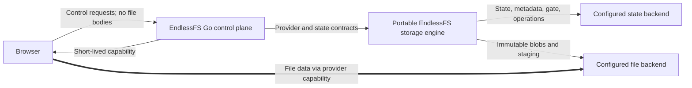
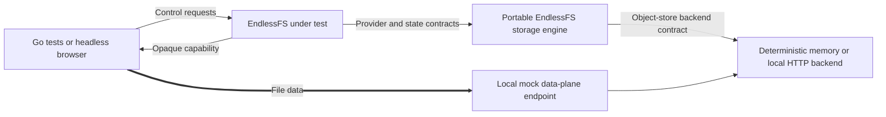
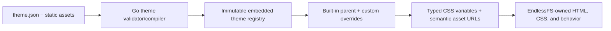

# EndlessFS v1 Specification

**Status:** Implementation specification  
**Audience:** Implementation agents, maintainers, reviewers, and security testers  
**Normative language:** “MUST”, “MUST NOT”, “SHOULD”, and “MAY” are requirements terms.  
**Target:** A feature-complete, provider-portable, locally reproducible v1 that requires no deployment, cloud account, GCP project, GCS bucket, cloud credential, or network access to build and verify.

---

## Versioned extension specifications

This document is the normative contract for the feature-complete mock-backed v1.0 baseline. Later feature releases are specified as scoped, independently reviewable extensions:

- [`v1.1-media-preview-specification.md`](./v1.1-media-preview-specification.md) — always-available media browsing and virtualized grids with optional generated image thumbnails;
- [`v1.2-video-preview-specification.md`](./v1.2-video-preview-specification.md) — separately packaged video poster and metadata generation; and
- [`v1.3-pdf-preview-specification.md`](./v1.3-pdf-preview-specification.md) — separately packaged PDF first-page preview generation.

An approved extension inherits this document and supersedes it only where the extension explicitly says so. Completion of v1.0 remains defined solely by this document. A later release cannot claim an extension merely because the base behavior falls back safely; it must satisfy that extension's acceptance criteria and release evidence.

Search remains a future feature with its own eventual specification. The preview extensions do not implement search and do not constrain its future product direction beyond preserving the existing security and provider-independence boundaries.

---

## 1. Executive contract

EndlessFS is an open-source, provider-agnostic, security-first, private, self-hostable cloud drive. It provides a fast browser interface over cloud object storage while separating the application control plane from the file data plane.

The central architectural rule is:

> EndlessFS authorizes and coordinates file operations; in a real provider deployment, file bytes travel directly between the browser and the storage provider through short-lived, provider-native capabilities.

EndlessFS v1 MUST deliver the complete user-facing and control-plane behavior described in this document against deterministic local object-store implementations. It MUST also define and implement one canonical provider-independent storage-set format for all authoritative application state, file metadata, and file bytes. A storage set uses one state bucket plus an optional distinct file bucket; single-bucket mode configures the same bucket for both roles. Copying the keys and bodies of a quiescent conforming storage set to another conforming object-store backend MUST require no state conversion, reindexing, identifier rewriting, or logical-version migration.

The same configured storage set MUST support multiple simultaneously active EndlessFS replicas in one compatible writer set. Correctness MUST NOT depend on process-local locks, a leader process, sticky routing, graceful shutdown, or a node releasing a lock before it disappears. Every visible mutation is admitted through the canonical state-bucket write gate and is linearized by a provider-independent conditional commit; recoverable multi-object work uses durable operation state, immutable staging, expiring ownership leases, and monotonically increasing fencing tokens.

All v1 acceptance tests MUST run locally without real GCP integration. Google Cloud Storage (GCS) is the first intended production backend and informs the capability model, but a live GCS bucket, GCP credentials, and any deployment are explicitly outside the v1 completion gate.

This distinction is deliberate:

- **v1 feature complete** means the domain model, security boundaries, API, browser UI, transfer protocol, canonical storage-set format, backend contracts, raw-copy portability, and all specified workflows pass deterministic local tests.
- **v1 does not claim production-provider validation.** The credential-free protocol fake proves conformance to the documented GCS surfaces and EndlessFS contracts, not interoperability with a live GCS deployment.
- A GCS adapter MUST implement only the object-store backend contract and MUST use the same portable storage engine and canonical storage-set format as every other backend. It MUST pass deterministic local integration tests and separate opt-in live tests before it can be called production-ready.

Provider portability and multi-replica safety are clarifications of the original provider-agnostic v1 contract, not a new product specification or post-v1 features. The v1 API and product scope remain the same; this document makes the previously underspecified persistence, adapter, concurrency, and recovery boundaries explicit.

### 1.1 Non-negotiable constraints

- Go is the only application language and server-side toolchain.
- Nix is the sole build, development, test, packaging, and CI/CD tooling framework.
- The browser client uses embedded HTML, CSS, and minimal vanilla JavaScript.
- Themes are data-only bundles containing a typed manifest and validated static assets. Theme-supplied CSS, HTML, JavaScript, templates, or executable expressions are prohibited.
- EndlessFS ships immutable, complete light and dark theme bundles. Custom themes inherit from one of them so missing or newly introduced visual assets always have a safe fallback.
- Node.js, npm, pnpm, Yarn, frontend frameworks, CSS frameworks, Python, Ruby, Java, Make, Taskfile, and language-independent task runners MUST NOT be required.
- No SQL database, Redis, cache service, queue, persistent volume, external identity provider, OAuth provider, email service, analytics service, CDN, or other external runtime infrastructure is allowed.
- Authentication uses WebAuthn/passkeys only. There are no passwords, OAuth flows, or email identities.
- The user profile contains only `userID` and `displayName`. Email addresses MUST NOT be requested, inferred, transmitted as identity, or stored.
- `ALLOW_REGISTRATION` and `INVITE_REGISTRATION` are independent v1 controls. Invite links and secure first-admin bootstrap are required in v1.
- Browser-direct provider-native upload and download capabilities are a core contract, not an optional optimization.
- The authoritative storage-set format is owned by EndlessFS and MUST NOT vary by storage provider or by single-/split-bucket configuration.
- Provider-native generations, ETags, version IDs, metadata, upload sessions, rewrite tokens, and capability values MUST NOT become authoritative or portable state.
- Multiple replicas sharing a storage set MUST use canonical distributed admission, CAS, fencing, and recovery. Process-local mutexes and timeout-only locks cannot protect storage state.
- Every object-store backend implementation MUST have deterministic test doubles and MUST pass shared backend, portable-storage, provider, state, and raw-copy portability contract tests.
- Development follows red → green → refactor. Security-sensitive behavior requires positive and negative tests.

---

## 2. Product goals and success definition

### 2.1 Goals

EndlessFS v1 MUST provide:

1. A private multi-user drive with strict logical user isolation.
2. Secure passkey-only registration and authentication.
3. Secure bootstrap of exactly one initial administrator.
4. Public and invite registration policies controlled independently by environment variables.
5. A polished browser experience for browsing and managing files and folders.
6. Direct, resumable, concurrent browser-to-provider uploads through provider capabilities.
7. Direct provider-to-browser downloads through short-lived capabilities.
8. Trash, restore, sharing, previews, and basic administration.
9. A provider-neutral application core with no GCS types or object keys crossing into domain or HTTP APIs.
10. A deterministic local implementation proving the complete product without cloud resources.
11. A single Go binary with embedded frontend assets and no external production runtime dependencies other than a configured storage provider.
12. Reproducible development and CI entry points defined entirely by Nix.
13. User-selectable light, dark, and operator-supplied data-only themes without allowing theme code to change application behavior.
14. A canonical provider-independent storage-set format whose keys and bodies can be copied unchanged between conforming object stores and reopened without state migration.
15. Stable provider-independent logical versions, identifiers, directory relationships, operation records, and state records that survive a backend change even when every native generation or ETag changes.
16. Horizontally scaled replicas that safely share one configured storage set, including deterministic recovery when a node disappears before, during, or after a mutation.

### 2.2 Product statement

> EndlessFS is a private, open-source, self-hostable cloud drive whose Go control plane uses passkeys for identity and short-lived storage capabilities for direct browser transfers. Its functionality is visually unopinionated through safe data-only themes, and it adds no required database, cache, queue, identity provider, or persistent application filesystem.

### 2.3 v1 completion boundary

The implementation is v1 complete only when:

- every acceptance criterion in section 21 passes;
- every required checkbox in section 22 is checked with test or review evidence;
- `nix flake check` succeeds from a clean checkout without cloud credentials;
- the full required suite succeeds with outbound network access denied;
- no real provider or deployment is needed for any required check;
- deterministic tests prove that a complete single- or split-bucket storage set copied as keys and bodies to backends with different native versions and listing behavior opens with identical logical state and can continue mutating safely; and
- deterministic multi-replica tests prove write admission, same-resource races, directory/tree isolation, expired-owner takeover, stale-worker denial, lost-success recovery, rolling compatibility, and checkpoint fencing; and
- the limitations in this specification are documented without presenting the local mock as production storage.

---

## 3. Scope

### 3.1 Required end-user functionality

#### Identity and accounts

- Usernameless passkey sign-in using discoverable WebAuthn credentials.
- Passkey registration with user verification required.
- Multiple passkeys per account.
- Passkey listing, naming, and removal; the final passkey cannot be removed through self-service.
- Sign-out and revocation of the current session.
- No password, email, username, OAuth, or social-login path.
- A profile consisting strictly of:

  ```text
  userID       cryptographically random 128-bit or 256-bit identifier
  displayName  user-supplied display value
  ```
- Self-service display-name update; changing it has no authentication or authorization effect.

#### Registration and administration

- One-time, concurrency-safe bootstrap of the first administrator.
- Independent support for all four combinations of `ALLOW_REGISTRATION` and `INVITE_REGISTRATION`.
- Admin-created bearer invite links with hashed-at-rest tokens.
- Single-use invites by default, optional expiry, listing, and revocation.
- Registration from an invite using only a display name and passkey.
- Admin user listing using only opaque user IDs, display names, separate role membership, and account status.
- Admin account disable/enable.
- Admin-generated, single-use account-recovery links that allow a user who lost all passkeys to register a new passkey. Recovery MUST NOT reveal or replace the user ID and MUST revoke existing sessions when completed.
- Admin role grant/revoke, while preventing removal or disablement of the final enabled administrator.

#### Files and folders

- Browse a root and nested folders.
- Paginated directory listings.
- Current-folder filename filtering.
- Create empty folders.
- Drag-and-drop files or directory trees where the browser exposes dropped directory entries.
- Multi-file selection and upload.
- Folder upload where the browser exposes relative paths, with recursive dropped-directory traversal and a multi-file fallback.
- Concurrent upload initialization and transfer.
- Resumable uploads, progress, retry, and cancellation.
- Upload conflict handling: fail, replace, or generate a non-conflicting name.
- Single-file direct downloads.
- Multi-selection downloads as separate direct downloads; server-generated ZIP archives are not required.
- Rename, move, copy, trash, restore, and permanent deletion.
- Batch operations on a selection.
- File metadata: name, virtual path, kind, byte size, media type, modification time, and opaque version.
- Basic safe previews for common images, plain text, and PDF.

#### Sharing

- Read-only public bearer links for a file or folder.
- Optional share expiry.
- Share listing and revocation by the owner.
- Public folder browsing limited to the shared subtree.
- Direct-capability downloads from shares.
- No anonymous write, upload, edit, or re-share.

#### Browser experience

- Responsive layout usable on desktop and mobile browsers.
- Familiar list/grid file-browser interactions without imitating a full operating system.
- Keyboard navigation and accessible status/error reporting.
- Upload queue with per-item status and progress.
- Clear empty, loading, offline/error, conflict, expired-link, and access-denied states.
- No externally hosted or runtime-fetched third-party scripts, fonts, images, analytics, or telemetry. Validated embedded theme media is allowed.
- User-selectable installed themes, including the bundled light and dark themes.
- A theme preference that follows the user across devices while remaining separate from the two-field identity profile.
- Safe fallback to an immutable built-in parent if a custom theme or individual override becomes unavailable.

### 3.2 Required operator/developer functionality

- Environment-variable configuration with startup validation.
- Health and readiness endpoints that reveal no secrets.
- Structured logs with secret and path redaction rules.
- One Go binary with embedded frontend assets.
- A locally buildable OCI image; publishing or deployment is not required.
- Deterministic in-memory mocks and a local capability/data-plane mock.
- A canonical storage-set-format implementation shared by every backend role, with deterministic single-/split-backend raw-copy portability and checkpoint-verification tests.
- Nix commands for formatting, linting, testing, fuzz smoke tests, security checks, building, image creation, and local development.
- Nix validation, preview, test, and embedding of operator-supplied data-only theme bundles.

---

## 4. Explicit non-goals

The following are not part of v1:

- Live GCS interoperability, deployment qualification, and production-readiness testing. The thin GCS adapter and its credential-free local qualification are required by v1.
- Creating or configuring a GCP project, bucket, service account, workload identity, IAM binding, CORS policy, domain, TLS certificate, ingress, Kubernetes resource, or production deployment.
- Amazon S3, S3-compatible, Azure Blob, or multi-provider implementations.
- Production durability supplied by the local mock provider.
- Google Drive or Dropbox feature parity.
- Google Docs-style editing, office-suite integration, or real-time collaboration.
- Desktop sync, WebDAV, FUSE, native desktop clients, or native mobile apps.
- Content-addressed deduplication or cross-user deduplication.
- End-to-end or client-side file encryption.
- File version history beyond the opaque version used for concurrency control.
- Full-drive indexed search, document-content search, or OCR. Search remains a future feature; it is not required for the v1.0 baseline or the v1.1–v1.3 preview deliverables.
- Favorites, comments, activity feeds, notification delivery, or email.
- Antivirus scanning, data-loss prevention, media transcoding, generated thumbnails, or archive creation in the v1.0 baseline. The versioned preview specifications explicitly introduce bounded disposable raster generation without adding playable-media transcoding.
- Anonymous uploads, writeable shares, user-to-user collaboration ACLs, teams, or groups.
- Billing, quotas, subscriptions, telemetry, or an EndlessFS-hosted control service.
- Automated account recovery without an administrator.
- Live dual-provider writes, continuous cross-provider replication, zero-downtime online cutover, or reconciliation of mutations made outside EndlessFS. Quiescent raw-copy portability without state transformation is required by v1.
- A guarantee of unlimited storage or bandwidth. Limits remain those of the browser and selected provider.
- Theme-supplied CSS, HTML, JavaScript, Web Components, templates, or application plugins.
- Themes changing semantic structure, control visibility, event behavior, authorization, wording, accessibility relationships, breakpoints, or DOM order.
- Ordinary-user theme upload or runtime administrator theme installation. Custom v1 themes are validated and embedded reproducibly through Nix.

---

## 5. Architecture

### 5.1 Production-target architecture



The EndlessFS control plane authenticates users, validates virtual paths, and applies authorization. One provider-independent portable storage engine implements the file and state semantics over narrow conditional object-store backends. The state backend holds every canonical record except immutable blobs and transient upload staging; the file backend holds those byte objects and supplies direct-transfer capabilities. Both roles MAY use the same backend/bucket. Backend adapters supply transport, native preconditions, server-side copy, and direct-transfer capabilities; they do not define the storage layout or persisted schemas. The control plane MUST NOT expose provider credentials and MUST NOT accept file bodies through its normal control API.

Every replica is an interchangeable participant in one state-bucket-scoped writer set and MUST use the same state/file backend pairing. Replicas coordinate only through canonical records and object-backend conditional operations; there is no distinguished in-process leader and no correctness dependency on routing a retry to the replica that began an operation. The state-bucket write gate controls distributed admission across both backends, resource roots control visible single-resource mutations, and durable operation records control multi-resource commit and recovery.

### 5.2 v1 local verification architecture



For end-to-end tests, the mock data-plane endpoint MUST be distinguishable from the EndlessFS control endpoint by origin or listener. Instrumentation MUST prove that upload and download bodies did not traverse the control-plane handlers. The mock may run in the same test process, but it MUST model a separate trust boundary and capability-bearing request.

### 5.3 Component boundaries

The implementation SHOULD use packages with narrow responsibilities:

```text
cmd/endlessfs           process entry point only
internal/config         environment parsing and validation
internal/domain         IDs, paths, file metadata, policies
internal/auth           WebAuthn ceremonies and sessions
internal/registration   bootstrap, public registration, invites, recovery
internal/admin          role and account administration
internal/files          file/folder use cases and authorization
internal/shares         share lifecycle and public access
internal/trash          trash lifecycle
internal/provider       application-facing storage interface and contract suite
internal/state          application-facing metadata interface and contract suite
internal/storageformat  canonical bucket schemas, keys, logical versions, and portable engine
internal/objectstore    narrow backend interface and contract suite
internal/objectstore/mock deterministic memory and local HTTP backends
internal/objectstore/gcs GCS transport, authentication, signing, and capability adapter
internal/theme          bundle schema, validation, inheritance, asset registry
internal/httpapi        HTTP transport, middleware, problem responses
internal/web            embedded HTML/CSS/vanilla JavaScript
```

These names are guidance, not a required directory layout. The dependency direction is required:

```text
HTTP/UI -> application use cases -> domain + provider/state interfaces
portable storage engine -> provider/state + object-store interfaces
object-store adapters -> object-store interface
```

Domain and application packages MUST NOT import object-store adapter packages, GCS SDK packages, mock-backend packages, or HTTP transport packages. Object-store adapters MUST NOT import application use cases or construct provider-specific filesystem/state layouts.

### 5.4 Persistent-state principle

In a real deployment, the configured state bucket and file bucket form the authoritative storage set. They MAY be the same bucket. The state bucket holds the small amount of EndlessFS state and filesystem metadata; the file bucket holds immutable user file blobs and transient upload staging. The application container is replaceable and has no required persistent filesystem. Every authoritative object uses the canonical format and placement rules in section 9; no backend-specific database, index, third persistence role, or application filesystem may be required to reopen it.

A complete quiescent storage set is portable as object keys and bodies. A destination backend may assign different native generations, ETags, version IDs, timestamps, storage classes, encryption details, or custom metadata without changing the logical EndlessFS state. State and file buckets MAY use different provider storage classes, billing boundaries, encryption policies, and retention controls, provided those policies preserve every live canonical object and the required conditional/read/list/direct-transfer behavior. Provider-specific authentication and deployment configuration are deliberately external and are reconfigured for the destination.

The v1 local mock MAY be in-memory and ephemeral. Temporary directories MAY be used inside tests but are not application dependencies and MUST be created and removed by the test harness. A v1 demo restarting with an empty mock is acceptable; production durability is not claimed until a real provider is implemented and validated.

Built-in and custom v1 theme bundles are build inputs embedded in the Go binary. Only the selected theme ID is persistent user state; no runtime theme directory or persistent application volume is required.

---

## 6. Technology and repository constraints

### 6.1 Allowed technology

- All application, server, test-driver, helper, and generator code MUST be Go.
- Go’s standard library SHOULD be preferred.
- Third-party Go modules MAY be used where they materially improve security or reduce risky complexity, especially for WebAuthn, Unicode normalization, and future provider SDKs.
- Cryptographic protocols MUST use established libraries; custom WebAuthn or cryptographic implementations are prohibited.
- Frontend assets MUST be authored as HTML, CSS, and minimal vanilla JavaScript and embedded with Go’s `embed` package.
- Application CSS is owned by EndlessFS. Themes supply only typed manifest data and static media that the Go theme compiler converts into allowlisted CSS custom-property values and semantic asset mappings.
- Headless browser tests MAY use Chromium supplied by Nix and controlled by a Go library. They MUST NOT require Node.js.
- Nix flakes MUST pin the complete development and CI environment.

### 6.2 Forbidden project dependencies

The repository MUST NOT require or contain project workflows based on:

- `package.json`, npm, pnpm, Yarn, Bun, Deno, or Node.js;
- React, Vue, Angular, Svelte, Preact, HTMX, Tailwind, Bootstrap, or another frontend/CSS framework;
- Python, Ruby, Java, .NET, PHP, Rust, or another application language;
- Makefiles, Taskfiles, Justfiles, or bespoke CI shell pipelines as the public task interface;
- SQL migrations or database schemas;
- Docker Compose or a container runtime for required tests;
- externally hosted runtime assets.
- raw CSS, HTML, JavaScript, template, or executable files inside a theme bundle.

Nix may package normal command-line tools such as Go, a linter, a vulnerability checker, a container builder/scanner, and Chromium. Nix remains the only public orchestration layer.

### 6.3 Dependency policy

- Every Go module and Nix input MUST be locked.
- New dependencies MUST be justified in review by maintenance health, license, security history, and why the standard library is insufficient.
- Direct dependencies SHOULD remain small and auditable.
- Frontend dependencies vendored as prebuilt JavaScript are prohibited.
- Builds MUST be repeatable from `go.sum` and `flake.lock`.
- Generated source or assets MUST have a reproducible Nix command and MUST be committed only if the repository documents why.

---

## 7. Domain rules and security invariants

The following invariants apply in every HTTP handler, background-free use case, portable-storage component, mock, and object-store backend:

1. **Authenticated scope:** every private storage operation derives its owner scope from the authenticated session, never from a client-supplied user ID.
2. **No raw provider keys:** HTTP requests and responses never accept or expose provider object keys. Provider capability URLs are the only intentional provider-specific values returned to a browser.
3. **Reserved metadata:** application metadata is outside all user-visible namespaces and cannot be listed, previewed, shared, moved, copied, trashed, or downloaded through file APIs.
4. **Path construction:** a client supplies only a validated virtual path. The server combines it with an internal `userID` and area.
5. **Deny by default:** an operation without an explicit policy decision fails closed.
6. **Bearer capability handling:** invite, recovery, share, session, and provider-capability tokens are secrets and are never written to normal logs or stored in plaintext.
7. **No identity inference:** display names are presentation only, need not be unique, and never participate in authentication or authorization.
8. **No email:** request DTOs, persisted schemas, UI labels, logs, fixtures, and tests MUST NOT model email as user identity.
9. **One-time actions:** bootstrap, invite consumption, recovery consumption, and WebAuthn challenges use atomic create/compare-and-swap operations so concurrent replays yield at most one success.
10. **Private-by-default files:** provider objects remain private; access is mediated by short-lived capabilities.
11. **Control-plane body limit:** control endpoints reject unexpectedly large bodies and never expose a generic file-proxy route.
12. **Time and randomness:** security-sensitive time and randomness use injected interfaces in tests and cryptographically secure system sources in normal operation.
13. **Data-only themes:** theme inputs are parsed against a closed typed schema, never interpreted as markup or code, and cannot add network origins or arbitrary CSS declarations.
14. **Theme fallback:** every custom theme resolves through an immutable complete built-in parent before it can be selected.
15. **Canonical storage-set authority:** every durable file, directory, state, operation, idempotency, and checkpoint record uses the canonical EndlessFS v1 format and state/file placement rule. Backend adapters cannot introduce an alternative authoritative layout.
16. **Portable logical versions:** versions exposed to application code or clients are derived from canonical record state and survive raw-copy backend changes. Native generations, ETags, and version IDs are request-local preconditions only.
17. **Bodies over provider metadata:** correctness never depends on provider custom metadata, tags, ACL entries, storage class, native creation timestamps, listing order, or object-versioning configuration. Authoritative metadata lives in canonical object bodies.
18. **Portable cutover:** a portability checkpoint spanning the complete configured storage set is created only after writes are quiesced and provider-native transfer/copy leases are drained or aborted. Mixed, corrupt, incomplete, misplaced, or unsupported format state fails closed at destination verification.
19. **Distributed admission:** every user/application mutation and provider-side data mutation is associated with a durable admission for the current state-bucket write-gate epoch. Closing the gate is an atomic storage-set-wide barrier, not a process-local flag.
20. **Fenced recovery:** an expired ownership lease only permits a conditional takeover that increases the canonical fencing token. Expiry alone never releases a resource or authorizes a commit, and a stale worker cannot publish after takeover.
21. **Commit-defined visibility:** public upload targets and intermediate multi-record results are immutable staging artifacts. They become visible only through a canonical CAS-controlled resource root or committed operation record.
22. **Replica compatibility:** all simultaneous writers use the same writer-set identity, writer protocol, canonical format/features, security-critical configuration fingerprint, and provider-independent keyring identifiers. Incompatible replicas fail readiness before serving traffic.

### 7.1 Virtual path rules

A `UserPath` is a provider-independent absolute virtual path.

- Root is `/`.
- Separator is `/`.
- Input MUST be valid UTF-8 and normalized to Unicode NFC before comparison or persistence.
- Each segment MUST be 1–255 UTF-8 bytes after normalization.
- The full normalized path MUST be at most 4096 UTF-8 bytes.
- NUL, ASCII control characters, `/`, and `\` are forbidden inside a segment.
- `.` and `..` segments are forbidden rather than resolved.
- Empty segments, repeated separators, and trailing separators are rejected except for root.
- The reserved top-level names `.endlessfs` and `.trash` are rejected case-insensitively.
- Paths are case-sensitive after normalization.
- Percent-decoding occurs exactly once at the HTTP boundary before validation.
- Validation MUST be applied identically to list, stat, upload, download, preview, create, move, copy, delete, trash, restore, and share paths.

Path conflict behavior is explicit; the server MUST NOT silently overwrite an existing item unless the caller chose `replace` and passed the required current version where applicable.

### 7.2 Display names and credential labels

- Display names are valid UTF-8 normalized to NFC, trimmed at both ends, 1–100 Unicode code points, and at most 256 UTF-8 bytes.
- NUL, control characters, and line/paragraph separators are rejected.
- Display names are not unique and never select an account.
- Optional passkey labels follow the same rules with a 64-code-point limit.
- Both values are always rendered as text and safely encoded in logs and JSON.

---

## 8. Provider, state, portable-format, and backend interfaces

Exact package names may differ, but the semantic separation and behavior in this section are normative.

### 8.1 Core types

```go
type UserID string

type Area uint8
const (
    AreaLive Area = iota + 1
    AreaTrash
)

type Scope struct {
    UserID UserID
    Area   Area
}

// UserPath can only be constructed by the validated parser.
type UserPath struct { /* unexported normalized segments */ }

type EntryKind string
const (
    EntryFile      EntryKind = "file"
    EntryDirectory EntryKind = "directory"
)

type Entry struct {
    Path         UserPath
    Name         string
    Kind         EntryKind
    Size         int64
    MediaType    string
    ModifiedAt   time.Time
    Version      string // opaque provider-independent concurrency token
}
```

Only trusted application code may create a `Scope`. Provider implementations receive a scope and a validated path, not a concatenated key from HTTP input.

### 8.2 Storage provider interface

```go
type StorageProvider interface {
    List(ctx context.Context, scope Scope, req ListRequest) (ListPage, error)
    Stat(ctx context.Context, scope Scope, path UserPath) (Entry, error)
    CreateDirectory(ctx context.Context, scope Scope, req CreateDirectoryRequest) (Entry, error)

    CreateUpload(ctx context.Context, scope Scope, req CreateUploadRequest) (UploadCapability, error)
    CompleteUpload(ctx context.Context, scope Scope, req CompleteUploadRequest) (Entry, error)
    AbortUpload(ctx context.Context, scope Scope, uploadID UploadID) error
    CreateDownload(ctx context.Context, scope Scope, req CreateDownloadRequest) (DownloadCapability, error)

    Copy(ctx context.Context, from Scope, to Scope, req CopyRequest) (Operation, error)
    Move(ctx context.Context, from Scope, to Scope, req MoveRequest) (Operation, error)
    Delete(ctx context.Context, scope Scope, req DeleteRequest) (Operation, error)
    GetOperation(ctx context.Context, userID UserID, operationID OperationID) (Operation, error)
}
```

Required semantics:

- `List` is one directory only, stable within a page sequence, paginated with an opaque cursor, and never leaks another scope.
- `Stat` returns `ErrNotFound` for missing entries without leaking whether an out-of-scope provider key exists.
- `CreateDirectory` supports empty directories independent of how a provider represents them.
- `CreateUpload` binds a capability to one authenticated scope, one destination path, declared size, safe media type, and expiration.
- `CompleteUpload` verifies that the uploaded object matches the initiated destination and declared constraints before making it visible as complete.
- `CreateDownload` binds the capability to a single authorized object/version and disposition.
- `Copy` and `Move` receive trusted source and destination scopes created by the application. Provider implementations reject differing user IDs; v1 permits area transitions only for the application’s live↔trash workflows.
- `Copy`, `Move`, and `Delete` work for files and directory trees and are idempotent when the same idempotency key is reused.
- Long operations MAY be asynchronous. `Operation` exposes `pending`, `running`, `succeeded`, or `failed` and a stable error, but never provider internals.
- Conflict modes are `fail`, `replace`, and `rename`. `fail` is the default.
- Cancellation and partial failure MUST leave a diagnosable operation record. A failed operation MUST not report success for a partially completed tree.
- Provider errors map to a small domain taxonomy: invalid, unauthenticated, unauthorized, not found, conflict, precondition failed, rate limited, unavailable, and internal.

### 8.3 Capability model

```go
type UploadProtocol string
const (
    UploadSingle    UploadProtocol = "single"
    UploadResumable UploadProtocol = "resumable"
)

type UploadCapability struct {
    UploadID   UploadID
    Protocol   UploadProtocol
    URL        string
    Method     string
    Headers    map[string]string
    ExpiresAt  time.Time
    ChunkRules *ChunkRules
}

type DownloadCapability struct {
    URL       string
    Method    string
    Headers   map[string]string
    ExpiresAt time.Time
}
```

- Capability URLs and headers are bearer secrets.
- They MUST be scoped to the minimum action and shortest practical lifetime.
- Download capabilities default to 60 seconds and MUST NOT exceed 10 minutes.
- Upload-initiation capabilities default to 5 minutes. A resumable session MAY remain valid for a bounded provider-supported duration required to complete a large transfer; its leakage risk MUST be documented and it MUST remain restricted to one destination.
- API responses containing capabilities MUST use `Cache-Control: no-store`.
- Capability values MUST be redacted from logs, metrics, traces, error messages, and referrers.
- The browser MUST send only the returned method and allowlisted headers to the returned URL.
- A capability MUST NOT grant list, overwrite-other-object, metadata-namespace, or cross-user access.

### 8.4 Application state store

Small application records are stored through a separate provider-neutral interface:

```go
type StateStore interface {
    Get(context.Context, StateKey) (StateValue, error)
    List(context.Context, StatePrefix, PageRequest) (StatePage, error)
    Create(context.Context, StateKey, []byte) (Version, error)
    CompareAndSwap(context.Context, StateKey, Version, []byte) (Version, error)
    Delete(context.Context, StateKey, Version) error
}
```

- `Create` succeeds only when the key is absent.
- `CompareAndSwap` and `Delete` succeed only for the supplied current version.
- These primitives MUST be sufficient to implement single-use token consumption and final-admin invariants without SQL transactions.
- Records use versioned JSON with strict decoding, size limits, and unknown-field rejection.
- State keys are constructed only from trusted fixed prefixes and encoded opaque IDs.
- State values MUST never contain plaintext bearer tokens.
- The portable storage engine implements both storage-provider and state-store behavior over one required state backend and one optional distinct file backend, but the application-facing interfaces and authorization surfaces remain separate. A nil/unspecified file backend means the state backend serves both roles.

### 8.5 Object-store backend interface

Object-store adapters implement transport primitives, not EndlessFS filesystem or state semantics. Exact Go names may differ, but the semantic boundary is normative:

```go
type ObjectBackend interface {
    Get(context.Context, ObjectKey, GetObjectRequest) (Object, error)
    Verify(context.Context, ObjectKey, ExpectedIntegrity) (ObjectInfo, error)
    List(context.Context, ListObjectsRequest) (ObjectPage, error)
    Put(context.Context, ObjectKey, PutObjectRequest) (NativeVersion, error)
    Delete(context.Context, ObjectKey, DeleteObjectRequest) error
    Copy(context.Context, ObjectKey, ObjectKey, CopyObjectRequest) (CopyResult, error)

    CreateUpload(context.Context, ObjectKey, BackendUploadRequest) (BackendUploadCapability, error)
    ProbeUpload(context.Context, BackendUploadLease) (BackendUploadStatus, error)
    AbortUpload(context.Context, BackendUploadLease) error
    CreateDownload(context.Context, ObjectKey, BackendDownloadRequest) (BackendDownloadCapability, error)
}
```

- `ObjectKey` is constructed only by the canonical-format package and uses the restricted grammar and bounds in section 9. Backend adapters never receive a `UserPath` and never invent user, area, state, or metadata prefixes.
- `Put` supports exactly one of unconditional write where explicitly safe, create-only, or match-current-native-version. `Delete` and mutable `Copy` support match-current-native-version conditions.
- `NativeVersion` is opaque, scoped to one backend object incarnation, and usable only as an immediate conditional-request input. It MUST NOT be serialized into canonical objects, returned through provider/state interfaces, logged, compared across backends, or used as an EndlessFS logical version.
- Successful single-object create, replace, copy, and delete operations are atomic. After success, `Get` and complete prefix `List` operations are strongly consistent for the affected live object; a backend with eventual object or listing visibility cannot satisfy the v1 contract.
- `Get` and `List` return native versions separately from object bodies. The portable engine normalizes provider listing order, page sizes, missing metadata, and error forms, but it does not attempt to repair an eventually consistent backend.
- `Verify` accepts a provider-independent expected byte size and checksum and returns an exact native version only when that immutable object incarnation matches. An adapter MAY satisfy the assertion from provider integrity metadata or by reading the body. Provider-native checksum encodings never leave the adapter and the expectation remains authoritative after a raw-copy cutover.
- `Copy` keeps file bytes inside the configured provider data plane. A backend that cannot provide conditionally safe server-side copy/rewrite semantics cannot satisfy the v1 backend contract.
- Upload capabilities bind only to operation-specific immutable staging keys supplied by the portable engine. Download capabilities bind only to committed immutable blob keys. Capabilities cannot address state, directory, operation, idempotency, admission, checkpoint, gate, or lease objects.
- Provider authentication, endpoints, retry hints, native checksum values, generations, ETags, version IDs, signing material, resumable session URIs, multipart IDs, block IDs, and rewrite/copy tokens remain inside the adapter or an encrypted transient lease.
- Backend adapters may set provider metadata for transport optimization, but portable behavior MUST remain correct when all such metadata is absent or changed after a raw-copy cutover.

### 8.6 Canonical records and logical versions

Every mutable canonical object is a strict versioned envelope containing its schema identifier, positive logical revision, logical version, and typed payload. The logical version is:

```text
base64url(
  SHA-256(
    "endlessfs-logical-version-v1" || NUL ||
    canonicalObjectKey || NUL ||
    uint64-big-endian(logicalRevision) ||
    SHA-256(canonicalPayloadBytes)
  )
)
```

`canonicalPayloadBytes` excludes the `logicalVersion` field and is produced by the single canonical encoder defined in section 9. A create starts at revision 1. A successful mutation increments the prior revision exactly once, including when the new typed payload is otherwise equal. The version therefore changes for every successful mutation but remains identical when the object body is copied unchanged to another backend.

To mutate a canonical record, the portable engine MUST read both the canonical logical version and the backend-native version, validate the caller's logical precondition, construct the next canonical envelope, conditionally write against the native version, and then discard the native version. Retries use the canonical operation/idempotency state machine rather than assuming native identifiers survive.

A portable fencing token is a positive monotonically increasing integer in a canonical resource guard or operation record. It is distinct from `NativeVersion`: it survives raw-copy, identifies the currently authorized operation attempt, and is never sufficient by itself to perform a write. A visible commit MUST both present the current fencing token in the canonical transition and use the current request-local native condition on the same commit object. Takeover changes that commit object's body and native version before the new worker can publish, so an old worker's conditional commit fails.

Immutable file blobs use stable random blob IDs and are never overwritten. Content-addressed or cross-user deduplication is not required. Their integrity digests and all user-visible metadata live in the referencing canonical entry record, not in provider metadata.

### 8.7 Multi-replica execution contract

- All replicas in one writer set are peers. Any replica may initiate, poll, resume, or reconcile an operation.
- Other than the gate, ticket, and fenced recovery transitions that enforce this protocol, a mutation MUST complete the write-admission protocol in section 9.2 before it creates a provider capability, writes staging data, changes canonical state, or performs a provider copy/delete. Coordination transitions cannot alter user-visible logical state except by completing an already admitted operation.
- Single-record mutations linearize at the conditional write of that record. Directory-content mutations linearize at the conditional directory-root update. Multi-resource operations linearize only at the conditional `committed` transition of their durable operation record.
- A worker owns a recoverable operation attempt only while its canonical lease is current. Renewal, takeover, step advancement, commit, and terminal failure are CAS transitions. Wall-clock expiry makes takeover eligible but never changes ownership by itself.
- Takeover preserves the stable operation ID, conditionally increments its attempt and fencing token, and resumes from durable steps. If several replicas attempt takeover, exactly one wins.
- A stale worker may create only unreachable immutable staging artifacts. It cannot overwrite committed blobs, unlock resources, advance an operation, or publish directory/state changes after its fence is superseded.
- Lost-success responses are resolved by reading the intended canonical or staged object and verifying operation ID, fence, digest, size, and step before retrying. An unconditional retry of an ambiguous mutation is prohibited.
- Locks are canonical states on the resource root or operation, not separate best-effort mutex objects. Locks are acquired in deterministic canonical-resource order. Expiry does not delete them; a successful fenced takeover, recovery, or terminal transition releases them.
- A crashed owner may temporarily reduce availability for the affected resources until expiry and recovery. It MUST NOT corrupt state or block unrelated resources. Maintenance waits for recovery rather than overriding a possibly active fence.
- Correctness cannot depend on process memory, local disks, synchronized routing, replica count, graceful termination, background queues, or the failed worker returning.

### 8.8 Shared contract suites

Every implementation MUST pass reusable tests covering:

- file and directory CRUD;
- empty folders;
- pagination and cursor rejection;
- path boundary behavior;
- conflict and version preconditions;
- upload create/complete/abort;
- resumable offset, retry, and completion behavior;
- capability expiry and scope;
- direct downloads and range requests;
- recursive copy, move, delete, trash, and restore prerequisites;
- idempotency;
- injected faults and retry classification;
- concurrency;
- two-to-eight-replica admission, mutation, reconciliation, and takeover races;
- stale-worker denial before and after lease expiry, including a paused worker returning after takeover;
- node loss before a side effect, after a staged write, after provider success with a lost response, and after logical commit;
- directory mutation during move/trash/delete and multi-resource commit visibility;
- write-gate close/open races and checkpoint quiescence with crashed owners;
- compatible rolling replicas and fail-closed incompatible writer/configuration joins;
- cross-scope isolation; and
- state-store create/CAS/delete races;
- canonical key grammar, envelope encoding, logical-version derivation, and collision detection;
- backend-native version replacement without logical-version changes;
- loss or mutation of provider custom metadata without behavior changes;
- raw key/body copy into a backend with different native versions, page sizes, and listing order;
- checkpoint creation, verification, corruption detection, and post-copy continued mutation; and
- rejection of provider-native values found in canonical durable records.

The application provider/state suites and canonical-format suite, not an adapter-specific test suite, define EndlessFS semantics. A separate object-store backend suite defines the primitives every adapter must supply.

### 8.9 Deterministic local mocks

v1 MUST include:

1. **An in-memory object-store backend under the portable storage engine** for fast unit, integration, race, format, portability, and contract tests.
2. **A capability-aware local data-plane mock** for HTTP and browser end-to-end tests.
3. **Fault injection** for expiry, not-found, conflict, partial operation failure, rate limiting, transient unavailability, checksum mismatch, interrupted upload, and stale version.
4. **Controllable time, randomness, IDs, and ordering** so tests are deterministic.
5. **Instrumentation** that records control-plane calls and data-plane byte counts without recording secrets or content.
6. **Large-object simulation** using logical sizes and resumable offsets without allocating multi-gigabyte files.
7. **Native-divergence modes** that change native versions, provider metadata, page sizes, ordering, and error shapes without changing object keys or bodies.
8. **Raw-copy harnesses** that transfer only keys and bodies between independently configured backends and then reopen the destination.
9. **Replica schedulers** that deterministically pause, crash, restart, partition, and resume independent engine instances at every admission, lease, staging, provider-response, resource-root, operation-commit, and checkpoint boundary.

Mocks MUST enforce the same authorization, conditional-object, and capability constraints expected of a real backend. A permissive map that bypasses expiry, scope, native conditions, logical versions, resumability, or portability rules is insufficient.

---

## 9. Internal storage layout and data model

### 9.1 Canonical EndlessFS storage-set format

The following layout and placement are normative for every object-store backend. They MUST NOT appear in public APIs, but they MUST be identical in memory, local HTTP, GCS, and every future S3, Azure, or other conforming adapter. `[state]` objects live in the state backend. `[file]` objects live in the file backend. When both roles name the same backend/bucket, the unchanged keys coexist in that bucket.

```text
[state] endlessfs/v1/
  superblock.json
  control/writer-set.json
  control/write-gate.json
  state/<namespace>/<encoded-key>.json
  state-versions/<namespace>/<encoded-key>/<encoded-logical-version>.json
  fs/<encoded-user-id>/<area>/dirs/<directory-id>/directory.json
  fs/<encoded-user-id>/<area>/dirs/<directory-id>/manifests/<manifest-id>.json
  fs/<encoded-user-id>/<area>/dirs/<directory-id>/pages/<page-id>.json
  operations/<encoded-user-id>/<operation-id>.json
  idempotency/<encoded-user-id>/<key-digest>.json
  admissions/<gate-epoch>/<operation-id>.json
  checkpoints/<checkpoint-id>.json
  leases/<backend-kind>/<lease-id>.json
[file] endlessfs/v1/
  fs/<encoded-user-id>/blobs/<blob-id>
  staging/<encoded-user-id>/<operation-id>/<artifact-id>
```

No adapter may map these records to a different authoritative schema, key layout, or backend role. The configured bucket/container names and provider account/project are external configuration and are never embedded in canonical keys or bodies. In split mode, a checkpoint fails closed if a canonical blob is found in the state backend or a canonical state/metadata object is found in the file backend.

Canonical object keys:

- use only lowercase ASCII `a-z`, digits `0-9`, `/`, `-`, and `.` where the fixed schema requires a file suffix;
- contain no empty, dot, or dot-dot segments and never begin or end with `/`;
- are at most 240 ASCII bytes and at most 24 segments so the same key is valid across the supported GCS, S3, Azure, hierarchical, flat, and local-test profiles;
- encode opaque IDs and trusted state-key parts with one specified unpadded lowercase base32 encoding;
- use lowercase base32 SHA-256 digests for untrusted names and idempotency lookup components; and
- are created only by the canonical-format package, never by HTTP handlers, application use cases, or backend adapters.

The state backend's `superblock.json` object identifies `endlessfs-portable-bucket-v1`, the immutable storage-set ID, canonical encoder version, key-format version, writer-protocol version, creation time, and required feature set. Startup MUST reject a missing, corrupt, mixed, newer-unsupported, or incompatible superblock before serving authenticated or public operations. The file backend does not define another writer set, gate, or filesystem schema.

Each current state record also has one immutable `state-versions` snapshot addressed by its logical key and logical version. It gives paginated state enumeration a provider-independent stable view across replicas while ordinary CAS updates continue. Cursor capabilities are authenticated-encrypted, bounded, expire, bind the exact prefix/limit plus gate epoch and logical gate version, and reveal neither state keys nor provider keys. Gate closure invalidates outstanding cursors and prunes every snapshot except the current version of each live state record before checkpoint inventory is created. Snapshots are authoritative canonical bodies; no cursor token is stored in the bucket.

The root directory ID is a fixed format constant. Every other directory and blob ID is a stable opaque random identifier stored in canonical records. Each mutable `directory.json` root points to one immutable manifest whose immutable pages contain the directory's sorted child entries. The root also contains its logical revision and any operation-owned pending pre/post-manifest transition. A page entry is addressed by the digest of its normalized child name and stores the complete normalized name. On every read, list, create, move, copy, restore, or delete, the stored name MUST hash to its recorded digest and match the requested name; a mismatch is a collision or corruption and fails closed.

A single-directory content change writes new immutable page/manifest objects and conditionally replaces `directory.json`; that root replacement is its visibility point. Unreferenced pages or manifests are garbage, never visible entries. A multi-directory operation first CAS-locks every affected root in canonical resource-ID order, records immutable pre/post manifests and the current operation fence in each pending transition, and then conditionally changes the durable operation record to `committed`. Readers encountering a pending transition use the pre-manifest before that commit and the post-manifest after it. Root finalization and garbage collection are idempotent consequences of the operation state, so a node failure cannot expose a half-move, duplicate tree, or partially deleted directory.

Virtual paths are resolved one validated segment at a time through directory IDs. Provider object-key length therefore does not grow with virtual-path depth, and the full 4096-byte `UserPath` contract remains available on backends with shorter object-name limits. Empty directories exist as canonical directory and parent-entry records; they do not depend on provider folders, delimiter behavior, or zero-byte marker conventions.

File blobs are immutable and live only under the file backend's blob namespace for their owner. File-entry records in state-backend directory pages contain the blob ID, normalized name, size, safe media type, integrity digests, timestamps, and portable logical version. Copy creates the required new portable entry/blob relationship according to the file-operation state machine; cross-user blob references and cross-user deduplication are forbidden.

All authoritative properties are encoded in object bodies. Correctness MUST NOT depend on provider custom metadata, tags, ACLs, storage class, object versioning, soft delete, native timestamps, checksums, listing order, folder resources, or preservation of those values by a cross-cloud copy tool. Provider-side integrity and encryption features MAY add defense in depth.

The `admissions`, `staging`, and `leases` namespaces are transient and are excluded from portable logical state and checkpoint inventories. Admissions and leases live in the state backend; staging lives in the file backend. Admissions contain only portable writer-gate tickets linked to durable operation records. Staging contains only immutable operation-specific data that is unreachable from committed directory manifests. Leases may contain only authenticated-encrypted, bounded backend-native resumable-session, multipart/block-upload, or rewrite/copy continuation data. Lease bodies MUST contain the backend kind and expiry and MUST NOT be required to reopen durable logical state. A checkpoint requires no admitted ticket, live staging operation, or live lease; cancelled/expired ticket objects and unreachable staging garbage may be removed before or after cutover and are never copied as authoritative state.

### 9.2 Multi-replica write admission, fencing, and recovery

`control/writer-set.json` binds the state backend and its configured file-backend role to one stable operator-configured writer-set ID, writer-protocol version, canonical feature set, security-critical configuration fingerprint, and provider-independent keyring identifiers. It contains no secret values or provider identifiers. Every replica validates it during startup and readiness. A replica with a different writer set, unsupported writer protocol/feature, origin/RP configuration, registration policy, or keyring identity MUST NOT serve any request against the storage set. A compatible rolling binary MAY join only when its declared reader and writer protocols accept the active versions; a writer-protocol or security-critical configuration change requires the closed-gate procedure.

`control/write-gate.json` is a canonical state-backend CAS record containing a positive epoch and mode `open`, `closing`, or `closed`. It is the storage-set-wide mutation-admission barrier. A replica MUST NOT cache an `open` decision across mutations. Admission is:

1. Read the gate and require `open`; capture its epoch.
2. Create-only a `candidate` admission ticket under that epoch containing a stable operation ID, writer-set ID, replica-attempt ID, creation/expiry times, the observed gate logical version, and enough non-secret canonical intent to locate the durable operation.
3. Re-read the gate. Only if it is still `open` at the same logical version may the replica CAS the candidate to `admitted` and proceed. Otherwise it conditionally changes the ticket to `cancelled` and performs no side effect. Losing a race with maintenance cancellation also performs no side effect.
4. Create or claim the durable operation/idempotency state before provider work. Keep the ticket until the operation is terminal and every capability or native continuation is expired, cancelled, or drained.

Gate transitions, admission-ticket maintenance, and fenced recovery of an operation admitted in the closing epoch are the only writes that do not acquire a new ticket. They are restricted to coordination state and to completing the already recorded intent; they cannot initiate unrelated user-visible work.

Gate closure conditionally changes `open` to `closing` and then enumerates the epoch's admissions using the backend's strong listing contract. It conditionally cancels candidates and reconciles admitted tickets and their operations. A ticket that became admitted from an `open` observation before closure already existed as a candidate and is visible to that enumeration; a worker racing cancellation has one CAS winner. A candidate created after closure must observe `closing` on its second read and cannot become admitted or begin work. Because provider listings are paginated rather than transactional snapshots, closure restarts enumeration after every transition and requires a complete pass containing no admitted ticket before it advances to `closed`; cancelled or expired candidates are inert garbage. No live native lease may remain. Opening a verified destination conditionally increments the epoch and changes `closed` to `open`. The source remains closed. Process-local readiness, a load-balancer drain, or a grace period is not a substitute for this protocol.

Every recoverable operation has a stable operation ID and canonical fields for state, step, attempt, fencing token, owner attempt ID, lease expiry, intended resource set, request fingerprint, prepared artifacts, and outcomes. It contains no native provider value. Required behavior is:

- acquisition and renewal are CAS transitions;
- expiry makes a takeover eligible but does not release a lock or authorize a write;
- takeover is one CAS winner that retains the operation ID and increments the attempt and fencing token;
- a takeover worker reconciles ambiguous prior steps by reading canonical/staged results before issuing another provider mutation;
- provider writes before logical commit target immutable operation-specific staging or create-only final blobs;
- every visible resource transition uses the current fence and a native condition on the same resource root or operation commit object;
- a superseded worker can at most leave unreachable immutable garbage, because its old conditional commit cannot succeed;
- deterministic canonical-resource ordering prevents deadlock when several resource roots must be guarded; and
- locks are released only by idempotent finalization after committed/terminal state, never merely because a timestamp elapsed.

Single-record state operations and single-directory root swaps need no long-lived resource lock: their successful conditional write is the complete linearization point. Operations spanning multiple roots prepare immutable results behind operation-owned pending transitions and use the operation record's single `committed` CAS as the visibility point. A replica that receives an ambiguous provider response reads and validates the expected object or operation transition; it never converts an unknown outcome into an unconditional retry.

Public uploads always target the staging namespace. Completion verifies the staged object, conditionally copies it to a create-only immutable final blob, and then publishes it through the directory-root/operation commit protocol. Expired or aborted upload capabilities can create only unreachable staging garbage. Maintenance cancels or waits out every capability and native lease linked to an admission before closing the gate.

If a node disappears, its admission and operation remain durable. Unrelated resources continue. The affected resource may remain temporarily unavailable until lease expiry and successful recovery. Another replica then takes over through CAS and either completes the existing intent or records a safe terminal failure. If the old node returns, its obsolete fence and native conditions prevent it from advancing, committing, unlocking, or replacing the recovered result.

### 9.3 Raw-copy portability and checkpoints

Two conforming storage sets with the same canonical keys, bodies, and role placement represent the same EndlessFS logical state, regardless of provider-native versions or metadata. In single-bucket mode, both role inventories are physically co-located. In split mode, blob keys are copied file-backend to file-backend and every other authoritative key is copied state-backend to state-backend. A supported quiescent backend cutover is:

1. CAS the canonical write gate from `open` to `closing`; every replica immediately stops admitting new mutations through the protocol in section 9.2.
2. Reconcile every admission and active canonical operation to committed or safe terminal state; cancel or wait out every provider capability and drain or abort every native upload/copy lease.
3. Verify the epoch has no admitted ticket, no live staging operation or native lease remains, all pending directory transitions resolve from terminal operation state, and then CAS the gate from `closing` to `closed`; cancelled/expired candidates are transient and cannot publish.
4. Write a canonical checkpoint in the state backend containing the storage-set ID, writer-set and gate epoch, format/protocol versions, logical checkpoint revision, the combined sorted authoritative object-key inventory, object sizes, and SHA-256 body digests. The checkpoint includes the closed gate and writer-set record, but excludes itself and the transient admission, staging, and lease namespaces.
5. Copy every authoritative object key and body unchanged to the corresponding destination backend role.
6. Verify both destination role inventories and bodies against the checkpoint before enabling writes. A missing, extra-authoritative, or wrongly placed object fails closed.
7. Start compatible EndlessFS replicas with the destination state/file backend configuration, the same writer-set identity/configuration fingerprint/keyring identities, and the same provider-independent application secrets. No schema migration, reindex, ID rewrite, path rewrite, logical-version rewrite, or token reissue is permitted or required.
8. Verify the destination checkpoint, conditionally increment and open the destination gate epoch, and continue mutations using newly observed destination-native preconditions while retaining the copied portable logical versions.

The source MAY be copied in multiple passes before maintenance mode, but the final verified checkpoint is authoritative. Online dual writes, continuous replication, and reconciling writes made outside EndlessFS remain outside v1. A copied storage set with missing, extra-authoritative, misplaced, corrupt, mixed-version, or unverified objects fails closed; an operator must repair or recopy it rather than ask EndlessFS to guess.

Changing the object-store authentication mechanism, account/project, region, state/file bucket or container names, capability signing identity, or provider CORS configuration is deployment reconfiguration, not state migration. Provider-independent application secrets that protect cookies, encrypted leases, or other canonical values must remain available according to their ordinary rotation procedures.

### 9.4 User profile

The profile record contains exactly:

```json
{
  "userID": "base64url-random-identifier",
  "displayName": "User supplied name"
}
```

No email, login name, avatar URL, external identity, phone number, or provider subject exists in this model. Operational properties such as enabled/disabled state and administrator membership are separate records.

### 9.5 Account record

```text
schemaVersion
userID
status              enabled | disabled
createdAt
updatedAt
```

### 9.6 WebAuthn credential record

```text
schemaVersion
credentialID
userID
publicKey
signCount
transports          optional WebAuthn transport hints
backupEligible      when supplied by the WebAuthn library
backupState         when supplied by the WebAuthn library
label               optional user-supplied device label
createdAt
lastUsedAt
```

Attestation defaults to `none`. Only metadata required for correct WebAuthn verification and credential management is stored. Credential IDs are indexed by a non-reversible filename-safe hash or encoding; they are never treated as user identity.

### 9.7 Session record

```text
schemaVersion
sessionTokenHash
userID
csrfTokenHash
createdAt
expiresAt
lastSeenAt           optional, coarsely updated
authnCredentialIDHash
```

The raw session token exists only in the secure cookie. Disabling an account or completing recovery revokes all sessions for that user.

### 9.8 Invite record

```text
schemaVersion
inviteID             random non-secret management identifier
tokenHash
createdByUserID
createdAt
expiresAt            optional
maxUses              1 in v1
uses                 0 or 1
usedAt               optional
usedByUserID         optional
revokedAt            optional
```

The raw token is returned once at creation and is not recoverable later.

### 9.9 Recovery record

```text
schemaVersion
recoveryID           random non-secret management identifier
tokenHash
targetUserID
createdByUserID
createdAt
expiresAt
usedAt               optional
revokedAt            optional
```

Recovery links are single-use, short-lived, do not authenticate as the target user, and allow only a new WebAuthn credential ceremony. Completion revokes all prior sessions.

### 9.10 Share record

```text
schemaVersion
shareID               random non-secret management identifier
tokenHash
ownerUserID
rootPath
rootVersion           opaque version bound when the share is created
kind                  file | directory
createdAt
expiresAt             optional
revokedAt             optional
```

Shares are read-only. A folder share authorizes descendants of the normalized recorded root only. The root version prevents a moved, replaced, or trashed item from silently retargeting the token to a different object later created at the same path. Replacing the shared root invalidates the share; it must be explicitly recreated.

### 9.11 Trash record

```text
schemaVersion
trashID
ownerUserID
originalPath
trashedPath           internal only
kind
trashedAt
originalVersion
```

Trash has no automatic retention deadline in v1. Users may permanently delete items. Restore defaults to conflict failure and supports explicit rename-on-conflict.

### 9.12 Theme preference

```text
schemaVersion
themeID              stable installed theme identifier or system
```

The theme preference is presentation state, not identity. It MUST remain separate from the profile containing only `userID` and `displayName`. `system` resolves through the configured default light and dark theme IDs using the browser color-scheme preference. An unavailable custom theme resolves to its built-in parent or `endlessfs-light` without preventing authentication or navigation.

### 9.13 Serialization and schema evolution

- Every non-profile record has an integer `schemaVersion`.
- JSON decoding rejects duplicate keys, unknown fields, invalid UTF-8, oversized documents, and trailing content.
- Times are UTC RFC 3339 with sufficient precision for concurrency tests.
- Tokens and binary identifiers use unpadded base64url when exposed.
- IDs are at least 128 bits of cryptographic randomness; bearer invite, share, recovery, and session tokens are 256 bits.
- Token comparisons use constant-time comparison after hashing where applicable.
- Metadata changes use optimistic concurrency through state versions.
- Canonical mutable records use the envelope and logical-version algorithm in section 8.6.
- The canonical encoder emits one deterministic UTF-8 byte representation with fixed field ordering, minimal JSON escaping, no insignificant whitespace, integers only for numeric persisted fields, and no maps with uncontrolled key ordering.
- Backend adapters store canonical bytes unchanged and never decode/re-encode them into a provider-specific schema.
- A future format version requires an explicit reviewed compatibility/migration design; silent in-place reinterpretation is forbidden.

### 9.14 Crash-safe multi-record changes

The state store deliberately offers conditional single-record operations, not database transactions. Any use case that changes multiple records MUST therefore use a durable, crash-safe state machine:

1. A single conditional write is the linearization point that claims the bootstrap, invite, recovery, idempotency key, or administrative guard.
2. The claimed record contains a stable operation ID and enough non-secret information to resume safely.
3. Materialization of profile, account, credential, role, session, and related records is idempotent.
4. The new account or privilege is not usable until the operation reaches `committed`.
5. A retry of the same verified operation resumes it. A different replica may take over only through the expired-lease CAS/fencing protocol in sections 8.7 and 9.2; concurrent takeover attempts have one winner.
6. Startup or request-time reconciliation can finish an interrupted committed/claimed operation without cloud-specific logic or persisted native provider tokens.
7. Any resource guard acquired by the operation records its stable operation ID and current fence. Prepared results remain immutable and invisible until the operation's conditional commit point.

The admin-role index is one versioned set updated by compare-and-swap. Removing or disabling an administrator first updates this guard while proving that at least one enabled administrator remains, then idempotently applies the account change. A crash may temporarily leave an enabled non-admin account, but MUST never leave zero enabled administrators or grant an unintended privilege.

---

## 10. Authentication, registration, and administration

### 10.1 WebAuthn policy

- WebAuthn is the only authentication protocol.
- Registration requires a discoverable credential/resident key and user verification.
- Authentication is usernameless; the authenticator-provided `userHandle` resolves to the opaque `userID`.
- During registration, WebAuthn `user.id` is the random binary user ID, `user.name` is an opaque encoding of that ID, and `user.displayName` is the supplied display name. No field is populated with an email address.
- The WebAuthn RP ID and allowed origins come only from validated server configuration.
- Origin, RP ID hash, challenge, ceremony type, user presence, user verification, credential ownership, and signature MUST be verified by an established Go WebAuthn library.
- Attestation conveyance is `none` in v1; hardware provenance policy is out of scope.
- Challenges contain at least 256 bits of randomness, expire within five minutes, are bound to one ceremony and browser, and are consumed atomically.
- Counter behavior follows the chosen WebAuthn library’s current guidance; a counter anomaly is logged safely and handled without inventing custom cryptography.
- A credential ID may belong to exactly one user.
- Successful authentication rotates the session token.

### 10.2 Session and CSRF policy

- Cookie name: `__Host-endlessfs_session` in secure mode.
- Cookie attributes: `Secure`, `HttpOnly`, `SameSite=Strict`, `Path=/`, and no `Domain`.
- Local loopback development MAY use a clearly marked insecure cookie name because HTTPS is unavailable; this mode MUST refuse non-loopback binding.
- Sessions have an absolute expiry, default 12 hours and maximum 7 days.
- Authenticated mutations require a per-session CSRF token plus exact allowed-origin validation.
- Login and registration ceremony endpoints require exact origin validation and ceremony binding even before a session exists.
- GET and HEAD endpoints MUST be side-effect free.
- Session identifiers are rotated after authentication, recovery, privilege changes, and other security boundary changes.
- Logout revokes the server-side session and clears the cookie.

### 10.3 Registration-policy matrix

| `ALLOW_REGISTRATION` | `INVITE_REGISTRATION` | Required behavior |
|---|---|---|
| `false` | `false` | Only an unused configured bootstrap may create the initial admin; all other registration is closed. |
| `false` | `true` | Valid invites may register; public registration is denied. This is the recommended normal configuration. |
| `true` | `false` | Public passkey registration is allowed; invite creation/consumption endpoints are disabled. |
| `true` | `true` | Public and valid invite registration are both allowed independently. |

Policy is checked at both ceremony start and verification. Turning registration off during an in-progress ceremony causes verification to fail closed unless it is a still-valid invite flow explicitly permitted by `INVITE_REGISTRATION`.

### 10.4 Secure bootstrap

- Bootstrap is available only when no bootstrap-complete marker and no user records exist.
- `ENDLESSFS_BOOTSTRAP_TOKEN` is a high-entropy secret supplied through environment configuration, never a command argument or URL parameter.
- The token is sent in a protected request body or authorization header and is never logged.
- The bootstrap flow registers a display name and first passkey, then uses the crash-safe state machine in section 9.14. One conditional claim is the linearization point; user, enabled account, admin membership, and bootstrap-complete records are materialized idempotently before the account becomes usable.
- Concurrent valid bootstrap attempts result in exactly one administrator account; all others receive a generic conflict.
- Once complete, bootstrap endpoints permanently return unavailable even if the original token remains configured.
- Startup logs warn, without printing the value, if a bootstrap token remains configured after completion.
- The operator is instructed to remove the token after bootstrap.

### 10.5 Invite registration

- Only an authenticated enabled admin may create, list, or revoke invites.
- Invite tokens are 256 random bits and stored only as SHA-256 hashes.
- Raw tokens are returned once in a link of the form `/register/invite/<token>`.
- Tokens are single-use in v1 and may have an expiry.
- Invite pages use `Referrer-Policy: no-referrer` and `Cache-Control: no-store`.
- Invite consumption is claimed only after successful WebAuthn verification. One compare-and-swap transition binds the invite to a stable pending registration operation, which materializes the account idempotently and commits before the account becomes usable.
- Two concurrent verifications using the same invite produce exactly one account.
- Invalid, expired, used, and revoked tokens return the same public-facing error shape.
- Invite flows never request an email or preassign a display name.

### 10.6 Public registration

- When enabled, any visitor at an allowed origin may choose a display name and register a passkey.
- Public registration uses rate limits local to the process for basic abuse resistance. These limits are not claimed as distributed denial-of-service protection.
- Duplicate display names are allowed.
- No first-user-becomes-admin shortcut exists. Only the explicit bootstrap creates the first admin.
- If no administrator exists due to corrupted state, public registration MUST NOT assign one implicitly.

### 10.7 Passkey management and recovery

- A signed-in user may add another passkey after fresh user verification.
- The UI strongly encourages at least two passkeys.
- Removing a passkey requires a recent authenticated ceremony and cannot remove the final credential.
- There is no self-service reset, backup code, password, email link, or OAuth fallback.
- An admin may create a short-lived single-use recovery link for a selected opaque user ID.
- The administrator copies that link to the user through an operator-chosen out-of-band channel; EndlessFS sends no email or notification.
- Recovery registers a new credential to the existing user and revokes all existing sessions.
- Recovery does not delete old credentials automatically; the recovered user or admin may remove them explicitly after review.
- Recovery creation and completion are security events in redacted logs.

### 10.8 Administration

- Admin membership is stored separately from the two-field profile.
- Admin APIs never grant access to users’ file contents. Administrators can technically be powerful at the deployment/provider level, but the application UI and file APIs do not provide impersonation or browse-as-user.
- Disabling an account revokes its sessions and blocks new authentication, capability creation, share access by ownership, and private file operations.
- Existing public share links owned by a disabled account become unavailable.
- The final enabled administrator cannot be disabled, deleted, or demoted.
- Permanent user deletion and bulk content deletion are out of scope for v1; account disable is the supported administrative action.

---

## 11. File, folder, transfer, trash, preview, and share behavior

### 11.1 Listings and metadata

- The default page size is 200 entries; the maximum is 1000.
- Cursors are opaque, integrity protected or server-validated, scoped to user and directory, and reject tampering or reuse in another scope.
- Sort options are name, modified time, size, and kind; ordering and tie-breaking are deterministic.
- Current-folder filtering is a case-insensitive display filter over loaded/listed filenames and is not advertised as indexed search.
- The API never requires a full-drive scan for a normal directory view.
- The root and all returned paths are virtual user paths.

### 11.2 Uploads

1. The browser submits destination path, name, size, media type, conflict mode, and resumable preference to EndlessFS.
2. EndlessFS authenticates, authorizes, validates and derives the internal scope.
3. The provider returns a destination-bound capability.
4. The browser sends file bytes directly to the capability URL.
5. The browser reports completion to EndlessFS.
6. EndlessFS verifies provider state and returns the final entry.

Requirements:

- The control API MUST reject file bodies and request bodies over its documented limit.
- A single upload and a batch of up to 100 upload initializations are supported.
- The UI defaults to four concurrent transfers and allows a bounded setting from one to eight.
- Resumable upload state tracks the confirmed provider offset, never merely bytes attempted by the browser.
- Retry uses bounded exponential backoff with jitter and distinguishes retryable from terminal errors.
- Resume after an interrupted request starts at the provider-confirmed offset.
- Cancellation calls `AbortUpload` and prevents completion where the provider supports it.
- Declared size, destination, media type, and expected version are checked at completion.
- Checksums are used when the provider supports them; mismatch fails completion.
- A failed or expired upload does not create a visible complete file.
- Durable upload intent, scope, destination, size, integrity expectations, and logical progress use canonical records. Provider-native resumable session URLs, multipart IDs, block IDs, and confirmed-native offsets are encrypted transient leases and cannot be required after a portability checkpoint.
- Completed bytes are committed as an immutable canonical blob before the portable file-entry record becomes visible. A completion race or failed descriptor commit leaves an unreferenced blob for bounded idempotent cleanup, never a visible corrupt entry.
- Upload status survives page navigation only if the provider/session supports it; cross-browser persistence is not required in v1.
- Large-object tests simulate offsets above 1 TiB without allocating equivalent storage.

### 11.3 Downloads

- EndlessFS authorizes the exact entry/version and returns a short-lived direct capability.
- Normal attachment downloads use a safe `Content-Disposition` filename.
- Previews use an explicit inline disposition only for the safe preview allowlist.
- Range requests are supported by the capability contract for preview and resume behavior.
- Multi-file download triggers independent capabilities; no server-side ZIP or byte proxy exists.
- The browser gives a clear error if a capability expires and may request a fresh one after reauthorization.

### 11.4 Create, rename, move, copy, and batch operations

- Empty directory creation is supported.
- Rename is a move within one parent.
- Move and copy accept files or trees.
- Destination conflicts fail by default.
- `replace` requires explicit confirmation and appropriate version preconditions.
- `rename` conflict mode generates a deterministic human-readable suffix without exceeding path limits.
- Batch requests contain at most 100 selected source items and return per-item results plus an overall operation ID.
- Repeating a request with the same user-scoped idempotency key returns the original outcome.
- Durable operation manifests, request fingerprints, item progress, compensation state, and final outcomes are canonical and provider independent. Native rewrite/copy continuation tokens are encrypted transient leases only.
- Source and destination are reauthorized when an asynchronous operation begins and before final commit where feasible.
- The UI displays progress for asynchronous operations and exposes actionable failures.

### 11.5 Trash and restore

- Normal delete means move to trash, not permanent deletion.
- Trash is not addressable by normal file paths and is exposed through dedicated endpoints.
- Trash listings include original path and trash time.
- Restore returns to the original path by default.
- Restore conflicts fail unless the user explicitly chooses generated-name restore.
- Permanent deletion requires an explicit confirmation action and deletes only the selected trash ID.
- Empty trash is a separate confirmed batch action.
- Trashed content cannot be downloaded or shared through normal file/share APIs.
- Existing share links to trashed content become unavailable.

### 11.6 Safe previews

v1 previews:

- raster images from an allowlist such as PNG, JPEG, GIF, and WebP;
- UTF-8 plain text up to a configurable displayed-byte limit, default 1 MiB; and
- PDF through the browser’s native viewer where available.

Security rules:

- Server-provided media types and client upload media types are untrusted.
- HTML, JavaScript, SVG, XML, office documents, and unknown formats are download-only.
- Text is decoded with strict limits and inserted as text, never `innerHTML`.
- Preview responses use `X-Content-Type-Options: nosniff` and a restrictive CSP.
- Image/PDF capability origins are explicitly allowlisted in CSP configuration.
- A failed preview falls back to metadata and download.
- No server-side transcoding or thumbnail service is introduced in the v1.0 baseline. The v1.1–v1.3 extension specifications supersede this sentence only for their bounded, optional, disposable preview artifacts.

### 11.7 Public shares

- Share tokens are 256 random bits and stored only as hashes.
- A token authorizes read-only access to one recorded file or one recorded directory subtree.
- The share landing page discloses the owner’s display name only if the product explicitly chooses to show it; default behavior is not to expose it.
- Public folder listing paths are always relative to the shared root.
- `..`, encoded traversal, alternate separators, and absolute paths cannot escape the root.
- File bytes use a fresh short-lived provider capability after each public authorization.
- Share pages and API responses use `Cache-Control: no-store` and `Referrer-Policy: no-referrer`.
- Revocation and expiry take effect before a new capability can be issued. Already issued capabilities may remain valid until their short expiry; this residual window is documented.
- Public errors do not distinguish nonexistent, expired, revoked, disabled-owner, or moved content.

---

## 12. HTTP API expectations

The exact JSON field casing may be finalized once and then documented in an OpenAPI-like Markdown reference generated or maintained without Node tooling. The route families and semantics below are required.

### 12.1 General conventions

- API prefix: `/api/v1`.
- JSON uses UTF-8 and `application/json`.
- Errors use `application/problem+json` with stable `type`, `title`, `status`, `code`, and `requestID`. Details MUST NOT expose secrets, internal keys, stack traces, or record existence across an authorization boundary.
- Unknown JSON fields, duplicate keys, invalid types, and trailing content are rejected.
- Control request bodies default to a 1 MiB maximum, with smaller endpoint-specific limits.
- Times are RFC 3339 UTC; sizes are signed 64-bit byte counts encoded safely for JavaScript.
- Pagination uses `limit` and opaque `cursor`.
- Mutating authenticated routes require CSRF and exact-origin validation.
- `Idempotency-Key` is required for upload initialization, copy, move, trash, restore, permanent delete, share creation, invite creation, and recovery creation.
- `Cache-Control: no-store` is required on authentication, session, token, and capability responses.
- Request IDs are accepted only after validation or generated by the server; untrusted values are not echoed into logs without sanitization.

### 12.2 Public configuration and health

| Method | Route | Behavior |
|---|---|---|
| GET | `/healthz` | Process liveness only; no provider details or secrets. |
| GET | `/readyz` | Valid configuration and reachable configured local provider for v1. |
| GET | `/api/v1/config` | Public product name, registration modes, passkey availability, upload limits; no secrets. |
| GET | `/api/v1/themes` | List safe metadata for installed Theme API 2.0 themes and the configured defaults. |
| GET | `/assets/themes/{digest}/{path}` | Serve immutable validated theme media with exact content type; no arbitrary filesystem lookup. |

### 12.3 Bootstrap, registration, and authentication

| Method | Route | Behavior |
|---|---|---|
| POST | `/api/v1/bootstrap/options` | Start initial-admin WebAuthn registration after bootstrap-token validation. |
| POST | `/api/v1/bootstrap/verify` | Verify credential and atomically create exactly one first admin. |
| POST | `/api/v1/registration/options` | Start public or invite registration using display name only. |
| POST | `/api/v1/registration/verify` | Verify and atomically create account/consume invite. |
| POST | `/api/v1/authentication/options` | Start usernameless passkey authentication. |
| POST | `/api/v1/authentication/verify` | Verify assertion and create rotated session. |
| POST | `/api/v1/logout` | Revoke current session and clear cookie. |
| GET | `/api/v1/me` | Return `userID`, `displayName`, separate roles, and CSRF delivery mechanism. |
| PATCH | `/api/v1/me` | Update the display name only; `userID` and roles are immutable here. |
| GET | `/api/v1/me/preferences/theme` | Return the current explicit or `system` theme preference and resolved theme. |
| PUT | `/api/v1/me/preferences/theme` | Select an installed Theme API 2.0 theme or `system`. |
| GET | `/api/v1/me/passkeys` | List credential IDs in safe display form, labels, and dates. |
| POST | `/api/v1/me/passkeys/options` | Begin add-passkey ceremony after recent authentication. |
| POST | `/api/v1/me/passkeys/verify` | Add a credential to the current user. |
| DELETE | `/api/v1/me/passkeys/{credentialID}` | Remove a non-final credential after fresh verification. |

WebAuthn request/response payloads follow the selected library and WebAuthn JSON conventions. The server ignores any client attempt to choose `userID`, RP ID, origin, role, or credential owner.

### 12.4 Admin APIs

| Method | Route | Behavior |
|---|---|---|
| GET | `/api/v1/admin/invites` | List invite metadata, never raw tokens. |
| POST | `/api/v1/admin/invites` | Create single-use invite and return raw link once. |
| DELETE | `/api/v1/admin/invites/{inviteID}` | Revoke invite. |
| GET | `/api/v1/admin/users` | Paginated minimal user/role/status listing. |
| POST | `/api/v1/admin/users/{userID}/disable` | Disable account and sessions, preserving final-admin rule. |
| POST | `/api/v1/admin/users/{userID}/enable` | Re-enable account. |
| POST | `/api/v1/admin/users/{userID}/admin` | Grant admin role. |
| DELETE | `/api/v1/admin/users/{userID}/admin` | Revoke admin role, preserving final-admin rule. |
| POST | `/api/v1/admin/users/{userID}/recoveries` | Create one-use recovery link and return it once. |
| POST | `/api/v1/recovery/options` | Begin passkey recovery from a valid token. |
| POST | `/api/v1/recovery/verify` | Register credential, consume token, and revoke sessions. |

### 12.5 File and transfer APIs

| Method | Route | Behavior |
|---|---|---|
| GET | `/api/v1/files` | List one virtual directory using `path`, `limit`, `cursor`, and sort. |
| GET | `/api/v1/files/stat` | Stat one virtual path. |
| POST | `/api/v1/directories` | Create an empty directory. |
| POST | `/api/v1/uploads` | Create one upload capability. |
| POST | `/api/v1/uploads/batch` | Create up to 100 destination-bound upload capabilities. |
| GET | `/api/v1/uploads/{uploadID}` | Return safe upload status/confirmed offset. |
| POST | `/api/v1/uploads/{uploadID}/complete` | Verify and finalize an upload. |
| DELETE | `/api/v1/uploads/{uploadID}` | Abort an upload. |
| POST | `/api/v1/downloads` | Create a short-lived capability for an authorized file/version. |
| POST | `/api/v1/files/copy` | Start idempotent file/tree copy. |
| POST | `/api/v1/files/move` | Start idempotent rename/move. |
| POST | `/api/v1/files/trash` | Move one or more items to trash. |
| GET | `/api/v1/operations/{operationID}` | Poll a user-scoped operation. |
| GET | `/api/v1/trash` | List trash records. |
| POST | `/api/v1/trash/{trashID}/restore` | Restore with explicit conflict policy. |
| DELETE | `/api/v1/trash/{trashID}` | Permanently delete one item. |
| POST | `/api/v1/trash/empty` | Confirmed empty-trash operation. |

The browser sends virtual paths only. Any JSON field resembling a provider key, bucket, owner prefix, or arbitrary capability URL is rejected.

### 12.6 Share APIs

| Method | Route | Behavior |
|---|---|---|
| GET | `/api/v1/shares` | List current user’s share metadata, not raw tokens. |
| POST | `/api/v1/shares` | Create a read-only file/folder link and return the raw link once. |
| DELETE | `/api/v1/shares/{shareID}` | Revoke an owned share. |
| GET | `/s/{token}` | Serve the public share shell with no token-referring assets. |
| GET | `/api/v1/public/shares/{token}` | Return safe root metadata or folder page. |
| POST | `/api/v1/public/shares/{token}/downloads` | Authorize a path under the root and create a direct download capability. |

### 12.7 Security headers

All application HTML responses MUST set at least:

```text
Content-Security-Policy: default-src 'self'; object-src 'none'; base-uri 'none'; frame-ancestors 'none'; form-action 'self'; ...explicit provider origins only...
X-Content-Type-Options: nosniff
Referrer-Policy: no-referrer
Permissions-Policy: camera=(), microphone=(), geolocation=(), payment=()
Cross-Origin-Opener-Policy: same-origin
```

The CSP MUST avoid `unsafe-eval`; inline script MUST be avoided or protected by a per-response nonce. HSTS is enabled in secure production mode, not forced for loopback development. CORS is denied by default on the control API. Future provider CORS is configured at the provider, never by broadening control API CORS.

---

## 13. Browser UI and accessibility requirements

### 13.1 Pages/views

The embedded UI MUST include:

- bootstrap;
- public/invite registration;
- passkey sign-in;
- drive browser;
- upload queue;
- preview/metadata panel;
- trash;
- share management;
- passkey, account, and theme settings;
- admin users, invites, and recovery management; and
- public file/folder share views.

### 13.2 Drive interaction

- Breadcrumbs always represent a validated virtual path.
- List and grid modes MAY be offered; at least one polished mode is required.
- Selection supports pointer and keyboard interaction, select all for the loaded page, and clear selection.
- Drag-and-drop has a visible target and does not prevent ordinary page interaction outside the target.
- Folder upload uses browser directory selection when available and clearly provides a multi-file fallback.
- Destructive operations show the exact item count and consequence.
- Permanent deletion is visually distinct from trash.
- Conflicts provide fail, replace, and non-conflicting-name choices where allowed.
- Progress uses confirmed uploaded bytes; indeterminate states are labeled accurately.
- The UI never displays or asks the user to manipulate bucket names, object keys, signed headers, or provider credentials.

### 13.3 Accessibility and responsive behavior

- Target WCAG 2.2 AA for core workflows.
- All functions are keyboard reachable.
- Focus is visible and restored sensibly after dialogs and navigation.
- Icons have accessible names; color is not the sole status cue.
- Dynamic upload and operation status uses non-disruptive live regions.
- Dialogs trap focus, close predictably, and have labeled titles/actions.
- Touch targets and layouts work at 320 CSS pixels wide.
- Reduced-motion preferences are respected.
- Browser end-to-end tests cover keyboard-only bootstrap, login, upload, download initiation, share creation, and trash restore where practical.

### 13.4 Frontend security and privacy

- No runtime requests occur except to the EndlessFS origin and returned/configured provider capability origins.
- No service worker is required in v1.
- Sensitive API responses are not persisted to `localStorage`, IndexedDB, or caches.
- Raw invite, recovery, share, and provider tokens are held only as long as needed.
- Filenames and display names are rendered as text, never HTML.
- UI state in URLs MUST NOT contain provider keys or session data.
- Theme selection MUST be applied before first meaningful paint where practical to avoid a light/dark flash.
- Theme asset alternative text and accessible control names come from the application, not the bundle.
- If a selected custom theme cannot resolve, the UI falls back safely and presents a non-blocking explanation after authentication.

---

## 14. Data-only theme system

Theme API 2.0 replaces Theme API 1.x after the clean-slate browser rebuild. It is not compatible with the old contract: schema/API 1.x bundles, token aliases, font declarations, compatibility adapters, and partial legacy interpretation are prohibited. The finished application UI defines the complete 2.0 surface below.

### 14.1 Theme boundary

EndlessFS owns all semantic HTML, application CSS rules, responsive behavior, JavaScript behavior, accessibility relationships, labels, interaction states, and security-sensitive presentation. A theme supplies data consumed by that implementation.

A theme bundle MAY supply:

- typed purpose-based color overrides;
- sanitized SVG images;
- PNG, WebP, and supported AVIF images;
- logos, favicons, individual file icons, and structured raster sprite atlases; and
- safe descriptive metadata such as theme name, author, version, and license.

A theme bundle MUST NOT contain or cause EndlessFS to interpret:

- CSS or preprocessor source;
- HTML, templates, Markdown, or DOM fragments;
- JavaScript, WebAssembly, Web Components, event handlers, or executable expressions;
- remote URLs, `@import`, data URLs, or dynamic asset discovery;
- raw CSS selectors, property names, property values, or arbitrary custom properties; or
- fonts, type scales, layout metrics, spacing, radii, motion, elevation, or other application-owned geometry; or
- application wording, accessible names, authorization rules, routes, or behavior.

Themes cannot configure `display`, `visibility`, `position`, `z-index`, `pointer-events`, DOM order, responsive breakpoints, overflow behavior, focus management, or security-dialog behavior. “Unopinionated look and feel” means that EndlessFS exposes a broad visual token and asset contract; it does not surrender functional control to the theme.

### 14.2 Runtime architecture



The Go theme compiler:

1. validates the archive, manifest, values, inheritance, and media;
2. resolves the complete parent-plus-override theme;
3. serializes typed values into application-owned CSS custom properties;
4. maps semantic asset slots to immutable content-addressed URLs;
5. embeds the resolved registry and media in the Go binary.

No raw manifest string is concatenated into HTML or CSS. Values are parsed into typed Go values and serialized by type-specific encoders.

### 14.3 Bundle format

The distributable format is a deterministic ZIP archive with the extension `.efstheme`. An unpacked directory with the same layout MAY be accepted as a Nix build input.

```text
example-theme.efstheme
├── theme.json
└── assets/
    ├── mark.svg
    ├── icons/
    │   ├── file.svg
    │   ├── folder.svg
    │   ├── image.svg
    │   └── document.svg
```

Example manifest:

```json
{
  "schemaVersion": 2,
  "themeAPI": { "major": 2, "minor": 0 },
  "id": "com.example.endlessfs",
  "name": "Example Theme",
  "version": "2.0.0",
  "extends": "endlessfs-light",
  "appearance": "light",
  "author": "Example",
  "license": "CC-BY-4.0",
  "tokens": {
    "color.primary": "#315bd6",
    "color.primary.tint": "#eef3ff"
  },
  "assets": {
    "brand.mark": "assets/mark.svg",
    "brand.favicon": "assets/mark.svg",
    "icon.file": "assets/icons/file.svg",
    "icon.folder": "assets/icons/folder.svg",
    "icon.file.image": "assets/icons/image.svg",
    "icon.file.document": "assets/icons/document.svg"
  }
}
```

Manifest rules:

- JSON is decoded strictly with duplicate-key, unknown-field, size, invalid-UTF-8, and trailing-content rejection.
- Theme IDs use a lowercase reverse-domain-style syntax, are at most 128 bytes, and cannot begin with `endlessfs-` unless built into the upstream project.
- Names, author values, and versions are presentation metadata and are rendered as text.
- `license` is required and contains a syntactically valid SPDX expression or documented `LicenseRef-*` identifier covering the distributed bundle; the build inventory preserves it without attempting online license resolution.
- `version` is semantic-version shaped. Theme API acceptance, not the theme version, controls loading.
- Every custom Theme API 2.0 theme directly extends exactly one of `endlessfs-light` or `endlessfs-dark`.
- `appearance` must match the built-in parent.
- Bundle paths are normalized relative paths beneath `assets/`; absolute paths, traversal, empty segments, backslashes, symlinks, hard links, and duplicate normalized names are rejected.
- A custom theme ID cannot shadow a built-in or another embedded theme ID.

### 14.4 Theme API and typed design tokens

The Theme API is a versioned public contract containing:

- the closed registry of token names;
- the strict color type and light/dark default for each token;
- semantic asset-slot names and accepted media for each;
- accessibility relationships and contrast pairs; and
- exact schema and API version acceptance.

Theme API 2.0 exposes only color roles that the completed UI consumes:

```text
color.background
color.foreground
color.text.muted
color.border
color.surface
color.primary
color.primary.tint
color.success
color.warning
color.error
```

Every value uses exactly `#RRGGBB`, is parsed as data, and is normalized to lowercase. Names describe purpose and never a particular hue. Background, foreground, muted text, primary interaction, and error relationships are contrast checked against the documented minimums.

Typography, Inter font files, density, shape, spacing, metrics, elevation, motion, focus geometry, responsive behavior, and hit targets are application-owned. A theme cannot alter them, because doing so would make layout and interaction nondeterministic.

Unknown tokens are rejected. Theme API 2.0 accepts exactly `schemaVersion: 2` and `themeAPI: {"major":2,"minor":0}`. Every other version fails closed; there is no alias, adapter, migration, minor-version inheritance, or partial interpretation. A future contract change requires an explicit reviewed specification and version decision.

The compiler maps token IDs one-to-one to internal CSS custom properties, for example:

```text
color.primary            -> --efs-color-primary
color.primary.tint       -> --efs-color-primary-tint
color.error              -> --efs-color-error
```

This mapping is generated and documented from the Go token registry. Theme authors cannot name arbitrary CSS properties or variables.

### 14.5 Semantic media slots

Application code requests media by a stable semantic slot, never by a bundle path. The Theme API MUST include complete registries for at least:

```text
brand.logo
brand.mark
brand.favicon

icon.file
icon.folder
icon.file.image
icon.file.video
icon.file.pdf
icon.file.audio
icon.file.document
icon.file.archive
icon.file.unknown
```

The full registry belongs in generated theme-author documentation. Changing it requires a new Theme API version decision; it does not expand through implicit compatibility behavior.

For every slot, the contract defines accepted formats, maximum decoded dimensions/bytes, aspect-ratio behavior, and whether it is rendered as an image, mask, favicon, or bounded background. The application owns the element, size bounds, loading behavior, alternative text, accessible name, and fallback. Bundle media is always decorative from the authorization and accessibility perspective.

Individual media files are preferred. A raster sprite atlas MAY be declared through a structured object containing a validated image path, integer crop rectangle, pixel ratio, and target slot. Coordinates must fit within the decoded image. SVG symbol sheets, inline SVG fragments, and theme-controlled DOM injection are prohibited.

Fonts are outside the theme boundary. The browser asset manifest embeds the approved Inter 4.0 WOFF2 files at Regular 400, Medium 500, and Semibold 600 from the pinned upstream release; the exact file and release digests plus the SIL Open Font License 1.1 are recorded in `docs/dependencies.md`. Runtime font origins and theme font declarations are prohibited.

### 14.6 Validation and media safety

The Go validator MUST enforce, at minimum:

- maximum 25 MiB compressed bundle size;
- maximum 50 MiB total uncompressed size;
- maximum 512 files;
- maximum 10 MiB per asset;
- maximum archive/path nesting of eight segments;
- compression-ratio and duplicate-entry defenses;
- media signature validation independent of filename extension;
- decoded image dimension/pixel limits;
- manifest-to-file reference closure; unreferenced files are rejected;
- no network, device, absolute, parent, or cross-bundle references; and
- a content digest over the canonical validated result.

SVG is accepted only as a sanitized static subset. The sanitizer rejects scripts, event attributes, external references, `foreignObject`, embedded HTML, remote/data URLs, animation capable of external access, and unsupported active elements. SVGs are never inserted inline into the EndlessFS DOM. They are served as image/mask resources with exact MIME type, `nosniff`, restrictive response CSP, and immutable content-addressed URLs.

Theme assets cannot add CSP origins. Runtime requests remain restricted to EndlessFS and explicitly returned provider capability origins.

A manifest that explicitly references a missing, invalid, or incompatible file fails theme validation. An omitted token or slot is valid and inherits from the parent. This distinction prevents typos from being mistaken for intentional fallback.

### 14.7 Built-in themes and inheritance

EndlessFS MUST ship:

- `endlessfs-light`; and
- `endlessfs-dark`.

They are normal Theme API 2.0 bundles processed by the same compiler, registry, and tests as custom bundles. Each is immutable and complete for every required purpose token and semantic asset slot. Neither can be removed, shadowed, or replaced by configuration.

Custom themes are partial overlays. Resolution is deterministic:

1. Load the complete declared built-in parent.
2. Apply valid custom token overrides.
3. Apply valid custom media-slot overrides.
4. Produce a resolved immutable theme with no missing required value.
5. Content-address the resolved theme and all media.

Fallback rules:

- An omitted custom token or asset inherits from the same-version parent.
- A custom media load failure in the browser triggers the already-resolved parent URL for that slot.
- If a selected custom theme is unavailable, the corresponding built-in parent is used.
- If its parent cannot be determined, `endlessfs-light` is used.
- Minimal application-owned emergency colors, pinned Inter assets, focus indicators, and reset controls remain embedded outside the bundle system so even an internal built-in asset failure cannot block sign-in or theme reset.

Fallback never changes application data or authorization. After authentication, the UI reports a custom-theme fallback non-disruptively and permits the user to select another installed theme.

### 14.8 Installation, selection, and delivery

v1 theme installation is reproducible and build-time only:

- Upstream light/dark bundles live in the repository.
- The Nix package exposes a `themeBundles` list of store paths. Operators add custom archives/directories through that argument in their own flake or through the documented source-tree development input; no mutable host path is read at runtime.
- Nix invokes the Go theme validator/compiler before the application build.
- Validated themes and media are embedded into the single Go binary.
- Any invalid bundle fails the build with a path-safe diagnostic.
- Theme IDs, versions, API compatibility, licenses, and content digests appear in build/release inventory.

Runtime admin import, ordinary-user upload, filesystem theme directories, remote theme registries, and network theme installation are outside v1. A future runtime importer must use the same validator and a provider-backed reserved theme store; it cannot weaken the data-only model.

At runtime:

- `GET /api/v1/themes` lists only installed Theme API 2.0 metadata.
- A signed-in user selects an installed ID or `system`.
- The preference is stored in the separate record described in section 9.12.
- `system` maps `prefers-color-scheme` to the configured default light and dark IDs.
- The server keeps a non-secret, allowlisted device theme cookie so signed-out pages can reuse the last resolved appearance. The cookie cannot select an uninstalled value and contains no identity or session data.
- The server emits the resolved content-addressed theme reference before first meaningful paint where practical.
- `?safe-theme=1` provides a request-scoped emergency built-in-light rendering without modifying the stored preference; authenticated settings allow a permanent reset.
- Theme media uses long-lived immutable caching by digest. Preference and resolution responses use `no-store`.

### 14.9 Accessibility and functional guarantees

Themes may alter presentation but MUST NOT weaken the application’s WCAG 2.2 AA target. The theme compiler or test suite rejects a theme when required combinations fail documented contrast requirements, including normal text, large text, focus indication, selected state, validation errors, and destructive actions.

Application-owned CSS enforces:

- visibility and operation of required controls;
- focus and keyboard behavior;
- semantic disabled/hidden states;
- dialog containment and destructive confirmation;
- responsive breakpoints and overflow safety;
- reduced-motion overrides;
- minimum usable target geometry; and
- text alternatives and non-color status cues.

Every embedded theme runs through a theme conformance fixture containing all components, visual states, dialogs, empty/error conditions, typography levels, icons, and responsive layouts. The full core workflow suite MUST run under both built-in themes. Each custom theme MUST pass theme validation, the conformance fixture, network-origin checks, and a bounded functional smoke suite before it can be embedded.

---

## 15. Configuration

Configuration is read from environment variables. Secrets MUST NOT be accepted as command-line flags.

| Variable | Required/default | v1 behavior |
|---|---|---|
| `ENDLESSFS_BASE_URL` | Required outside loopback dev | Canonical HTTPS origin; determines allowed origin. |
| `ENDLESSFS_LISTEN_ADDR` | Default `127.0.0.1:8080` | Non-loopback requires secure-mode validation. |
| `ENDLESSFS_WRITER_SET_ID` | Required with `gcs`; deterministic mock default | Stable random deployment identity shared by every replica allowed to mutate the configured storage set; preserved across provider cutover. |
| `ENDLESSFS_STORAGE_PROVIDER` | v1 default `mock` | Selects an object-store backend under the one portable storage engine. Deterministic local backends are acceptance-gated. |
| `ENDLESSFS_MOCK_PROVIDER_URL` | Required for split E2E mock | Local control/data-plane mock endpoint. |
| `ENDLESSFS_GCS_FILE_BUCKET` | Required with `gcs` | Private GCS file bucket used for immutable blobs and upload staging; also used for state when no distinct state bucket is configured. Excluded from canonical keys and bodies. |
| `ENDLESSFS_GCS_STATE_BUCKET` | Optional; defaults to `ENDLESSFS_GCS_FILE_BUCKET` | Private GCS bucket for the superblock, write gate, application state, filesystem metadata, operations, leases, and checkpoints. Set it equal to `ENDLESSFS_GCS_FILE_BUCKET` for explicit single-bucket mode. |
| `ENDLESSFS_GCS_PREVIEW_BUCKET` | Required only for the v1.1 `gcs` preview provider | Distinct private GCS bucket for disposable generated artifacts; never part of the authoritative storage set. See the v1.1 specification for its complete contract. |
| `ENDLESSFS_GCS_SIGNING_SERVICE_ACCOUNT` | Optional ADC discovery | Lowercase service-account identifier used by the official client for keyless IAM `signBlob`; never private-key material. |
| `ALLOW_REGISTRATION` | Default `false` | Public registration switch. |
| `INVITE_REGISTRATION` | Default `true` | Invite creation and consumption switch. |
| `ENDLESSFS_BOOTSTRAP_TOKEN` | Required to enable unused bootstrap | Minimum 32 random bytes; never logged. |
| `ENDLESSFS_SESSION_SECRET` | Required outside tests | Minimum 32 random bytes for cookie/ceremony protection. |
| `ENDLESSFS_WEBAUTHN_RP_ID` | Derived only when unambiguous | Explicit RP ID, validated against base URL. |
| `ENDLESSFS_WEBAUTHN_RP_NAME` | Default `EndlessFS` | Display name shown by authenticators. |
| `ENDLESSFS_SESSION_TTL` | Default `12h`, max `168h` | Absolute session lifetime. |
| `ENDLESSFS_DOWNLOAD_CAPABILITY_TTL` | Default `60s`, max `10m` | Download bearer lifetime. |
| `ENDLESSFS_UPLOAD_INIT_TTL` | Default `5m` | Upload initiation lifetime. |
| `ENDLESSFS_TEXT_PREVIEW_MAX_BYTES` | Default `1048576` | Bounded text preview. |
| `ENDLESSFS_DEFAULT_LIGHT_THEME` | Default `endlessfs-light` | Installed light-appearance theme used by `system`; invalid values fail startup. |
| `ENDLESSFS_DEFAULT_DARK_THEME` | Default `endlessfs-dark` | Installed dark-appearance theme used by `system`; invalid values fail startup. |
| `ENDLESSFS_LOG_LEVEL` | Default `info` | Structured logging level. |

Rules:

- Boolean values accept only documented exact forms and invalid values fail startup.
- Secret values are never included in config dumps.
- Base URL, RP ID, origin, cookie security, and listen address are validated as a coherent set.
- The writer-set ID is a non-secret unpadded base64url identifier containing at least 128 random bits. It is not a replica/pod ID; replacing a process does not change it.
- On first initialization, the canonical writer-set record is created conditionally. Thereafter the writer-set ID, writer protocol, security-critical configuration fingerprint, and non-secret keyed identifiers MUST match before readiness. The fingerprint covers origin/RP policy, registration policy, canonical feature set, and identifiers for every provider-independent secret/keyring needed to interpret shared state, but never contains a secret value.
- A security-critical configuration or writer-protocol change closes the write gate, drains the prior epoch, conditionally updates the writer-set record, and opens a new epoch. Independently changing replicas while the gate is open is prohibited.
- Production/secure mode requires HTTPS and forbids wildcard origins.
- Loopback development is explicit and cannot bind publicly.
- Unknown `ENDLESSFS_` variables SHOULD cause a warning to catch misspellings without logging values.
- Configured default themes must exist, be compatible, and declare the corresponding light/dark appearance. Built-in IDs remain the safe defaults.
- Changing backend kind, state/file bucket or container, provider account/project, region, authentication, or capability-signing configuration MUST NOT select another canonical schema or trigger state transformation. The read-only verifier validates the state superblock and the combined copied state/file inventory.
- No GCS variable or credential is required for v1 build, test, or acceptance.

---

## 16. Privacy, logging, and runtime behavior

### 16.1 Privacy

EndlessFS MUST NOT:

- collect telemetry or analytics;
- contact EndlessFS.com or any central service;
- load unvalidated or externally hosted third-party assets;
- fetch themes, fonts, icons, manifests, or other theme media from remote services;
- store email addresses;
- expose filenames or metadata to any service other than the configured provider;
- require license checks, crash-reporting services, update beacons, or external identity;
- make undocumented outbound requests.

### 16.2 Logs

Logs are structured and include time, severity, event name, request ID, result class, and duration where useful.

Logs MUST NOT contain:

- session cookies or CSRF tokens;
- WebAuthn challenges or full credential IDs;
- invite, share, recovery, bootstrap, or capability tokens;
- capability URLs/query strings or authorization headers;
- file bodies or preview content;
- full virtual paths at normal log levels; or
- provider object keys.

Theme validation logs may include a sanitized embedded theme ID and relative bundle path, but never raw media content, archive bytes, unsafe original paths, or user identity.

Security events may contain a stable keyed pseudonymous user reference and coarse operation category. Debug logging remains safe by construction; it does not switch secret logging on.

### 16.3 Runtime properties

- Graceful shutdown stops new admission and attempts to release or hand off owned work, but correctness assumes abrupt process loss at every mutation boundary. Durable tickets, fenced operations, and immutable staging—not shutdown hooks—protect state.
- The server sets read-header, read, write, idle, and request-body limits.
- The control plane never buffers file payloads.
- Resource use scales with control request concurrency and directory page size, not total stored bytes.
- Background queues or workers requiring durable external state are prohibited. Provider operations are polled through persisted operation records when asynchronous behavior is needed.
- The locally built OCI image contains the Go binary, required certificate/timezone data if needed, and embedded assets; it does not contain a shell, package manager, Node runtime, or cloud credential.
- Theme manifests and media are immutable embedded resources; normal theme selection performs no archive parsing, extraction, filesystem lookup, or network installation at runtime.
- Backend adapters hold native conditional values and transfer/copy leases only for the bounded request or encrypted lease lifetime. No provider-native identifier is required to reopen canonical durable state.

---

## 17. Threat model

### 17.1 Protected assets

- User file contents and filenames.
- User isolation boundaries.
- WebAuthn public credentials and ceremony state.
- Sessions and CSRF secrets.
- Invite, share, recovery, bootstrap, and provider capabilities.
- Administrator membership and account status.
- Application metadata integrity.
- Canonical bucket-format integrity, logical-version continuity, and portability checkpoints.
- Theme-registry integrity, safe visual fallbacks, and the distinction between application code and theme data.
- Provider credentials in a future real adapter.

### 17.2 Trust boundaries

1. Browser ↔ EndlessFS control plane.
2. Browser ↔ provider data plane.
3. EndlessFS ↔ provider control/state plane.
4. Anonymous visitor ↔ public invite/share/recovery routes.
5. Operator configuration ↔ process.
6. Embedded untrusted filenames/content ↔ browser rendering.
7. Operator-supplied theme archives/media ↔ Nix/Go build-time validation and browser rendering.

### 17.3 Assumptions

- TLS is correctly terminated for any non-loopback real deployment.
- The host, container runtime, configured provider, and operator are trusted at the infrastructure layer.
- The user’s browser and authenticator are not fully compromised.
- Go, Nix, pinned dependencies, and the chosen WebAuthn library behave according to their documented security contracts.
- A supported backend can issue appropriately scoped capabilities and perform conditional object create, replace, delete, list, and server-side copy operations.
- Operators treat custom theme media as untrusted build input and do not bypass Nix validation.

### 17.4 Threats, mitigations, and residual risk

| Threat | Required mitigation | Residual risk / explicit tradeoff |
|---|---|---|
| Cross-user object access | Server-derived scope; validated `UserPath`; no raw keys; exhaustive negative tests | Logical siloing is not cryptographic separation. |
| Compromised EndlessFS process | Least-privilege provider identity, private configured buckets, short capability TTLs, no static keys where possible | A single real-provider identity may access all users’ metadata/files across the storage set. Compromise can expose all users. This v1 tradeoff is explicitly accepted. |
| Malicious/compromised operator or provider | Application-level admin separation and audit events | No end-to-end encryption; operator/provider can access stored data. |
| Path traversal/namespace escape | Single canonical parser, NFC normalization, typed paths, reserved namespace, fuzz tests | Unicode confusables may mislead users but cannot alter authorization. |
| Bearer token theft | 256-bit tokens, hash at rest, TLS, no-referrer/no-store, redaction, expiry/revocation | An unexpired stolen share/provider capability can be used until expiry or revocation takes effect. |
| Invite/recovery replay | Atomic consume with CAS and indistinguishable errors | A recipient may intentionally give the unused bearer link to another person. No email binding exists by design. |
| Bootstrap race/reuse | High-entropy config token plus atomic one-time marker | Operator leaking the unused bootstrap token allows first-admin capture. |
| Session theft/fixation | Secure host cookie, hashed server record, rotation, expiry, logout/recovery revocation | A compromised browser can act as the user during session lifetime. |
| CSRF | SameSite strict cookie, CSRF token, exact-origin checks, safe methods | Browser defects or same-origin script compromise defeat CSRF defenses. |
| XSS/content execution | Embedded assets, strict CSP, escaping, no `innerHTML`, safe preview allowlist, `nosniff` | Browser PDF/image decoder vulnerabilities remain browser risk. |
| Theme code/injection | Data-only closed manifest; no CSS/HTML/JS; typed serialization; sanitized SVG; exact MIME; no remote references; build-time validation | Fonts and image decoders remain browser attack surface, so formats and sizes are deliberately restricted. |
| Theme hides or spoofs functionality | Application-owned layout/behavior, bounded token registry, immutable built-in parents, contrast tests, conformance fixture, safe-theme override | A trusted operator may still choose misleading branding or imagery; themes are not an authenticity boundary. |
| Missing/stale theme assets | Complete immutable 2.0 parents, same-version inheritance, content-addressed embedding, per-slot and whole-theme fallback | Fallback may temporarily produce mixed custom/default visuals but cannot block functionality. |
| WebAuthn phishing/misconfiguration | Exact RP ID/origin validation, user verification, established library, startup checks | RP/domain migration and lost credentials require deliberate operator/user action. |
| Passkey loss | Multiple passkeys encouraged; admin recovery link | No automated recovery; loss of all passkeys plus no available admin can make an account inaccessible. |
| Disabled account retaining access | Revoke sessions, block capability issuance, block owner shares | A previously issued provider capability remains usable until its short expiry. |
| Concurrent metadata corruption | Conditional create/CAS/delete, immutable manifests, idempotency, race tests | A future provider lacking required atomic primitives cannot be supported safely. |
| Replica crash, pause, or network partition while owning work | Durable admission; expiring CAS-owned attempt; monotonically increasing fence; immutable staging; one conditional visibility point; deterministic takeover tests | The affected resource may be unavailable until expiry and recovery; stale work may leave bounded unreachable garbage. |
| Directory/tree split-brain | CAS-controlled immutable directory manifests; deterministic multi-root guards; operation-record commit as the visibility point | Large tree operations may temporarily block changes to affected directories. |
| Incompatible replicas sharing a storage set | Canonical writer-set/protocol/configuration record; startup/readiness denial; closed-gate configuration transition | Operators must coordinate security-critical configuration, state/file backend pairing, and writer-protocol changes. |
| Checkpoint race with an admitted or stale writer | Strong-list two-read admission protocol; canonical gate epoch; ticket/operation recovery; capability and lease drain | A crashed operation can delay maintenance; v1 does not trade correctness for forced cutover. |
| Backend lock-in or native-version leakage | One canonical key/body format; portable logical versions; adapter boundary; scans rejecting native values in durable records | Provider authentication, cost, service availability, and deployment configuration remain provider specific. |
| Incomplete/corrupt cross-backend copy | Quiescent checkpoint, sorted key/body digest inventory, destination verification, fail-closed startup | Online zero-downtime migration and third-party mutations remain outside v1. |
| Denial of service | Body/page/batch limits, timeouts, bounded concurrency, local rate limits | No distributed DDoS protection is provided by the application. |
| Malicious large/small-file workloads | Direct data path, batch bounds, concurrency bounds, pagination | Provider request costs and browser/provider limits still apply. |
| Supply-chain compromise | Locked inputs, minimal modules, reproducible Nix checks, vulnerability/static/container scans | Scanners cannot prove absence of unknown vulnerabilities. |
| Sensitive logs | Central redaction, structured fields, adversarial log tests | Operators control log sinks; pseudonymous event data still has privacy value. |
| Mock/real-provider mismatch | Shared backend/format/provider/state contracts, protocol-level local integration, and opt-in live suites | Local v1 success proves portable semantics but does not by itself prove live GCS interoperability or production readiness. |

### 17.5 Security claims EndlessFS MUST NOT make

- “Unlimited” storage or bandwidth.
- Cryptographic isolation between users.
- End-to-end encryption.
- Protection from a malicious operator, compromised host, or compromised provider identity.
- Production readiness based only on mock tests.
- Zero-downtime or automatically reconciled cross-provider migration; v1 guarantees verified quiescent raw-copy portability.
- Complete protection from denial of service or malicious files.
- Safety of a theme whose validation was deliberately bypassed or whose containing binary was modified by an untrusted operator.

---

## 18. Test-driven development and test strategy

### 18.1 Required development loop

Every behavior change follows:

```text
write a failing test
→ run it and confirm the expected failure
→ implement the minimum behavior
→ run it and confirm green
→ refactor without changing behavior
→ run the relevant and full suites
```

- New features begin with an executable failing test for the next observable behavior.
- Bug fixes begin with a regression test that fails for the defect.
- Security fixes include an exploit/negative test and a valid-path test.
- Provider behavior begins in the shared contract suite before implementation-specific code.
- Refactors do not weaken or delete behavioral coverage merely to make the suite pass.
- Commits or change notes SHOULD preserve the red/green intent so reviewers can verify TDD was followed.

### 18.2 Test layers

#### Unit tests

Cover path parsing, ID/token generation, schema decoding, policy decisions, conflict naming, configuration, error mapping, content-disposition creation, safe preview selection, cursor validation, and redaction.

#### Provider/state contract tests

Run the same application-facing suites against the portable engine over every in-memory, local HTTP, and real object-store backend. Contract tests are mandatory for any backend merge. Application-facing semantics are implemented once in the portable engine, not independently in each adapter.

#### Object-store backend and portability contract tests

Every backend runs the same primitive suite for atomic conditional create/replace/delete, strong read-after-success and complete-prefix listing visibility, prefix pagination, native-version scoping, server-side copy, capability scope, ranges, resumability, errors, retry classification, cancellation, and ambiguous lost-success recovery. The suite deliberately varies page sizes, ordering, metadata, native versions, and error encodings.

The portability suite populates a complete source bucket through several replicas, closes the canonical gate, recovers every outstanding ticket/operation, creates a quiescent checkpoint, copies only authoritative keys and bodies into an independently configured destination whose native versions and metadata differ, verifies the checkpoint, opens a new gate epoch, and continues mutations through several new replicas. It covers writer compatibility, identity, passkeys, sessions, roles, files, empty directories, long paths, immutable manifests, trash, shares, preferences, logical versions, state CAS, operations, idempotency, and reverse-direction copy. It also proves that missing, extra-authoritative, corrupt, mixed-version, collision, live-admission, pending-transition, live-lease, incompatible-writer, and unsupported-feature states fail closed.

#### HTTP integration tests

Run the real router/middleware/use cases with the portable engine over deterministic object-store backends. Cover success and malformed requests, authentication, authorization, CSRF/origin, body limits, cache controls, headers, idempotency, and problem responses.

#### WebAuthn tests

- Unit tests use a verifier boundary only where needed to exercise surrounding policy.
- Integration tests exercise the chosen WebAuthn library with deterministic authenticators/fixtures.
- Browser end-to-end tests use a virtual authenticator through Chromium controlled from Go, including discoverable credentials and user verification.
- Tests cover wrong origin, RP ID, challenge, ceremony type, user handle, credential owner, signature, expired/used challenge, disabled user, and duplicate credential.

#### Browser end-to-end tests

Use Nix-provided headless Chromium controlled by Go. No Node test runner is allowed. Required workflows include bootstrap, passkey login, invite registration, upload/resume, browse, preview, direct download initiation, move/copy, trash/restore, share create/use/revoke, passkey addition, admin recovery, theme selection, and safe theme fallback. The full workflow suite runs under both built-in themes.

#### Theme contract and conformance tests

- The Go theme registry tests every purpose token’s strict color type, serialization, contrast relationships, and built-in default.
- The light and dark bundles must resolve completely without emergency fallback.
- A minimal 2.0 custom bundle overriding one token must inherit every other token and asset from its 2.0 parent.
- Every Theme API 1.x or otherwise mismatched schema/API bundle must fail closed; no alias or compatibility path is tested or implemented.
- Archive traversal, duplicate paths, symlinks, compression bombs, oversized media, invalid signatures, active SVG, unknown tokens, raw code files, external references, ID collisions, and incompatible APIs must fail validation.
- Media-load failure, missing selected theme, and incompatible preference tests must reach a usable built-in fallback.
- The conformance fixture checks every component/state at desktop and 320-pixel widths, required contrast pairs, focus visibility, target geometry, reduced motion, clipping, and external network requests.
- Every custom theme presented to the Nix build must pass validation, conformance, and bounded functional smoke tests before embedding.

#### Security and adversarial tests

- A cross-user matrix invokes every private file/share/trash/operation endpoint with paths, IDs, cursors, versions, and idempotency keys originating from another user.
- A reserved-namespace matrix exercises raw, encoded, double-encoded, Unicode, slash, backslash, dot-segment, and overlong inputs.
- Token tests verify entropy source usage, hash-at-rest, expiry, revocation, replay, race behavior, cache headers, referrer policy, and log redaction.
- XSS tests use hostile filenames, display names, media types, metadata, and errors.
- Theme tests use hostile JSON strings, paths, ZIP structures, colors, numeric extremes, font metadata, raster dimensions, SVG elements/attributes, sprite rectangles, and manifest references.
- Control-plane tests fail if file bytes reach control handlers.
- Outbound-network tests fail any connection outside explicitly created loopback mock listeners.

#### Fuzz tests

Go fuzz targets are required for:

- virtual path parsing and path-to-canonical-entry resolution;
- canonical object-key construction, directory-name digests, envelopes, logical versions, superblocks, checkpoints, and inventory decoding;
- URL and percent-decoding boundaries;
- JSON metadata decoders;
- pagination cursors;
- share-subtree resolution;
- `Content-Disposition` filenames;
- origin/RP ID configuration;
- theme manifest decoding, token parsing/serialization, archive paths, inheritance resolution, SVG sanitization, and sprite rectangles;
- WebAuthn response boundary parsing where supported by the library; and
- log/token redaction.

Seed corpora include all known traversal and encoding cases. CI runs bounded deterministic fuzz smoke tests; maintainers may run longer campaigns with the same Nix entry point.

#### Concurrency and race tests

Run `go test -race` through Nix. Explicit tests cover concurrent bootstrap, invite/recovery consumption, credential registration, final-admin changes, upload completion/abort, same-path writes, restore conflicts, idempotency, and state CAS.

The multi-replica scheduler runs two through eight separately constructed engine/server instances against one configured single- or split-backend storage set. At every admission, lease renewal, staging write, provider response, directory-root preparation, operation commit, finalization, gate transition, and checkpoint boundary it can pause, crash, partition, restart, or resume any instance. Required schedules cover:

- one winner for conditional record, directory-root, idempotency, token, and final-admin races;
- owner loss before work, after staging, after a successful provider request whose response is lost, after prepare, after logical commit, and during finalization;
- lease expiry with concurrent takeover attempts and an old worker resuming before and after the winner commits;
- child creation/mutation racing directory move, trash, restore, recursive copy, and recursive delete;
- upload completion and abort racing capability expiry, takeover, and maintenance;
- gate admission racing `open` to `closing`, a crashed admitted operation delaying `closed`, and denial of all post-close publication;
- compatible rolling replicas and rejection of different writer-set IDs, writer protocols, configuration fingerprints, feature sets, or keyring identifiers; and
- restart/reconciliation with no process-local state and no wall-clock sleep.

Each schedule asserts one logical outcome, no half-visible multi-resource state, no stale-fence commit, no permanent lock after recoverable owner loss, bounded unreachable staging only, and byte-for-byte deterministic canonical results where the operation order is the same.

### 18.3 Determinism and isolation

- Required tests run with no cloud credentials and no access to GCP metadata endpoints.
- Required tests run without SQL, Redis, a container runtime, a persistent service, or Internet access.
- Tests inject clock, random source, ID generator, and mock fault schedule.
- Tests do not depend on execution order or wall-clock sleeps.
- Temporary state is unique per test and cleaned automatically.
- Golden files contain no secrets and are reviewed like source.
- Theme test bundles and media are generated or stored as reviewed deterministic fixtures; validation never downloads assets.
- Mock ordering is deterministic unless a test explicitly asks for shuffled/concurrent behavior.
- Raw-copy portability tests preserve only object keys and bodies; they intentionally replace native versions and remove/change provider metadata before reopening the destination.
- Multi-replica schedules use logical steps and injected clocks; lease expiry, renewal, takeover, pause, restart, and return of a stale worker never depend on wall-clock sleeps.

### 18.4 Coverage and quality gates

- Repository Go statement coverage MUST be at least 85%.
- Authentication, authorization, path, token, capability, state-CAS, scope-mapping, canonical-format/key/version/checkpoint, write-gate/admission, operation-fencing/recovery, directory-manifest, and theme validation/sanitization packages MUST each be at least 95% statement coverage.
- Every enumerated security invariant requires explicit positive and negative tests regardless of percentage.
- Race tests, static analysis, formatting, linting, contract tests, integration tests, browser tests, and fuzz smoke tests are required gates.
- A coverage exception requires documented unreachable/generated code and maintainer approval; generated frontend assets do not dilute Go coverage.

Coverage is a backstop, not a substitute for behavioral assertions.

---

## 19. Nix development and CI contract

### 19.1 Required commands

The flake MUST expose at least:

```text
nix develop
nix build
nix build .#container
nix flake check

nix run .#dev
nix run .#fmt
nix run .#fmt-check
nix run .#lint
nix run .#test
nix run .#test-unit
nix run .#test-integration
nix run .#test-contract
nix run .#test-replica
nix run .#test-portability
nix run .#test-e2e
nix run .#test-ui-benchmark
nix run .#test-race
nix run .#test-fuzz
nix run .#test-theme
nix run .#theme-check -- ./path/to/theme.efstheme
nix run .#theme-preview -- ./path/to/theme.efstheme
nix run .#security
nix run .#container
nix run .#provider-verify -- check CONFIG
```

Semantics:

- `nix develop` supplies Go and all pinned developer/test tools.
- `nix build` builds the reproducible single binary with embedded assets.
- `.#dev` launches an ephemeral local EndlessFS plus capability-aware mock with safe loopback settings.
- `.#fmt` applies formatting; `.#fmt-check` is non-mutating.
- `.#test` runs all required non-long-running test gates, including integration and contract suites.
- `.#test-replica` runs the deterministic two-to-eight-engine admission, fencing, crash/takeover, manifest-visibility, compatibility, and checkpoint schedules without wall-clock sleeps.
- `.#test-portability` runs canonical-format, backend-divergence, checkpoint, raw-copy/reopen, and continued-mutation suites without cloud credentials or non-loopback network access.
- `.#test-fuzz` runs the bounded CI fuzz campaign; an argument or documented app may extend duration locally.
- `.#theme-check` validates and resolves a supplied bundle without embedding it; `.#theme-preview` serves the complete component/state fixture on loopback; and `.#test-theme` validates every embedded bundle and runs required conformance/smoke tests.
- `.#security` runs deterministic static/vulnerability/config/container checks using pinned inputs or databases. A separate optional freshness check may use the network but is not the reproducible acceptance gate.
- `.#container` builds the local OCI artifact without publishing it.
- `.#provider-verify -- check CONFIG` is an explicit operator command that read-only verifies a configured storage set's state superblock and combined portability checkpoint. Local fixtures require no network; verification of real single or split GCS destinations is optional and uses those backends' ordinary keyless authentication. It never transforms or repairs state.
- `nix flake check` is the authoritative umbrella gate and includes build, format check, lint, unit, integration, backend/provider/state contract, multi-replica, portability, E2E, theme validation/conformance, race, fuzz smoke, forbidden-dependency checks, and deterministic security checks.

### 19.2 CI policy

- CI configuration contains no duplicated project logic.
- A CI job invokes Nix commands and uploads results; it does not install Go/Node/tools manually or reimplement test selection.
- The same Nix commands run unchanged on a contributor machine.
- CI does not require GCP secrets, workload identity, a bucket, SQL, Redis, a container daemon, or deployment permissions.
- Network-denied testing is a required job or a property enforced by the Nix sandbox/test harness.
- Any optional online vulnerability freshness job is clearly non-reproducible and does not replace the pinned required check.

### 19.3 Reproducibility evidence

The v1 release record includes:

- source revision;
- `flake.lock` revision;
- successful `nix flake check` output summary;
- test/coverage summary;
- binary and OCI artifact hashes;
- dependency/license inventory;
- installed theme/API/license/content-digest inventory;
- known limitations, including lack of live GCS validation;
- canonical storage-set-format/writer-protocol versions, multi-replica schedule summary, state/file fixture and checkpoint digests, and raw-copy portability summary; and
- confirmation that no credentials or external services were used.

---

## 20. Implementation sequence

This order is recommended because each stage establishes contracts used by the next. Every step is developed red → green → refactor.

### Milestone 0 — Reproducible skeleton

- Flake, dev shell, binary build, embedded static page, test commands, lint/format/security scaffolding.
- Forbidden-dependency check and network-denied test harness.

### Milestone 1 — Domain and persistence contracts

- Opaque IDs, validated paths, errors, entries, operations, capabilities.
- Application-facing state/provider interfaces and shared contract suites.
- Narrow object-store backend interface and conditional-operation contract suite.
- Canonical bucket keys, superblock, writer-set/write-gate records, admission tickets, record envelopes, logical versions, directory-ID traversal, immutable directory manifests/pages, immutable blobs, operation fences, staging, checkpoints, and strict codecs.
- One portable storage engine implementing provider/state semantics over deterministic backends.
- Multi-replica admission, fenced recovery, deterministic operation takeover, and fail-closed replica/configuration compatibility.
- Capability-aware local backend, fault/native-divergence injection, replica crash scheduler, and raw-copy portability harness.

### Milestone 2 — Identity and registration

- Configuration validation, WebAuthn adapter, ceremony store, sessions, CSRF/origin.
- Secure bootstrap, policy matrix, invite lifecycle, user/passkey management.
- Admin roles, disable/enable, final-admin invariant, recovery links.

### Milestone 3 — File control plane

- Browse/stat/create directory.
- Upload/download capability lifecycle and control-plane byte exclusion.
- Copy/move/batch operations and idempotency.
- Trash/restore/permanent delete.

### Milestone 4 — Data-only theme system

- Closed Theme API registry, typed serializers, bundle/archive validator, media inspection, and SVG sanitizer.
- Complete light and dark bundles, inheritance/fallback resolver, content-addressed asset registry, and theme preference state.
- Nix theme check/preview/test entry points, component-state conformance fixture, and minimal custom-theme fixtures.

### Milestone 5 — Browser drive

- Responsive accessible shell, login/registration, file browser.
- Drag/drop, folder and concurrent resumable upload queue.
- Downloads, previews, metadata, selection, operation progress, trash UI, and theme selection/fallback UI.

### Milestone 6 — Sharing and administration UI

- File/folder public shares and public browser.
- Invite, user, role, account status, recovery, share, and passkey management views.

### Milestone 7 — Adversarial hardening and release proof

- Full cross-user matrix, traversal corpus, token races, XSS/headers, logging tests.
- Race, fuzz, coverage, browser accessibility workflows, canonical-format corruption, backend-divergence, raw-copy/reopen, continued-mutation, and OCI inspection.
- Clean network-denied `nix flake check` and v1 evidence record.

No milestone requires GCP, a live bucket, deployment, or credentials.

---

## 21. Acceptance criteria

Each criterion MUST have an automated test unless marked “inspection”.

### 21.1 Build and architecture

**AC-001** — From a clean checkout, `nix flake check`, `nix build`, and `nix build .#container` succeed without cloud credentials or external services.  
**AC-002** — Required tests pass with non-loopback outbound network denied.  
**AC-003** — Inspection finds one Go application binary with embedded frontend assets and no Node/runtime frontend toolchain.  
**AC-004** — Inspection finds no SQL, Redis, queue, PVC, external IdP, OAuth, email, telemetry, or CDN runtime dependency.  
**AC-005** — Domain/application packages contain no backend SDK types or raw object-key construction; adapter packages contain no filesystem, user-path, state-namespace, or canonical-record mapping logic.
**AC-006** — The OCI artifact contains no shell, package manager, Node runtime, source credentials, or required writable application volume.  
**AC-007** — Inspection finds that theme bundles contain only strict manifest JSON and allowlisted static media; no bundle or theme pipeline accepts CSS, HTML, JavaScript, templates, executable expressions, or remote references.  
**AC-008** — The single binary contains complete immutable light and dark bundles plus every validated custom build-input theme and no runtime theme directory.
**AC-009** — Exactly one portable storage engine implements application provider/state semantics over the object-store backend interface; memory, local HTTP, GCS, and future adapters cannot select different authoritative formats.

### 21.2 Bootstrap, identity, and policy

**AC-010** — A valid configured bootstrap token can create exactly one initial enabled admin with a display name and passkey.  
**AC-011** — Invalid, absent, replayed, and concurrently reused bootstrap tokens cannot create an account; exactly one concurrent valid request succeeds.  
**AC-012** — All four `ALLOW_REGISTRATION`/`INVITE_REGISTRATION` combinations behave as specified at ceremony start and verification.  
**AC-013** — An admin can create a single-use expiring invite; one of two concurrent uses succeeds, and expiry/revocation is enforced.  
**AC-014** — Public or invited registration asks for only a display name and passkey.  
**AC-015** — Schema, request, UI, fixture, and persistence scans plus behavior tests find no email identity field or flow.  
**AC-016** — `userID` is random, opaque, stable, and never accepted from a registration client. Duplicate display names work.  
**AC-017** — Usernameless discoverable passkey login succeeds with user verification and fails for wrong origin, RP ID, challenge, user handle, signature, owner, or expired/used ceremony.  
**AC-018** — A user can add a second passkey, authenticate with either, remove one after fresh verification, and cannot self-remove the last.  
**AC-019** — Disabled users cannot authenticate or use existing sessions; owned public shares stop issuing capabilities.  
**AC-020** — The final enabled admin cannot be disabled or demoted, including under concurrent requests.  
**AC-021** — A single-use admin recovery link adds a passkey to the intended user and revokes prior sessions without changing identity.  
**AC-022** — A user can update a validated display name without changing the permanent user ID, credentials, role, scope, or session owner.

### 21.3 Canonical storage-set format and portability

**AC-023** — Golden tests prove one deterministic superblock, writer-set/write-gate format, admission layout, key grammar, canonical envelope encoding, logical-version algorithm, immutable directory-root/manifest/page mapping, staging/blob layout, operation/idempotency/fence layout, and checkpoint format.
**AC-024** — Every valid 4096-byte virtual path, including maximum UTF-8 segments and deep nesting, resolves through bounded canonical keys no longer than 240 ASCII bytes; digest collisions and corrupt name/key pairs fail closed.
**AC-025** — Scans and behavior tests prove that authoritative records contain no provider-native generation, ETag, version ID, bucket/container/account identifier, custom metadata dependency, upload session URL, multipart/block ID, rewrite/copy token, signed URL, or provider capability.
**AC-026** — Copying only authoritative object keys and bodies from a closed-gate quiescent single- or split-bucket source into independent destination backend roles with different native versions, metadata, page sizes, listing order, and error encodings preserves the writer set, gate epoch, all users, credentials, sessions, roles, files, directory manifests, trash, shares, preferences, versions, operations, idempotency, and state CAS behavior.
**AC-027** — After raw-copy reopen, pre-cutover logical versions and tokens remain valid, stale preconditions still fail, one-time/final-admin races still have one winner, and new mutations succeed using destination-native conditional values.
**AC-028** — Checkpoint verification detects missing, extra-authoritative, wrongly placed, corrupt, truncated, mixed-format, unsupported-feature, collision, and digest-mismatched objects across both backend roles before writes are enabled.
**AC-029** — The canonical gate's strong-list admission barrier refuses new mutations and cannot close while an admitted ticket, recoverable operation, live staging transfer, pending directory transition, or provider-native transfer/copy lease remains; cancelled/expired candidates cannot publish, and verified quiescent cutover requires no schema conversion, reindex, identifier/path rewrite, logical-version rewrite, or token reissue.

### 21.4 Multi-replica concurrency and recovery

**AC-080** — Two through eight independently constructed replicas sharing the same single- or split-backend storage set produce the same authorized results and invariants as one replica without process-local coordination, sticky routing, or a distinguished leader.
**AC-081** — Candidate admission racing a gate transition has a total CAS outcome: it either becomes an enumerable admitted ticket and is recovered before `closed`, or is cancelled/observes the changed gate and performs no side effect. No post-close logical publication succeeds.
**AC-082** — At every operation boundary, a crashed owner leaves durable intent; after expiry exactly one CAS takeover increments the fence and resumes to the same idempotent outcome without a permanent lock.
**AC-083** — A paused old worker resumed before or after takeover cannot advance, commit, unlock, overwrite a committed blob, or replace the recovered result; at most it leaves bounded unreachable immutable staging data.
**AC-084** — Concurrent child changes and recursive move/copy/trash/restore/delete operations expose either the complete pre-operation or complete post-operation directory manifests, never missing, duplicate, orphaned, or half-moved visible entries.
**AC-085** — Direct uploads target only operation staging. Completion/lost-success/abort/expiry/takeover races publish at most one verified immutable blob reference and never a visible partial or corrupt entry.
**AC-086** — Compatible rolling replicas can join one writer set; replicas with a different writer-set ID, writer protocol, security configuration fingerprint, canonical feature set, or keyring identity fail readiness before serving any bucket-backed request.
**AC-087** — A crashed admitted operation delays gate closure until fenced recovery completes; checkpoint creation never forces lock deletion or sacrifices consistency for availability.
**AC-088** — Every object backend proves atomic single-object mutation plus strong read-after-success and complete-prefix listing visibility; an eventually consistent backend fails the contract suite.

### 21.5 Isolation and files

**AC-030** — For every private API family, user A cannot list, stat, upload, download, preview, copy, move, trash, restore, delete, share, poll, or reference user B’s resources using paths, IDs, versions, cursors, or idempotency keys.  
**AC-031** — Raw, encoded, double-encoded, Unicode-normalized, slash/backslash, dot-segment, reserved-name, NUL/control, and overlong traversal attempts fail without provider access.  
**AC-032** — Users can browse paginated root/nested folders, create empty folders, and view required metadata.  
**AC-033** — Rename, move, copy, and batch selection work for files and directory trees with deterministic conflict modes and idempotency.  
**AC-034** — Normal delete moves content to isolated trash; restore, rename-on-conflict, permanent delete, and empty-trash behave as specified.  
**AC-035** — Trashed or moved share roots no longer issue share capabilities.

### 21.6 Direct transfer behavior

**AC-040** — Upload initiation returns a method/header/URL capability bound to one user path and expiry; using it for another path, method, user, or after expiry fails.  
**AC-041** — Browser upload bytes reach the separate mock data-plane listener and control-plane byte instrumentation remains zero.  
**AC-042** — Interrupted resumable upload reports the provider-confirmed offset, resumes from it, tolerates an idempotent retry, and completes once.  
**AC-043** — Cancellation, expiry, checksum mismatch, wrong declared size, and transient provider faults yield safe recoverable/terminal UI states and no visible corrupt file.  
**AC-044** — Batch/folder uploads preserve validated relative structure, enforce 100-init and concurrency bounds, and report per-file plus aggregate folder progress. Dropped directory entries are recursively traversed without treating the directory itself as a zero-byte file.
**AC-045** — Tests simulate offsets and sizes greater than 1 TiB without control-plane buffering or equivalent memory allocation.  
**AC-046** — Download and preview authorization returns short-lived exact-object capabilities; bytes flow through the mock data plane, not the control API.  
**AC-047** — Expired download capability refresh, range request, safe attachment filename, and preview disposition work.  
**AC-048** — Capability responses are no-store and tokens/URLs do not appear in logs.

### 21.7 Sharing and previews

**AC-050** — An owner can create, list, expire, and revoke read-only file and folder shares; raw tokens are returned only at creation.  
**AC-051** — Public folder traversal is confined to the recorded subtree for all path-encoding corpus cases.  
**AC-052** — Invalid, absent, expired, revoked, disabled-owner, and moved-root shares are publicly indistinguishable.  
**AC-053** — A share issues only exact read/download capabilities and cannot upload, edit, re-share, or list outside its root.  
**AC-054** — PNG/JPEG/GIF/WebP, bounded UTF-8 text, and PDF use safe preview paths; HTML/JS/SVG/XML/unknown types are download-only.  
**AC-055** — Hostile filenames, display names, metadata, and text render without script execution or HTML injection under the required CSP.

### 21.8 Themes

**AC-056** — `endlessfs-light` and `endlessfs-dark` pass the same schema, compiler, completeness, contrast, media-safety, conformance, and workflow tests as custom themes.  
**AC-057** — A minimal Theme API 2.0 custom theme overriding one purpose token inherits every other value from its 2.0 built-in parent; Theme API 1.x fails closed; missing selections and media failures reach the specified fallback without blocking sign-in, navigation, or reset.
**AC-058** — Malformed archives, traversal, duplicate paths, symlinks, compression bombs, oversized/invalid media, active SVG, raw code files, arbitrary CSS values, external references, ID collisions, and incompatible Theme APIs fail the Nix build safely; runtime capture shows no added origin.  
**AC-059** — A user can select light, dark, `system`, or an installed custom theme; the preference follows the user from separate state, and all embedded themes pass the required responsive, contrast, focus, reduced-motion, component-state, and functional tests.

### 21.9 UX, privacy, and robustness

**AC-060** — Headless-browser tests complete bootstrap, login, invite registration, browse, concurrent/resumable upload, download initiation, move/copy, trash/restore, share use/revoke, second-passkey registration, and recovery.  
**AC-061** — Core workflows are keyboard accessible at desktop and 320-pixel viewport sizes with labeled controls, visible focus, and announced progress/errors.  
**AC-062** — Runtime request capture shows no unrequested origin other than the application and explicit loopback mock capability origin.  
**AC-063** — Security headers, secure-cookie behavior, CSRF, exact-origin enforcement, body/page/batch/time limits, and safe errors pass positive and negative tests.  
**AC-064** — Redaction tests prove logs omit bearer tokens, credential/challenge secrets, provider URLs/keys, request authorization, bodies, and full paths.  
**AC-065** — Concurrency/race tests and injected fault tests finish without data races, invariant violations, leaks, or nondeterministic failures.

### 21.10 Test and release gates

**AC-070** — Unit, integration, object-backend/provider/state/portability contract, deterministic multi-replica, theme contract/conformance, E2E, race, fuzz smoke, format, lint, security, and forbidden-dependency checks all pass through Nix.
**AC-071** — Coverage meets the repository and security-package thresholds, with explicit tests for every invariant.  
**AC-072** — Every confirmed implementation bug has a regression test.  
**AC-073** — The release evidence records hashes, locked dependencies, results, coverage, and the no-cloud/no-deployment limitation.  
**AC-074** — Documentation distinguishes portable, locally verified v1 completeness from live-provider interoperability and production readiness; it makes no feature-complete claim while any section 22 requirement remains unchecked.

---

## 22. v1 feature-completion checklist

An implementation agent should keep this checklist current and attach test names or evidence links in the project’s release record.

### 22.1 Foundation and constraints

- [x] Go module exists with one application entry point and clear internal boundaries.
- [x] `flake.nix` and `flake.lock` pin the complete development/CI environment.
- [x] All required Nix commands in section 19 exist and are documented, including replica, portability, and read-only provider verification commands.
- [x] Embedded HTML/CSS/vanilla JavaScript and validated theme media load without third-party runtime requests.
- [x] Theme bundles contain data and allowlisted static media only; no theme CSS, HTML, JavaScript, template, executable expression, or remote reference is accepted.
- [x] No forbidden language, package manager, frontend framework, task runner, or runtime service is present.
- [x] Binary and minimal OCI image build reproducibly.
- [x] Required test suite runs without a container runtime.
- [x] Required test suite passes with cloud credentials absent and outbound network denied.
- [x] Open-source license, contribution guidance, security policy, and threat-model link are present.

### 22.2 Domain, provider, and state

- [x] Opaque random IDs and injectable secure randomness/time are implemented.
- [x] Canonical typed `UserPath` implements every rule in section 7.1.
- [x] Provider-neutral entries, operations, errors, conflict modes, and capabilities are implemented.
- [x] `StorageProvider` and `StateStore` interfaces contain no GCS-specific types.
- [x] Reusable storage-provider and state-store contract suites include the clarified portable-engine and raw-copy semantics.
- [x] The deterministic in-memory object-store backend under the portable engine passes the application, backend, format, replica, and portability contracts.
- [x] The capability-aware local HTTP data plane and credential-free GCS protocol backend pass the shared application and backend contracts through the portable engine.
- [x] Mock expiry, scope, versions, resumability, range, faults, and byte instrumentation work.
- [x] Large logical objects are tested without equivalent allocation.
- [x] Application metadata is inaccessible through user file APIs.
- [x] Theme preference is separate from the two-field user profile and accepts only `system` or an installed Theme API 2.0 theme ID.

### 22.3 Canonical storage-set format and portability

- [x] A narrow object-store backend interface and reusable conditional-operation/capability contract suite are implemented.
- [x] Exactly one portable storage engine implements `StorageProvider` and `StateStore` semantics over every backend.
- [x] Optional split-backend mode keeps state/metadata/control records in the state backend and immutable blobs/staging in the file backend; omitting the file backend preserves the one-bucket layout.
- [x] The normative `endlessfs/v1` superblock, writer-set/write-gate records, key grammar, canonical envelopes, logical versions, immutable directory manifest/page layout, staging/blobs, fenced operation/idempotency records, state-version snapshots, and checkpoint schemas are implemented.
- [x] Canonical keys remain within the cross-provider length/alphabet/segment profile for every valid `UserPath`, and digest collisions/corruption fail closed.
- [x] Provider-native identifiers, metadata, endpoints, capabilities, and continuation tokens are absent from authoritative records.
- [x] Memory and the local GCS protocol backend exercise divergent native versions, metadata, pagination, ordering, and error forms under the same portable engine.
- [x] Raw-copy key/body portability preserves complete logical state and supports continued mutation in both directions; the combined checkpoint and read-only verifier cover both backend roles.
- [x] Checkpoint creation requires a closed canonical gate, no admitted ticket, resolved pending manifests, and no live staging operation or backend lease; cancelled/expired candidates are inert and destination verification rejects incomplete, corrupt, extra, mixed, or unsupported state.
- [x] `test-portability` and local `provider-verify` Nix commands are implemented and included in the required gate.
- [ ] Release evidence records the canonical format version and portability fixture/checkpoint digests.

### 22.4 Multi-replica concurrency and recovery

- [x] Every backend proves atomic single-object mutations plus strong read-after-success and complete-prefix listing visibility.
- [x] Every mutation uses candidate creation, second gate read, and candidate-to-admitted CAS before any state, staging, capability, copy, or delete side effect.
- [x] Gate closure cancels candidates, repeatedly enumerates and recovers every admitted ticket, and cannot reach `closed` while admitted or native work remains.
- [x] Recoverable operations use durable step state, expiring CAS ownership, monotonically increasing portable fences, and one conditional visibility point.
- [x] Lease expiry alone never unlocks a resource; exactly one takeover wins and a resumed stale worker cannot publish or unlock.
- [x] Directory children use immutable pages/manifests behind CAS-controlled roots; multi-root operations expose only complete pre-commit or post-commit views.
- [x] Browser uploads target immutable operation staging and publish only through verified create-only blob plus directory/operation commit.
- [ ] Two-to-eight-replica deterministic crash schedules cover every admission, lease, provider-response, prepare, commit, finalization, gate, and checkpoint boundary.
- [x] The required `test-replica` Nix command is implemented and included in the umbrella gate.
- [x] Compatible rolling replicas work; mismatched writer-set, protocol, configuration, feature, and keyring identities fail readiness.
- [x] Node loss may delay an affected resource or checkpoint but never causes a permanent lock, split-brain commit, or forced unsafe cutover.

### 22.5 Authentication and accounts

- [x] Established Go WebAuthn library is selected, pinned, wrapped, and threat-reviewed.
- [x] Discoverable credentials and user verification are required.
- [x] Usernameless authentication works with a virtual authenticator.
- [x] Ceremony challenges are random, browser/type bound, expiring, and atomically single-use.
- [x] Exact RP ID and origin validation has positive and negative tests.
- [x] Secure session cookie, rotation, expiry, revocation, CSRF, and origin enforcement work.
- [x] User profile persists only `userID` and `displayName`.
- [x] Display-name update and display/credential-label validation work without affecting identity.
- [x] No request/UI/schema/fixture models email or OAuth identity.
- [x] Multiple passkeys work and final-passkey self-removal is denied.
- [x] Disabled-account authentication/session/share behavior is enforced.

### 22.6 Bootstrap, registration, invites, and recovery

- [x] Bootstrap token is supplied only by environment and never logged.
- [x] Exactly one concurrent bootstrap can create the first admin.
- [x] Completed bootstrap stays disabled even if the token remains configured.
- [x] All four public/invite registration configurations pass their matrix tests.
- [x] Public registration never implicitly creates an admin.
- [x] Admin can create, list, expire, and revoke single-use invites.
- [x] Invite and recovery raw tokens are returned only once and stored only as hashes.
- [x] Concurrent invite consumption creates at most one user.
- [x] Admin can create a target-specific one-use recovery link.
- [x] Recovery adds a passkey, preserves user identity, and revokes sessions.
- [x] Final enabled administrator cannot be disabled or demoted.

### 22.7 File and folder operations

- [x] Root/nested paginated listing and stat work.
- [x] Deterministic sorting and opaque scoped cursors work.
- [x] Empty folder creation works.
- [x] File and tree rename/move/copy work.
- [x] Conflict modes and version preconditions work.
- [x] Selection/batch operations have limits and per-item results.
- [x] Idempotency keys prevent duplicate mutations.
- [x] Normal delete moves to dedicated trash.
- [x] Trash list, restore, restore conflict, permanent delete, and empty-trash work.
- [x] Asynchronous operation polling is user scoped and fault safe.
- [x] Complete cross-user and reserved-namespace matrices pass for every operation.

### 22.8 Direct uploads and downloads

- [x] Single and batch upload initialization return destination-bound capabilities.
- [x] Control API rejects file bodies and enforces request-body limits.
- [x] Browser bytes bypass control handlers in E2E instrumentation.
- [x] Concurrent multi-file and folder upload preserve validated paths; dropped directory trees recurse and report aggregate plus per-file progress.
- [x] Resumable offset, interruption, retry, completion, expiry, checksum, and cancel work.
- [x] Upload conflict modes and completion verification work.
- [x] Large-size/offset behavior is simulated above 1 TiB.
- [x] Download capabilities are exact-object, short-lived, and no-store.
- [x] Attachment filename and range behavior are safe.
- [x] Multi-selection initiates independent direct downloads without a ZIP proxy.
- [x] Capability secrets are absent from logs and persistent browser storage.

### 22.9 Sharing and previews

- [x] Owners can create/list/revoke expiring file and folder shares.
- [x] Share tokens are high entropy, hash-at-rest, no-store, and no-referrer.
- [x] Public folder traversal cannot escape its recorded subtree.
- [x] Shares are read-only and cannot re-share.
- [x] Share errors avoid record-existence leakage.
- [x] Disabled owner, moved root, trash, expiry, and revocation block new capabilities.
- [x] Safe raster image, bounded plain-text, and PDF previews work.
- [x] HTML, JavaScript, SVG, XML, and unknown content are never rendered inline.
- [x] Hostile names/content cannot inject HTML or script.

### 22.10 Data-only themes

- [x] Closed Theme API 2.0 documents every purpose-based color token, exact default, fallback, contrast pair, and semantic media slot.
- [x] Go parsing/serialization never concatenates raw manifest values into CSS or HTML.
- [x] `endlessfs-light` and `endlessfs-dark` are complete immutable bundles processed by the ordinary theme pipeline.
- [x] Custom themes directly inherit one built-in parent and cannot shadow built-in IDs.
- [x] Minimal Theme API 2.0 custom bundles inherit all omitted tokens and assets from the same-version parent.
- [x] Theme API 1.x and every mismatched schema/API fail closed without aliases or adapters.
- [x] Missing/incompatible selected themes and failed custom media loads fall back without blocking functionality.
- [x] Emergency built-in-light rendering and permanent theme reset remain available.
- [x] ZIP traversal, duplicate/symlink/bomb/size rules and canonical digests are enforced.
- [x] Raster dimensions/signatures, sprite rectangles, and manifest references are validated; fonts are not accepted as theme input.
- [x] SVG sanitization rejects scripts, handlers, external/data references, embedded HTML, and active content; SVG is never inserted inline.
- [x] Theme assets use exact media types, `nosniff`, restrictive CSP, same-origin content-addressed URLs, and immutable caching.
- [x] Application-owned accessible names, semantics, layout behavior, breakpoints, focus, visibility, and interaction cannot be overridden by a bundle.
- [x] Required color pairs and focus states meet documented WCAG contrast thresholds.
- [x] User can select light, dark, `system`, and embedded custom themes; selection follows the user across devices.
- [x] Signed-out appearance uses the safe allowlisted device preference or browser color scheme without carrying identity.
- [x] `theme-check`, `theme-preview`, and `test-theme` Nix commands work without Node or network access.
- [x] Both built-ins pass the full E2E suite; every custom build input passes validation, conformance, and functional smoke tests.
- [x] Runtime user/admin theme upload, remote theme registries, and filesystem theme directories are absent from v1.

### 22.11 Browser UX and accessibility

- [x] Bootstrap, register, sign-in, drive, trash, theme/settings, admin, and public-share views exist.
- [x] Breadcrumb, pagination, filtering, selection, metadata, and operation feedback are clear.
- [x] Drag/drop, multi-file, folder fallback, progress, retry, cancellation, and conflicts are usable.
- [x] Empty/loading/error/expired/denied/offline states are explicit.
- [x] Core workflows are keyboard operable with visible focus and accessible labels.
- [x] Progress and errors are announced without disruptive focus changes.
- [x] Core layouts work at 320 CSS pixels and desktop sizes.
- [x] Reduced motion is respected.
- [x] No sensitive token or capability is persisted in browser storage.
- [x] No unvalidated/external asset, analytics, telemetry, or update request occurs.

### 22.12 Security, tests, and release proof

- [x] Threat model is reviewed against the implemented canonical-format, backend-adapter, multi-replica fencing/recovery, and portability boundaries.
- [x] Security headers and safe-cookie policies pass tests in secure and loopback modes.
- [x] CSRF, origin, body, pagination, batch, timeout, and rate limits pass negative tests.
- [x] Cross-user endpoint matrix is exhaustive and green.
- [x] Traversal/encoding fuzz corpus and continuous fuzz targets are green.
- [x] Theme archive/manifest/token/inheritance/SVG/sprite fuzz corpora and targets are green.
- [x] Bootstrap/invite/recovery/final-admin/upload concurrency tests are green.
- [x] `go test -race` is green through Nix.
- [x] Coverage meets 85% repository and 95% security-boundary package gates.
- [x] Structured log redaction passes adversarial tests.
- [x] Static, dependency, configuration, and OCI security checks are green.
- [x] Clean `nix flake check` includes the portability gate and is green with no cloud, database, external IdP, container runtime, or network.
- [ ] Release evidence includes source/input/artifact hashes and all test, canonical-format, and portability summaries.
- [x] Release evidence inventories embedded themes, the exact Theme API version, licenses, and content digests.
- [x] Release notes explicitly distinguish the locally qualified GCS adapter from untested live GCS interoperability and deployment.
- [x] README, release notes, operations guidance, threat model, and evidence no longer claim v1 feature completeness until sections 22.3 and 22.4 are complete.

---

## 23. GCS object-store adapter profile

GCS is the first intended real object-store backend. It does not implement `StorageProvider` or `StateStore` semantics and MUST NOT define a GCS-specific filesystem, directory, state, operation, idempotency, or version layout. It implements the object-store backend interface in section 8.5 and stores the canonical keys and bodies from section 9 unchanged. Operators MAY use one GCS bucket for both roles or a distinct state bucket plus file bucket; both use the same adapter and portable engine.

The adapter SHOULD:

- use the official maintained Go Cloud Storage and IAM Credentials clients with pinned modules;
- use Google Application Default Credentials (ADC);
- prefer keyless attached workload identity/service identity on GCP and Workload Identity Federation outside GCP;
- avoid static service-account JSON keys and GCS HMAC credentials;
- keep every configured bucket private with uniform bucket-level access where appropriate;
- issue short-lived V4 signed download and resumable-initiation capabilities through the official client's ADC credential discovery and IAM `signBlob` path when no local private key exists;
- initiate GCS resumable upload sessions server-side and pass the session capability to the browser;
- restrict browser data-plane CORS on the file bucket to the exact EndlessFS origin and required methods/headers; the state bucket needs no browser CORS;
- use object generations/metagenerations only as request-local `NativeVersion` preconditions;
- use create-only generation conditions for admission tickets, immutable staging, manifests/pages, canonical records, and final blobs;
- use generation-match conditions for writer-set, gate, resource-root, operation, state, and delete transitions so the portable engine's CAS/fencing rules have one-object linearization points;
- implement server-side copy/rewrite with source and destination conditions and persist any rewrite token only in an encrypted expiring GCS lease;
- use GCS checksums for transport integrity while keeping portable integrity data in canonical entry bodies;
- force all public upload capability targets into the operation staging namespace and all public download targets into committed immutable blobs; and
- treat flat and hierarchical bucket namespaces identically because directory semantics live in canonical roots/manifests/pages, not GCS folder resources.

Conceptual mapping:

| Object-store backend primitive | GCS mapping |
|---|---|
| `Get` | Object metadata/body read with returned generation/metageneration |
| `List` | Lexicographic prefix listing and page tokens, normalized by the portable engine |
| create-only `Put` | Object write with generation-match `0` |
| match-current `Put`/`Delete` | Generation/metageneration conditional request |
| `Copy` | Conditional copy/rewrite loop with bounded continuation lease |
| `CreateUpload` | V4 signed `PUT` or server-initiated resumable session bound to one immutable operation staging key |
| `ProbeUpload`/`AbortUpload` | Resumable-session status request/cancellation |
| `CreateDownload` | Generation-bound short-lived V4 signed `GET` with safe response disposition |
| `NativeVersion` | In-memory opaque generation/metageneration pair, never canonical state |

The required credential-free GCS integration layer uses an in-process Go HTTP test server that independently models only the documented GCS JSON/XML surfaces exercised by the adapter. Tests use injected endpoints, unauthenticated clients, clocks, deterministic signing callbacks, and fault schedules; production endpoint overrides and unauthenticated modes are not accepted as ordinary runtime configuration. The local server verifies methods, V4 signed requests, atomic object replacement, strong read/list visibility, generations, metagenerations, resumable offsets, ranges, checksums, rewrites, CORS, error mapping, lost-success responses, and byte counts without GCP credentials or non-loopback network access. Separate construction tests prove that the production ADC/workload-identity and automatic IAM-signing configuration needs no private-key material and cannot contact a real metadata, token, IAM, or storage endpoint.

Before a GCS adapter may be merged as locally qualified, it MUST pass:

1. the complete object-store backend contract suite;
2. the canonical-format, provider/state, multi-replica admission/fencing/recovery, raw-copy portability, checkpoint, continued-mutation, race, fuzz, security, integration, and browser E2E suites through the portable engine;
3. adapter unit tests using deterministic fakes at the official Go client boundary;
4. protocol-level local integration tests for JSON/XML requests, the V4 signer boundary, CORS, direct browser transfers, generations, checksums, rewrites, resumable sessions, rate limits, malformed responses, disconnects, and lost-success responses;
5. ADC/workload-identity construction tests that cannot reach a real metadata server or token endpoint; and
6. source, dependency, log-redaction, container, and release-evidence checks.

Before it may be called production-ready, it MUST additionally pass an explicitly opt-in live suite against an isolated disposable bucket, validate the deployed ADC/workload-identity and `signBlob` path, validate real browser CORS and direct transfers, and receive a separate deployment/security/operations review.

No live check, GCP credential, project, bucket, IAM binding, or deployment permission may become a prerequisite for the deterministic v1 completion gate. Local qualification proves that the GCS integration layer obeys the documented protocol and the portable EndlessFS contracts; it does not claim that an untested deployment is production-ready.

The implementation order is contractual: canonical format and multi-replica suites first; portable engine over divergent memory/local backends second; gate/checkpoint verifier third; GCS object adapter fourth; GCS direct-transfer/signing behavior fifth; credential-free protocol qualification sixth; optional live qualification last. GCS-specific code MUST NOT be used to establish or weaken a portable semantic merely to make the adapter pass.

---

## 24. Definition of done for every change

A change is complete only when:

1. Its behavior was first expressed by a failing test where practicable.
2. The implementation makes the new test and all existing tests pass.
3. A bug fix includes a regression test.
4. Affected authorization/security boundaries have positive and negative coverage.
5. Provider behavior is expressed in the shared application-facing contract suite; backend behavior is expressed in the object-store backend suite.
6. Race and concurrency implications are tested where relevant.
7. All relevant checks run through Nix locally.
8. No forbidden runtime, language, framework, infrastructure, or cloud dependency was added.
9. Logs and errors reveal no new sensitive data.
10. Any UI addition first updates the application-owned design contract; any resulting theme-surface change requires an explicit Theme API version decision, complete built-in themes, and same-version fallback proof.
11. Any custom theme input remains data-only and passes the shared theme validation/conformance suite.
12. User-facing and implementation documentation is current.
13. Any durable-storage change preserves the canonical key/body format, logical-version rules, and raw-copy portability or introduces an explicit reviewed format-version compatibility design with failing-before-green fixtures.
14. No provider-native identifier, metadata dependency, capability, endpoint, or continuation token has entered authoritative canonical state.
15. Any mutation or recovery change preserves write-gate admission, immutable-preparation visibility, fencing, stale-worker denial, deterministic takeover, and checkpoint quiescence under independently constructed replicas.
16. No lock is process-local, released solely by elapsed time, or recoverable only by the node that acquired it.

The project’s engineering principle is:

> If behavior matters, it is testable. If it is testable, it is reproducible locally. If it crosses a security boundary, both success and denial are proven.
