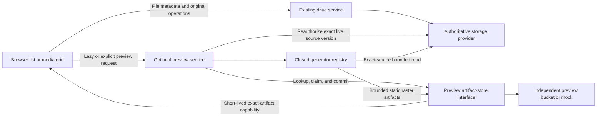

# EndlessFS v1.1 Media Browsing and Image Preview Specification

**Status:** Implemented for the deterministic mock-backed v1.1 boundary
**Audience:** Implementation agents, maintainers, operators, reviewers, and security testers  
**Normative language:** “MUST”, “MUST NOT”, “SHOULD”, and “MAY” are requirements terms.  
**Target release:** v1.1  
**Inherits:** [`v1-specification.md`](./v1-specification.md)

---

## 1. Executive contract and precedence

EndlessFS v1.1 adds an optional media-browsing grid and disposable generated image previews alongside the existing file list and safe original-file preview behavior.

This specification inherits every v1 requirement unless it explicitly replaces that requirement for the media-preview feature. In particular, it supersedes the v1 statements that server-generated thumbnails are out of scope and that no thumbnail service is introduced. It does not weaken the v1 identity, authorization, provider-key, capability, path, theme, privacy, logging, reproducibility, or local-testability requirements.

The authoritative source remains the original file in the configured primary storage provider. Preview artifacts are derived, disposable, independently stored, and never required for normal EndlessFS operation.

The v1.1 release MUST remain useful in all four configurations:

| Media browser | Preview store | Required behavior |
|---|---|---|
| Disabled | Disabled | Existing v1 list and safe-original-preview behavior is unchanged. |
| Enabled | Disabled | Grid and full-screen navigation work with built-in file-type icons. |
| Disabled | Enabled | Preview APIs may be used, but the ordinary browser remains the v1 list. |
| Enabled | Enabled | Lazy generated previews are shown where available and icons remain the fallback. |

Search is a future feature. It does not expand the v1.1 deliverable, and this feature MUST NOT introduce an index or search API. The media metadata and filtering contracts SHOULD remain reusable by a future search feature.

---

## 2. Scope

### 2.1 Required functionality

v1.1 includes:

- an optional thumbnail grid alongside the existing file list;
- lazy preview lookup and generation for visible image tiles;
- row-based grid virtualization with bounded overscan;
- built-in file-type icons when previews are disabled, absent, excluded, unsupported, corrupt, or unavailable;
- an independently configured preview artifact store representing a separate preview bucket in a durable provider;
- independent automatic-generation recency and maximum-source-size policies;
- explicit Generate Preview and Regenerate Preview actions that bypass the automatic recency and automatic-size policies;
- multiple independently generated resolution variants;
- a full-viewport media viewer with previous and next navigation;
- filtering over metadata already available for the loaded directory entries;
- exact-source-version authorization before generation and before every artifact capability is issued;
- loud runtime health failure without original-file corruption when a configured preview store becomes unavailable or is removed; and
- deterministic provider, generator, HTTP, browser, security, race, and failure tests with no cloud account.

### 2.2 Built-in v1.1 generation support

The base v1.1 build MUST generate previews for provider-validated raster image formats supported by its closed generator registry. The minimum set is PNG, JPEG, GIF, and WebP. Animated formats produce a static representative frame and MUST NOT produce an animated preview artifact.

The base build MUST validate and serve compatible static WebP preview artifacts for its active configured capabilities. A configured generator MUST be packaged in the selected build; otherwise startup fails.

### 2.3 Explicitly deferred functionality

The following are not v1.1 completion requirements:

- generated video poster frames or video metadata, specified separately for v1.2;
- generated PDF page images or PDF metadata, specified separately for v1.3;
- full-drive indexed search, content search, OCR, similarity search, or face/object recognition;
- preprocessing an existing bucket or scanning the full drive for preview candidates;
- office-document rendering;
- editable media, video transcoding, streaming renditions, or adaptive bitrate output;
- user-supplied generator commands, executable plugins, remote generator services, or runtime-downloaded codecs; and
- synchronous deletion of obsolete preview artifacts when an original is moved, replaced, trashed, or deleted.

---

## 3. Architecture and dependency direction



The required dependency direction is:

```text
HTTP/UI -> preview application service -> domain + source/artifact interfaces
source/artifact implementations --------> source/artifact interfaces
generator implementations --------------> generator interface
```

The existing authoritative `provider.Storage` interface MUST NOT gain mandatory preview methods. v1.1 introduces narrow optional ports so a provider or build without preview support continues to satisfy the v1 storage contract.

Suggested packages are:

```text
internal/preview                  policy, orchestration, recipes, and application types
internal/preview/generator        closed generator interface and image implementation
internal/previewstore             provider-neutral artifact-store interface and contract
internal/previewstore/memory      independently removable deterministic preview store
internal/provider                 optional exact-version preview-source interface
internal/httpapi/previews.go      authenticated preview transport
internal/web                     virtualized grid and full-viewport viewer
```

### 3.1 Optional source interface

The preview source interface MUST:

- accept only a trusted server-derived live owner scope, validated current virtual path, exact entry version, and move-stable preview content identity;
- support bounded sequential or range reads without accepting a provider key from the application or browser;
- fail if the source no longer exists, is no longer live, or has a different version;
- never grant list, write, cross-user, trash, or metadata-namespace access; and
- expose deterministic byte-count instrumentation in the local implementation.

### 3.2 Optional artifact-store interface

The artifact store MUST support:

- lookup of a compatible completed generation;
- an idempotent or conditionally claimed generation attempt;
- bounded writes of declared artifact variants;
- commit only after every declared artifact is complete and validated;
- retrieval of safe manifest metadata without artifact bytes;
- issuance of a short-lived capability for one exact artifact; and
- unavailable, missing, conflict, stale-claim, corruption, and removal behavior through its shared contract suite.

Bucket names, object names, provider keys, lifecycle rules, storage classes, and provider credentials never enter public APIs.

---

## 4. Build and container profiles

v1.1 establishes a stable preview-capability profile contract used by later releases.

The base outputs are:

| Nix output | Packaged generation capabilities | Required contents |
|---|---|---|
| `.#container` | `image` | The existing minimal container plus the built-in image generator. |
| `.#container-images` | `image` | An explicit alias of the base capability profile. |
| `.#release` | `image` | Base release artifacts and inventories. |
| `.#release-images` | `image` | An explicit image-profile release alias and inventory. |

The base container remains one statically linked Go application binary with embedded browser/theme assets, certificate/timezone data where required, and no shell or package manager.

Every build profile MUST expose a compile-time capability manifest containing:

- application version;
- preview specification version;
- packaged generators;
- formats and codecs each generator accepts;
- artifact formats it can produce and serve;
- recipe versions; and
- dependency/license inventory digest.

The safe public configuration response MAY expose packaged and active capability names, supported media groups, and configured policy values. It MUST NOT expose dependency paths, bucket names, provider keys, credentials, or artifact identities.

Every capability explicitly configured through `ENDLESSFS_PREVIEW_FORMATS` MUST be packaged in the selected container. A known but unpackaged configured capability is a startup configuration error. Unknown capability names are also startup errors. EndlessFS reports the offending capability name and selected profile without printing secrets, dependency paths, provider identifiers, or environment values.

Official container profiles use the same configuration schema, provider contracts, preview-store layout, and browser/API contract. Switching profiles requires no state migration or preview-store rewrite, but the operator MUST make `ENDLESSFS_PREVIEW_FORMATS` match the generators packaged in the selected profile before startup.

---

## 5. Configuration

All settings use the existing environment configuration system and strict startup parsing.

| Variable | Required/default | Behavior |
|---|---|---|
| `ENDLESSFS_MEDIA_BROWSER_ENABLED` | Default `false` | Enables the list/grid browser choice. |
| `ENDLESSFS_PREVIEW_PROVIDER` | Default `disabled` | v1.1 accepts `disabled` and the deterministic `mock`; durable adapters add closed provider-specific values. |
| `ENDLESSFS_PREVIEW_AUTOMATIC` | Default `true` when a preview provider is configured | Enables lazy viewport-triggered generation. `false` is manual-only. |
| `ENDLESSFS_PREVIEW_FORMATS` | Default all packaged capabilities | Closed comma-separated required capabilities such as `image`, `video`, and `pdf`; every named capability must be packaged in the selected build. |
| `ENDLESSFS_PREVIEW_AUTO_MAX_AGE` | Optional | Positive duration restricting automatic generation to sources at least as recent as `now - duration`. |
| `ENDLESSFS_PREVIEW_AUTO_MAX_SOURCE_BYTES` | Optional | Positive byte count restricting automatic generation by source size. |
| `ENDLESSFS_PREVIEW_RESOLUTIONS` | Default `256,512,1600` | Strict increasing list of maximum edge lengths, bounded from 64 through 4096 with at most four entries. |
| `ENDLESSFS_PREVIEW_MAX_CONCURRENCY` | Default `2`, maximum `8` | Global generation concurrency; a per-user bound MUST also apply. |
| `ENDLESSFS_PREVIEW_OPERATION_TIMEOUT` | Default `45s`, maximum `5m` | Hard wall-clock limit for one generation operation. |
| `ENDLESSFS_PREVIEW_STARTUP_TIMEOUT` | Default `10s`, maximum `60s` | Total bound for generator integrity checks and preview-store access validation. |
| `ENDLESSFS_PREVIEW_KEY_SECRET` | Required by a durable preview store | At least 32 random bytes used only for non-revealing artifact identity derivation. |

The recency and source-size settings are independently optional. Unset means no restriction for that dimension. Zero, negative, malformed, duplicate, or out-of-range values fail startup.

Preview bucket lifecycle, retention, object versioning, default storage class, location, and billing controls are configured through the selected storage provider. EndlessFS MUST document required permissions but MUST NOT provision or mutate those resources.

Every configured generator MUST initialize and pass a deterministic packaged integrity self-test within `ENDLESSFS_PREVIEW_STARTUP_TIMEOUT`. A missing binary, library, codec, renderer, recipe, capability-manifest entry, or incompatible dependency version is a startup error.

When `ENDLESSFS_PREVIEW_PROVIDER` is not `disabled`, startup MUST perform a provider-specific validation within the same timeout. It proves the configured preview bucket/store exists and that the application can authenticate, list its reserved preview prefix, conditionally create a probe generation containing an embedded fixed one-pixel WebP, read and validate that WebP, commit and read its immutable manifest, and issue and exercise an exact-artifact capability. Cleanup of the opaque probe is best effort because bucket retention may prohibit deletion. Failure of any required operation is a startup error. The error identifies the preview configuration field and failed permission category without printing a bucket name, object key, credential, capability, or probe identity.

Enabling or disabling an environment setting follows the existing restart/redeploy configuration model. If a validated preview bucket is deleted or access is lost while EndlessFS is running, preview requests return `unavailable`, `/readyz` becomes unhealthy, and a structured security-safe error is logged. Ordinary file operations continue so preview failure cannot corrupt or block access to authoritative originals. Readiness recovers only after a successful bounded revalidation; the next process startup fails until preview-store access is fully restored or preview configuration is explicitly disabled.

---

## 6. Source identity, storage layout, and lifecycle

The authoritative provider exposes a non-public preview content identity containing:

```text
contentID          random opaque identity assigned when file content is first created
contentVersion     opaque revision changed only when bytes or rendering-relevant metadata changes
contentModifiedAt  authoritative time of the content revision
```

`contentID` and `contentVersion` are provider-independent domain values and never appear in public HTTP responses. Upload completion to a new path assigns them. Rename, move, directory-tree move, trash, and restore preserve them. Copy assigns a new `contentID`. Replacing file bytes preserves the existing `contentID` and always assigns a new `contentVersion` and `contentModifiedAt`. Delete followed by a later new upload assigns a new `contentID`. A provider adapter MUST persist and conditionally preserve these values as trusted object metadata or an equivalent provider-native record; an adapter unable to provide these semantics cannot claim v1.1 conformance. Client-supplied values are never accepted.

The application constructs a trusted artifact binding from:

```text
owner scope
contentID
contentVersion
provider-validated media type
source byte size
generator recipe version
requested variant
```

The current validated live virtual path and exact entry version are authorization inputs, not artifact-identity inputs. Automatic recency policy uses `contentModifiedAt`, so a rename or move cannot make old content appear newly modified.

The artifact-store adapter maps that binding to provider-internal names using a dedicated keyed digest. A conceptual layout is:

```text
v1/<owner-digest>/<content-binding-digest>/<recipe>/<generation-id>/
  manifest.json
  256.webp
  512.webp
  1600.webp
```

This layout is not a public contract. Manifests and names MUST NOT contain raw user IDs, filenames, virtual paths, entry versions, content identities, bucket names, or provider keys.

Generations are immutable. Regenerate creates a new generation; it does not require overwriting or deleting a prior generation. A completed manifest is visible only after all declared artifacts are committed and validated. Incomplete generations are never served.

The preview store MAY delete any artifact at any time. Missing artifacts are treated as a cache miss. EndlessFS does not require synchronous cleanup when a source changes because every capability request reauthorizes the exact live source version.

Renaming or moving a file or directory tree preserves each file's content identity, so compatible preview artifacts are immediately reusable at the new authorized path without regeneration. Trash makes artifacts inaccessible; restore reuses them when the content identity is unchanged. Copy receives a new content identity and does not reuse the source artifact. Replacement changes the content version and therefore requires a new preview. None of these original-file operations waits for preview work. Inaccessible or superseded artifacts may be removed later by bucket lifecycle.

---

## 7. Eligibility and generation behavior

### 7.1 Automatic requests

Automatic generation begins only when a virtualized tile enters the configured visible/overscan window and all of the following are true:

```text
media browser is enabled
preview provider is configured
automatic generation is enabled
format is active in the selected build
source is an authorized live file at the exact current entry version
max age is unset OR contentModifiedAt >= now - max age
max source bytes is unset OR size <= max source bytes
hard decoder and resource limits allow an attempt
```

The policy decision MUST occur before a source-read capability is created. Disabled, off-screen, unsupported, excluded, stale, or directory items cause zero original-file bytes to be retrieved.

### 7.2 Explicit generation

Generate Preview and Regenerate Preview are authenticated mutations requiring CSRF, exact-origin validation, exact path/version authorization, and an idempotency key.

- Generate reuses a compatible ready artifact if present and otherwise creates one.
- Regenerate starts a new immutable generation even if a compatible artifact exists.
- Both bypass `ENDLESSFS_PREVIEW_AUTO_MAX_AGE` and `ENDLESSFS_PREVIEW_AUTO_MAX_SOURCE_BYTES`.
- Neither bypasses format support, source authorization, version matching, pixel/dimension/byte limits, concurrency, timeouts, or decoder safety rules.

### 7.3 Concurrency and crash behavior

Concurrent requests for the same content binding, recipe, and requested variants SHOULD share one generation attempt. Duplicate generation is acceptable only where the artifact-store consistency model cannot prevent it; duplicate completed artifacts remain semantically harmless.

Generation claims have bounded leases or epochs. Process termination, container switching, bucket unavailability, or generator failure cannot leave a permanent busy state. A later request can recover without wall-clock sleeps in tests.

There is no full-drive queue. Work exists only because a visible tile or explicit user action requested it. A bounded in-process executor MAY process claimed jobs, but job correctness cannot depend on process-local memory.

---

## 8. Artifact format, recipes, and loading performance

### 8.1 WebP artifact format

WebP is the only generated artifact format. It provides broad browser support, small photographic previews, alpha support, and fast transfer at thumbnail sizes while keeping validation and serving behavior uniform across every build profile.

The generator MUST:

- emit static `image/webp` output for every successful generation;
- remove source metadata, comments, profiles not required for correct color display, and animation;
- normalize orientation and output sRGB-compatible pixels;
- use a bounded, versioned encoding recipe so output quality and cost are reproducible;
- encode color pixels as lossy WebP at quality `80` through the single pinned v1.1 encoder;
- preserve the alpha plane losslessly when the source contains non-opaque pixels;
- use no adaptive output-format or quality selection; and
- record exact content type, dimensions, byte size, checksum, and recipe ID in the manifest.

Generated artifacts MUST be static WebP media. JPEG, PNG, GIF, AVIF, SVG, HTML, XML, JavaScript, PDF, video, animated image output, and arbitrary CSS are prohibited artifact formats. The browser requires the manifest content type to be exactly `image/webp` and never infers it from a filename.

### 8.2 Resolution behavior

The default maximum-edge variants are:

| Variant | Intended use | Generation behavior |
|---|---|---|
| `256` | ordinary grid tile | Generated on first visible demand. |
| `512` | high-density or large grid tile | Generated only when device/layout demand requires it. |
| `1600` | full-viewport viewer | Generated only when the viewer requests it. |

Every artifact preserves the source's display aspect ratio. Generation never crops, stretches, or pads source pixels and never upscales beyond decoded dimensions. The manifest includes exact intrinsic width and height. The browser selects the smallest ready/requestable variant that meets the rendered CSS size multiplied by device pixel ratio.

Generation of one variant MUST NOT require eager generation of every configured variant. Implementations MAY reuse one validated decode during the same operation when multiple requested variants make that cheaper.

### 8.3 Browser loading requirements

Grid images use explicit dimensions, asynchronous decoding, low fetch priority, and lazy requests. The browser keeps capability values and object URLs in memory only, aborts requests for evicted tiles, and releases object URLs when tiles or viewers close.

Preview capability and artifact responses use `Cache-Control: no-store` unless a later privacy specification explicitly defines an encrypted/private cache. Fast loading is achieved through small variants, direct preview-provider transfer, virtualization, bounded parallelism, and reuse within the current document—not through persistent sensitive browser caches.

The p95 local deterministic-mock target after capability issuance is:

- a ready 256-pixel artifact begins transferring within 100 ms;
- a ready grid tile completes within 250 ms for the standard acceptance fixture; and
- opening a ready viewer variant presents pixels within 500 ms.

These are regression targets for the local test fixture, not claims about Internet or provider latency.

---

## 9. HTTP API

The existing `POST /api/v1/downloads` request with `preview: true` remains the v1 safe-original-preview API.

v1.1 adds:

| Method | Route | Behavior |
|---|---|---|
| `POST` | `/api/v1/previews/resolve` | Resolve a bounded batch of visible exact path/version/variant requests and optionally start policy-eligible automatic generation. |
| `POST` | `/api/v1/previews/generations` | Explicit Generate or Regenerate for one exact source version. |
| `GET` | `/api/v1/previews/operations/{operationID}` | Poll safe owner-scoped generation state. |

Resolve accepts at most 64 items. Generation accepts one item. Requests contain virtual paths, opaque source versions, registered variants, and intent only. Fields resembling bucket names, object keys, arbitrary URLs, output media types, generator commands, codec paths, or user IDs are rejected.

Preview state is one of:

```text
disabled
unsupported
ineligible
missing
generating
ready
failed
unavailable
```

An `ineligible` response may identify the coarse automatic-policy reason `age` or `size`. An `unsupported` response may identify `format-disabled` or `input-format`. `generator-not-packaged` is never a runtime state for a configured generator because that mismatch prevents startup. Provider details, decoder errors, object identities, dependency paths, and source capability details are never exposed.

A ready artifact response includes safe variant metadata plus a short-lived exact-artifact capability. Every capability response is `no-store`. The server MUST reauthorize the live source path/version before issuing it.

Generated-preview creation is authenticated-owner-only in v1.1. Public shares retain the existing safe-original preview behavior and cannot trigger generated-preview work.

---

## 10. Browser interaction

### 10.1 Grid and virtualization

The existing list is the default and remains available whenever the media browser is enabled. A labeled list/grid choice controls presentation without changing authorization or listing semantics.

The grid:

- includes directories and files in the existing deterministic directory order;
- uses application-owned folder and file-type icons before or instead of a preview;
- virtualizes fixed-height rows based on container width and the Theme API thumbnail metric;
- renders only the visible rows plus a bounded overscan of at most three rows on each side;
- preserves selection when a tile leaves the DOM;
- uses `IntersectionObserver` or an equivalent browser primitive to request only rendered preview candidates;
- keeps preview request concurrency within the public configured limit; and
- retains existing provider pagination without requiring a full-folder or full-drive scan.

Every grid tile has a 1:1 square media frame. The generated WebP retains the source aspect ratio and is centered inside that square with `object-fit: contain`. The UI never crops or stretches the preview; unused horizontal or vertical space uses the application-owned tile background. Intrinsic artifact dimensions and the square frame dimensions are declared before load to prevent layout shift.

A 10,000-entry logical fixture MUST keep the rendered tile count proportional to the viewport and overscan rather than the loaded entry count.

### 10.2 File-type icon fallback

The Theme API adds semantic fallback slots for at least:

```text
icon.file.image
icon.file.video
icon.file.pdf
icon.file.audio
icon.file.document
icon.file.archive
icon.file.unknown
```

The application, not the theme, decides the semantic category, accessible name, fallback order, dimensions, loading behavior, and interaction. Built-in themes are complete. Older compatible themes inherit the new slots from their immutable built-in parent.

### 10.3 Full-viewport viewer

The viewer:

- uses a real labeled dialog or equivalent accessible top-layer primitive;
- shows generated screen-resolution imagery where ready;
- preserves the existing explicit safe-original image, bounded-text, and PDF behavior;
- offers Generate, Regenerate, Download, and metadata actions as applicable;
- navigates previous and next files in the current loaded, filtered, and sorted sequence;
- may load the next provider page when navigation reaches the loaded boundary;
- supports Left Arrow, Right Arrow, Escape, visible focus, focus trapping, and focus restoration;
- announces loading and failure without moving focus unexpectedly;
- works at 320 CSS pixels and respects reduced motion; and
- never places a provider capability or key in history, URLs, persistent browser storage, or the DOM as text.

An excluded or unavailable item opens with its file-type icon and metadata. It does not retrieve the original automatically. A user may then choose an explicit safe-original action or Generate Preview where allowed.

### 10.4 Filtering and future search compatibility

v1.1 filtering applies to directory entries already loaded through the ordinary paginated listing. Supported predicates include filename text, entry kind, provider-validated media category, byte-size range, modification-time range, and preview state.

The UI labels this as filtering loaded items. It does not claim to search unloaded pages or the full drive. Filter predicate types SHOULD be defined independently of the DOM so a future indexed-search result set can reuse the presentation layer without changing this release’s scope.

---

## 11. Security, privacy, and resource limits

All v1 security invariants apply. Additionally:

- preview scope always derives from the authenticated session;
- only `AreaLive` sources are eligible;
- preview artifacts remain private and capability-mediated;
- a disabled account cannot generate or receive new preview capabilities;
- no artifact capability is issued through a former path after move, or after replacement, trash, deletion, content-version mismatch, or entry-version mismatch; the current authorized path after rename/move may reuse the preserved content-bound artifact;
- the preview bucket uses a separate least-privilege provider configuration in a durable adapter;
- artifact provider origins are added only to the required `img-src` and `connect-src` CSP directives;
- generated artifacts are served only as exact `image/webp` with `nosniff`, safe inline disposition, restrictive headers, and no content negotiation from untrusted request values;
- logs omit source paths, filenames, content, dimensions where identifying, bucket names, keys, capabilities, generator input/output, and dependency command lines;
- decoder panics, crashes, timeouts, malformed input, oversized dimensions, pixel bombs, and partial writes fail the preview operation without failing ordinary file APIs; and
- automatic generation has global, per-user, and per-request concurrency and work bounds.

Preview generation is a distinct bounded processing plane. File bytes still never enter ordinary HTTP control handlers. The specification permits a one-shot worker mode of the same Go binary or another closed, packaged generator implementation defined by a later profile. Secrets are passed through protected pipes or internal capability channels, never arguments or logs.

When previews are disabled, preview health does not affect `/readyz`. When previews are configured, validated preview-store access and every configured packaged generator are readiness requirements. Runtime loss makes `/readyz` fail loudly while ordinary original-file operations remain available and authoritative.

---

## 12. Deterministic local proof

v1.1 adds:

1. an independent in-memory preview artifact store;
2. a distinct loopback preview data-plane origin;
3. deterministic artifact-store contract tests;
4. a deterministic fake generator for orchestration and fault tests;
5. reviewed image fixtures for the real built-in image generator;
6. injected clock, IDs, claim schedule, failures, and ordering;
7. instrumentation for source bytes read, preview bytes written/read, and control-handler bytes; and
8. removal/recreation controls that do not mutate the primary mock provider.

Required contract and integration cases include:

- disabled provider and missing bucket;
- immutable generation commit and incomplete-generation invisibility;
- exact owner/source/version/recipe/variant binding;
- independent expiry and capability scope;
- removal and recreation;
- unavailable, corrupt, conflict, stale claim, timeout, and partial output;
- source replacement, rename, move, copy, trash, restore, delete, and disabled owner, including proof that rename/move reuse the same artifact without generator calls;
- concurrent automatic requests and manual regenerate races;
- every unset/set combination and exact boundary of the age and size policies;
- zero source reads for off-screen and policy-excluded items;
- WebP-only output, signature, metadata stripping, orientation, dimensions, alpha, source-aspect preservation, and deterministic recipe behavior;
- malformed image headers, truncated content, excessive dimensions/pixels, and decompression bombs;
- CSP, `no-store`, `nosniff`, origin, CSRF, cache, and redaction behavior;
- bounded DOM nodes and preview requests under a large logical listing; and
- keyboard-only grid, viewer navigation, fallback, generation, and store-removal workflows under both built-in themes.

The preview policy, authorization, content-binding, artifact-store adapter, capability issuance, and artifact validation packages each target at least 95% statement coverage. Repository coverage remains at least 85%.

---

## 13. Nix, dependencies, and release artifacts

Nix remains the sole public task interface. New focused commands MAY include:

```text
nix run .#test-preview
nix build .#container-images
nix build .#release-images
```

`nix flake check` remains the complete required gate and MUST build and test the base image-only profile without cloud credentials, Internet access, a container runtime, or a preview bucket.

Any image encoder/decoder dependency is pinned, vendored or supplied through locked Nix inputs, statically linked into the base binary, license-reviewed, vulnerability-scanned, and recorded in `docs/dependencies.md` plus the release inventory. The standard library is preferred; a third-party codec requires the repository’s normal maintenance, license, security-history, and necessity justification.

Release evidence records:

- source and lock hashes;
- profile capability manifest and digest;
- binary and OCI hashes for each published profile;
- compressed and unpacked image sizes;
- packaged dependency and license inventories;
- recipe versions and supported formats;
- test, coverage, race, fuzz, security, and E2E summaries; and
- the unchanged no-GCS/no-production-provider limitation until a real adapter is validated.

---

## 14. Acceptance criteria

**MP-001** — With all v1.1 settings absent, existing v1 file, preview, share, test, and release behavior remains unchanged.  
**MP-002** — Media browsing enabled without a preview provider supplies a virtualized grid, full-viewport navigation, metadata filtering, and complete icons without source reads.  
**MP-003** — Preview storage is an independent interface and deterministic store; configured access is fully validated at startup, runtime loss makes readiness unhealthy, and original list, stat, upload, download, move, copy, trash, restore, and share data remains safe and operable.  
**MP-004** — Automatic age and size restrictions work independently and together at their exact boundaries; exclusions cause zero source reads.  
**MP-005** — Authenticated Generate and Regenerate work for automatically excluded sources while retaining every hard authorization and resource limit.  
**MP-006** — Preview lookup and storage bind to owner, move-stable content identity/version, recipe, generation, and variant; capability issuance additionally reauthorizes the current live path and exact entry version without exposing provider identities.  
**MP-007** — PNG, JPEG, GIF, and WebP inputs produce validated static WebP-only artifacts with the required metadata removal, orientation, source aspect ratio, dimensions, and bounded recipes.  
**MP-008** — The browser requests only visible/overscan variants, chooses an appropriate resolution, preserves source aspect ratio inside a 1:1 square tile, releases evicted resources, and keeps DOM/request counts bounded for 10,000 logical entries.  
**MP-009** — Full-viewport previous/next navigation and explicit actions are keyboard accessible at desktop and 320-pixel layouts under both built-in themes.  
**MP-010** — The base and explicit image container outputs expose identical configuration/API schemas, publish capability manifests, contain no shell/package manager, and pass the full offline Nix gate.  
**MP-011** — Startup fails with a sanitized configuration error when a named generator is unpackaged or when a configured preview bucket/store cannot pass every required access probe.  
**MP-012** — Rename and move preserve content identity and immediately reuse compatible artifacts without regeneration; replacement and copy use the specified distinct identity behavior.  
**MP-013** — Cross-user, disabled-account, moved, replaced, trashed, deleted, stale-version, corrupt-artifact, capability, CSP, CSRF, origin, and redaction tests pass.  
**MP-014** — Search is not implemented or required, while filtering remains clearly limited to loaded metadata and the presentation contract remains reusable by a future search result source.  
**MP-015** — Documentation and release evidence distinguish the mock-backed preview-store proof from a real preview bucket or production-provider claim.

---

## 15. Feature-completion checklist

- [x] The v1.1 spec conflict with the v1 thumbnail non-goal is documented and scoped.
- [x] Media browser and preview provider configuration are independent and default off at the feature boundary.
- [x] The authoritative storage interface remains valid without preview support.
- [x] Preview source and artifact-store contracts have deterministic implementations and shared suites.
- [x] Providers expose non-public move-stable content IDs/versions and preserve them exactly across rename, move, trash, and restore.
- [x] Preview artifacts use non-revealing immutable owner/content/version/recipe identities and never include the path.
- [x] Automatic age and size policies have every independent, combined, boundary, and no-read test.
- [x] Explicit Generate and Regenerate bypass only automatic policies.
- [x] The built-in image generator safely produces WebP-only multi-resolution artifacts that preserve source aspect ratio.
- [x] Removing, recreating, disabling, or switching the preview store never corrupts or blocks original operations; configured loss fails readiness and the next startup until repaired or disabled.
- [x] Base and image Nix/OCI/release outputs publish capability and dependency inventories.
- [x] Every explicitly configured generator is packaged or startup fails with a sanitized error.
- [x] Every configured preview store passes full bounded access validation or startup fails with a sanitized error.
- [x] Runtime preview-store access loss fails readiness loudly without corrupting or blocking authoritative file data.
- [x] Grid virtualization, lazy loading, bounded concurrency, square tile frames, uncropped source aspect ratio, and large-list behavior pass browser tests.
- [x] File-type icons are complete across built-in themes and inherit safely in older compatible themes.
- [x] Full-viewport navigation and controls meet the accessibility and responsive contract.
- [x] Metadata filtering is clearly distinct from future search.
- [x] All authorization, capability, artifact, decoder, CSP, cache, logging, fault, race, fuzz, and coverage gates pass.
- [x] `nix flake check` and every profile-specific release check are green.
- [x] Release evidence preserves the no-real-provider limitation.

The v1.1 feature is complete only when every criterion and checklist item above has evidence. A fallback icon is valid behavior for previews that are disabled, an unsupported input format, an automatic-policy exclusion, or a runtime generation failure. A configured unpackaged generator or inaccessible configured preview store is a startup error, never a fallback condition. A placeholder generator or skipped test is not evidence.
